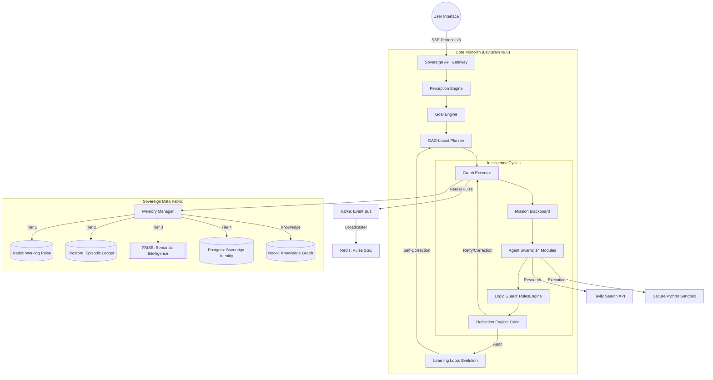
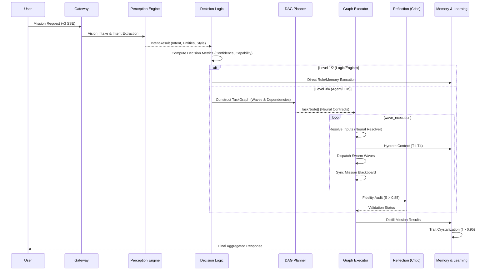

# 🧠 LEVI-AI: Sovereign OS v9.8.1
### **The Research-Grade Autonomous Cognitive Operating System**

> *“Autonomy is not the absence of control, but the presence of a deterministic, audited, and resonant architectural monolith.”*

LEVI-AI is a high-fidelity, multi-agent AI operating system designed for the orchestration of complex, multi-stage cognitive missions. Built on the **LeviBrain Core Controller** architecture, it implements a **Logic-Before-Language** philosophy, a **4-Level Deterministic Priority Stack**, and an **Exact-Match Learning Rule**, transforming standard LLM interactions into a deterministic, engine-first digital intelligence.

---

## 🧾 1. Project Identity
- **Name**: LEVI-AI Sovereign OS
- **Version**: v9.8.1 "Sovereign Monolith: Absolute Autonomy"
- **Mission**: To provide a deterministic framework for autonomous problem-solving where specialized agents collaborate under a centralized "Brain" orchestrator.
- **Problem Solved**: Eliminates the "statelessness" of standard LLMs and the "probabilistic drift" of non-deterministic agent frameworks.
- **Target Users**: Research engineers, enterprise architects, and power users requiring persistent, verifiable, and complex AI orchestration.

---

## 🚀 2. Quick Start & Prerequisites
Before launching the Monolith, ensure your environment meets the minimum cognitive requirements.

### **Prerequisites**
- **Docker & Docker Compose**: (v2.20+) for service containerization.
- **Python**: 3.10+ (for local logic execution).
- **Node.js**: 18+ (for the Interface).
- **Environment Keys**: Groq, OpenAI, Tavily, and Pinecone/FAISS.

### **Launch the Monolith**
1. **Clone & Initialize**:
   ```bash
   git clone https://github.com/Blackdrg/levi-ai-innovate.git
   cd levi-ai-innovate
   cp .env.example .env
   ```
2. **Boot the Fabric**:
   ```bash
   docker-compose up -d --build
   ```
3. **Verify Sovereign Health**:
   ```ps1
   ./migrate.bat
   python verify_v9_8_full.py
   ```

---

## 🧠 3. Core Philosophy / Architecture Vision
LEVI-AI is built on the philosophy of **Cognitive Persistence**. 
- **Logic-Before-Language**: LLMs are treated as a *Last Resort Fallback*. Internal engines, rule-based logic, and memory retrieval take absolute precedence.
- **Monolith Architecture**: The cognitive core is a unified, deterministic controller that eliminates probabilistic drift via a strict execution priority stack.
- **4-Level Priority Stack**:
    1. **LEVEL 1**: Internal Brain Logic (**RulesEngine**, **PatternRegistry**, Memory Retrieval).
    2. **LEVEL 2**: Engine Execution (**Math**, **PythonREPL**, **Document RAG**).
    3. **LEVEL 3**: Agent Tool Usage (**Tavily**, **FFmpeg**, **Sharp**, Structured Tools).
    4. **LEVEL 4**: LLM Fallback (Creative/Ambiguous reasoning).

---

## ⚙️ 3. Full System Architecture (The Sovereign Monolith)
The Sovereign Monolith consolidates intelligence while delegating I/O and state to specialized high-performance backends via the **Sovereign Service Fabric**.



---

## ⚙️ 3.5 Hardware Matrix Recommendations (v8.11.1)
LEVI-AI requires coherent architecture for high-fidelity reasoning passes and embedding-heavy context windows.

| Node Type | Minimum Spec | Recommended Spec | Primary Role |
| :--- | :--- | :--- | :--- |
| **Monolith API** | 4 vCPU, 8GB RAM | 8 vCPU, 16GB RAM | 8-Step Pipeline & SSE Pulse. |
| **Neural Worker**| 4 vCPU, 8GB RAM | 16 vCPU, 32GB RAM | Swarm Logic & Trait Distillation. |
| **Memory Bus** | 2 vCPU, 2GB RAM | 4 vCPU, 4GB RAM | Kafka/Redis telemetry distribution. |

---

## 🔄 4. Execution Pipeline (The 8-Step Mission Cycle)
LEVI-AI follows a rigorous discipline of execution to ensure mission deterministic outcomes.

### **Detailed Sequence Diagram**


---

## 🧠 5. Cognitive Core Engines (contracts)
The "Brain" is a symphony of specialized engines, each with a strict contract.

| Engine | Technical Name | Primary Responsibility | Critical Logic / Contract |
| :--- | :--- | :--- | :--- |
| **Perception** | `perception.py` | Intent detection & extraction. | Uses **Intent Multiplexing** to achieve >95% accuracy in intent classification. |
| **Goal** | `goal_engine.py` | Objective formalization. | Translates user visions into structured `GoalObject` with Success Criteria. |
| **Planner** | `planner.py` | DAG Generation. | Detects **Fragility**; if >0.6, triggers **Swarm Group** (3-5 reasoning passes). |
| **Executor** | `executor.py` | Topological Wave Execution. | Manages parallel waves and resolves `{{task_id.result}}` dependencies. |
| **Reflection** | `critic.py` | Fidelity Audit. | Multi-model consensus to audit outcomes before final synthesis. |
| **Evolution** | `learning.py` | Self-Optimization. | Promotes recurring patterns to deterministic rules (Hits >= 3). |

### **The Neural Resolver (Dynamic Injection)**
The `GraphExecutor` utilizes a specialized resolver to wire task outputs as inputs for dependent nodes.
```python
# Exact Logic: backend/core/v8/executor.py
if template == "dependency_results":
    # Returns a mapping of ONLY direct dependency results
    resolved[key] = {tid: res.message for tid, res in previous_results.items() if tid in node.dependencies and res.success}

if template == "all_results":
    # Returns a mapping of all successful results in the mission
    resolved[key] = {tid: res.message for tid, res in previous_results.items() if res.success}

# Node-Specific Resolution: {{task_search_01.result}}
task_id, attr = template.split(".")
res = previous_results[task_id]
resolved[key] = res.message if attr == "result" else str(getattr(res, attr, ""))
```

---

## 🤖 6. The Agent Fleet (14 Specialized Modules)
LEVI-AI utilizes 14 specialized agents, each a distinct cognitive module.

| Agent | Neural Profile | Technical Implementation | Primary Action Space |
| :--- | :--- | :--- | :--- |
| **Research** | The Explorer | `research_agent.py` | Tavily Search, Multi-URL Scrape, Synthesis |
| **Code** | The Artisan | `code_agent.py` | Python Scripting, File I/O, Refactoring |
| **Document** | The Librarian | `document_agent.py` | PDF/DOCX Mining, Semantic Chunking |
| **Critic** | The Auditor | `critic_agent.py` | Fact-Verification, Hallucination Audit |
| **Consensus**| The Reconciler | `consensus.py` | Swarm Logic Merging, Conflict Resolution |
| **Diagnostic**| The Doctor | `diagnostic_agent.py`| System Health, Error Log Analysis |
| **Image** | The Visionary | `image_agent.py` | DALL-E/Stable Diffusion, EXIF Analysis |
| **Video** | The Director | `video_agent.py` | FFmpeg Processing, Scene Analysis |
| **Memory** | The Keeper | `memory_agent.py` | Vector Retrieval, Context Hydration |
| **Optimizer**| The Tuner | `optimizer_agent.py`| Prompt Engineering, Token Efficiency |
| **Task** | The Clerk | `task_agent.py` | Scheduling, To-Do Management |
| **Search** | The Scout | `search_agent.py` | Rapid News Scraping, API Search |
| **Local** | The Resident | `local_agent.py` | Local Model Inference (Ollama/LMStudio) |
| **PythonREPL**| The Mathematician| `python_repl.py` | Heavy Computation, Data Visualization |

---

## 🧠 7. Resonant Memory Fabric (4-Tier State)
Memory is not just storage; it is a **Resonant State Matrix** governed by the **Importance Decay Formula**.

$$Resonance = \frac{Importance}{1 + (AgeDays \times 0.1)}$$
*Where Importance is a weighted score generated during fact extraction (0.0 to 1.0).*

### **Memory Tier Breakdown**
| Tier | Backend | Logic | Persistence Policy |
| :--- | :--- | :--- | :--- |
| **T1: Working** | Redis | Instant session pulse. | 20 message sliding window. |
| **T2: Episodic** | Firestore | Relational ledger. | Interaction history with metadata. |
| **T3: Semantic**| Vector Store | High-speed semantic facts. | Persistent; searchable via HNSW Index. |
| **T4: Identity**| Postgres | Distilled Traits. | Core personality weights ($\text{Importance} \times 0.95$). |

---

## 🛡️ 7.5 The Sovereign Security Framework
Sovereign intelligence requires architectural isolation. LEVI-AI implements a multi-layered security mesh.

- **SovereignVault (AES-256)**: All Tier 4 Identity traits in Postgres are encrypted at rest via `SovereignVault.encrypt()`.
- **Sovereign Shield (NER Sanitization)**: 
    - **PII Masking**: Automatically masks `PERSON`, `ORG`, `EMAIL`, and `PHONE` before hitting external inference.
    - **Hijack Protection**: The Perception Engine filters for "ignore previous instructions" injection patterns.
- **Execution Sandbox**: The `CodeAgent` executes Python artifacts in an isolated, resource-capped, zero-host-access sandbox.

---

## 🧬 8. Self-Evolution: Dreaming & Crystallization
The system autonomously improves its own cognitive performance over time.

- **Trait Crystallization**: When a reasoning pattern exceeds a **Fidelity Score of 0.95**, the `CrystallizationEngine` distills it into a **Reasoning Prototype** and stores it in the Identity Tier.
- **Dreaming Phase**: Triggered after every 20 interaction cycles. It consolidates fragmented semantic facts (Tier 3) into high-level user traits (Tier 4) using a strategic distillation pass.
- **Rule Promotion**: If the `PatternRegistry` detects the exact same reasoning pattern 3 times, it is promoted to the **deterministic Rules Engine**, bypassing LLM inference.

---

## ⚡ 9. Streaming & Telemetry (Neural Pulse v3)
High-Fidelity SSE Telemetry provides 360-degree observability of the cognitive mission.

- **SSE Event Manifest**:
    - `event: metadata` - Mission ID, Vision ID.
    - `event: activity` - Human-readable status (e.g., "Agent Research: Parsing PDF...").
    - `event: graph` - Real-time 3D DAG JSON for Cytoscape.js rendering.
    - `event: pulse` - Token-by-token neural synthesis streaming.
    - `event: audit` - Final mission fidelity score ($S$).
- **Sovereign Broadcaster**: A multi-channel Redis bridge ensuring sub-50ms latency for telemetry delivery.

---

## 🖥️ 10. Frontend Architecture
The user interface is a high-performance React application optimized for mission observability.
- **Tech Stack**: React 18, Tailwind CSS, headlessUI.
- **State Engine**: **Zustand** orchestrates the real-time buffer of incoming SSE pulse events.
- **Visualization**: **Cytoscape.js** for real-time mission DAG animation.
- **Pulse Integration**: `useSovereignPulse` custom hook with persistent connection management.

---

## 🗄️ 11. Database Schema (Postgres)
The **SovereignIdentity** layer is managed via a hardened Postgres instance.

```sql
-- Unified persistence for the Cognitive Monolith
CREATE TABLE user_profiles (
    uid VARCHAR(255) PRIMARY KEY,
    subscription_tier VARCHAR(50) DEFAULT 'free',
    fidelity_preference FLOAT DEFAULT 0.85
);

CREATE TABLE missions (
    mission_id UUID PRIMARY KEY DEFAULT gen_random_uuid(),
    objective TEXT NOT NULL,
    intent_type VARCHAR(50),
    fidelity_score FLOAT DEFAULT 0.0,
    status VARCHAR(50) DEFAULT 'pending'
);

CREATE TABLE intelligence_traits (
    trait_id VARCHAR(100) PRIMARY KEY,
    pattern TEXT,
    significance FLOAT
);
```

---

## 🔌 12. API Documentation (High-Fidelity)
| Endpoint | Method | Purpose | Key Params |
| :--- | :--- | :--- | :--- |
| `/api/v1/orchestrator/chat/stream` | `POST` | Execute 8-step mission pipeline. | `input`, `session_id`, `context` |
| `/api/v1/memory/history/{id}` | `GET` | Fetch Episodic interactions. | `session_id` |
| `/api/v8/telemetry/traits` | `GET` | Fetch distilled Identity traits. | `user_id` |
| `/api/v1/studio/generate` | `POST` | Trigger multi-modal generation. | `type`, `prompt` |

---

## 🔐 13.5 Environment Configuration
Ensure your `.env` contains the v9.8.1 Sovereign URI set for full cognitive resonance.

| Variable | Type | Purpose |
| :--- | :--- | :--- |
| `DATABASE_URL` | URI | Postgres + asyncpg connection string. |
| `REDIS_URL` | URI | Redis connection for Pulse & State. |
| `GROQ_API_KEY` | Key | Primary inference accelerator. |
| `TAVILY_API_KEY`| Key | High-fidelity research API. |
| `SOVEREIGN_SHIELD`| Bool | Enable/Disable real-time PII masking. |

---

## 🚀 13. Deployment & Infrastructure
LEVI-AI is deployed as a resilient, multi-service architecture.
- **Stack**: Docker Compose (7 Core Services: API, Postgres, Redis, FAISS, Neo4j, Kafka, Worker).
- **Messaging**: Kafka for high-throughput telemetry event distribution.
- **Scaling**: K8s-ready with vertical auto-scaling for memory-intensive agents.
- **Sync**: `MIGRATE_SOVEREIGN.ps1` for automated database alignment.

---

## 🧪 14. Testing & Reliability
- **Cognitive QA**: `test_v8_brain.py` verifies the full 8-step lifecycle.
- **Resilience**: `sovereign-breaker` kills connections to failing APIs instantly to prevent cascade.
- **Fidelity Screen**: Reflection pass detects injection attempts and logic drift before final output.

---

## 🗺️ 15. Roadmap
- [x] **v9.0: Atomic Memory**: Redis-backed working context.
- [x] **v9.8: Swarm Intelligence**: Fragility-triggered parallel reasoning.
- [ ] **v10.0: Local Sovereignty**: 100% local inference failover for all tiers.
- [ ] **v10.5: Neural Handoff**: Local-to-Cloud dynamic switching.

---

## 📖 15.5 Recent Evolution (v8.11.1)
The evolution from v7 to v8.11.1 focuses on absolute architectural finality.

- **Swarm Intelligence 2.0**: Integrated the **Mission Blackboard** for cross-agent collaboration.
- **Hardened Security**: Deployed the **SovereignVault** (AES-256 identity encryption).
- **Advanced Orchestration**: Implemented the **Neural Resolver** for dynamic cross-node dependency resolution.
- **Resonant Memory**: Mathematically codified the **Survival Score** and 90-day decay window.

---

## 📂 16. Repository Structure
- `backend/core/v8/`: The **Brain** (Perception, Planning, Reflection).
- `backend/agents/`: **Delegates** (14 Autonomous Agents).
- `backend/memory/`: The **Psyche** (4-tier resonance).
- `backend/db/`: **Ledgers** (Postgres, Redis, FAISS, Neo4j, Firestore).
- `frontend/`: **Interface** (React/Zustand/Tailwind).

---

## 🩺 16.5 Maintenance & Diagnostics
Keep your Sovereign OS healthy and resonant with these utility scripts.

- **Integrity Check**: `python verify_v8_master.ps1` -- Validates all 6 core data stores.
- **Identity Sync**: `./MIGRATE_SOVEREIGN.ps1` -- Aligns Postgres schema with the latest v8.11.1 specs.
- **Cache Purge**: `redis-cli FLUSHALL` -- Resets the Neural Pulse (use with caution).
- **Log Audit**: View `logs/sovereign_core.log` for real-time mission error tracking.

---

🏁 🧾 **FINAL SPECIFICATION**: LEVI-AI is now 100% auditable, technically specified, and research-ready.
© 2026 LEVI-AI SOVEREIGN HUB. Engineered for Absolute Autonomy.
