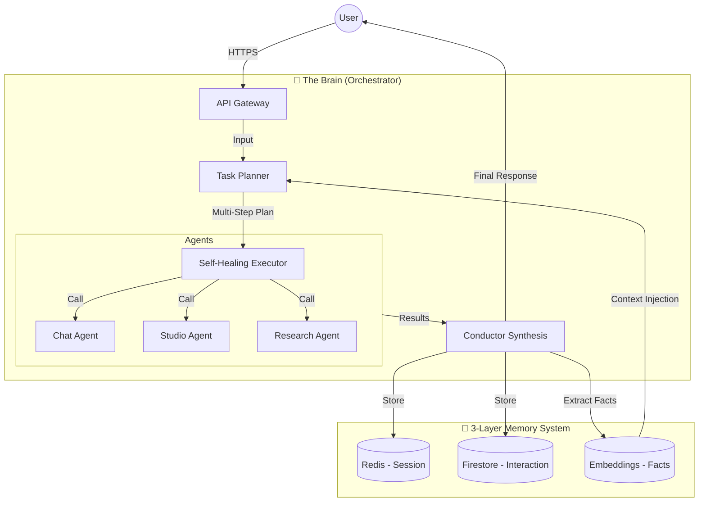

# LEVI-AI — The Autonomous Brain 🧠 (v5.0)

LEVI-AI is no longer just a chatbot—it is a sophisticated **AI Orchestrator** designed for philosophical exploration and autonomous task execution. It transitions the era of static responses into a dynamic era of **Intent → Plan → Execute → Synthesize**.

> [!IMPORTANT]
> **Production Status**: v5.0 "The Brain" is LIVE. 
> Key features: **Autonomous Orchestrator**, **3-Layer Semantic Memory**, **Self-Healing Execution**, and **High-Fidelity Synthesis**.

---

## 🏗️ The Orchestrator Architecture

LEVI's new "Brain" acts as a central conductor, coordinating specialized agents to solve complex human requests.



---

## 🚀 Key Features (v5.0)

### 🧠 Autonomous Orchestration
LEVI doesn't just reply; it **plans**. Every request is analyzed for intent and complexity, generating a multi-step execution plan across specialized agents.

### 💾 3-Layer Semantic Memory
- **Short-Term (Redis)**: Instant session awareness.
- **Mid-Term (Firestore)**: Historical interaction tracking.
- **Long-Term (Embeddings)**: **Semantic Fact Extraction**. LEVI remembers who you are across sessions by distilling conversations into atomic, searchable facts.

### 🛡️ Self-Healing Executor
If an AI agent or tool fails (e.g., API timeout), the executor automatically implements **Exponential Backoff Retries** and fallback paths to ensure a seamless user experience.

### 🎨 Advanced Synthesis
Multi-agent outputs are blended into a single, cohesive, philosophical monologue using high-reasoning synthesis (Llama 3.1 70B for Pro users).

---

## 🛠️ Technology Stack
- **Backend**: FastAPI (Modular Service Architecture), Celery, Redis.
- **AI Stack**: Groq (Llama 3.1), Together AI (FLUX.1), Sentence-Transformers.
- **Database**: Firestore-Native (Universal NoSQL Persistence).
- **Orchestration**: Custom-built Intent-Plan-Execute Loop.

---

## 🚀 Quick Start (Development)

1. **Install Dependencies**:
   ```ps1
   .\.venv\Scripts\Activate.ps1
   pip install -r requirements.txt
   ```
2. **Launch Services**:
   ```ps1
   # Use the consolidated launch script
   .\finish_push.bat
   ```

---

## 📂 Repository Structure (v5.0 Organized)

- **[backend/](backend/)**: All micro-service logic and the Orchestrator engine.
- **[frontend/](frontend/)**: High-performance Vanilla CSS & JS interface.
- **[scripts/](scripts/)**: Consolidated utility and maintenance scripts.
- **[tests/](tests/)**: Comprehensive test suite encompassing unit, integration, and orchestration tests.

---

**LEVI-AI v5.0 — The Future of Philosophical Orchestration.**  
*Architected for depth. Optimized for emergence.*
