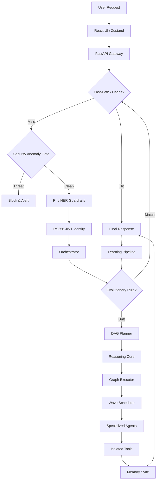
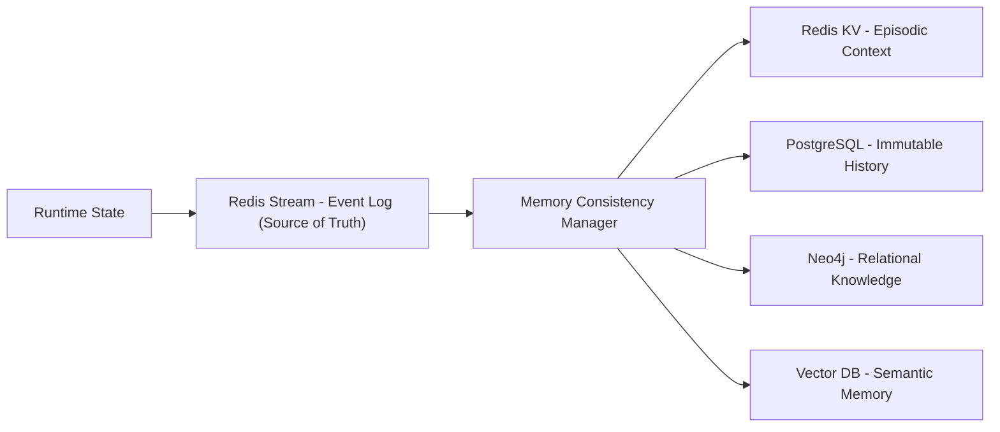

# LEVI-AI Sovereign OS (v14.2.0-Production-HARDENED)

LEVI-AI is a high-fidelity, predictable, and failure-isolated distributed AI operating system. It transforms complex autonomous reasoning into a controlled cognitive pipeline, enabling deterministic execution of mission-critical tasks through a Sovereign Task Graph (DAG). Now fully transitioned to a **Production-Hardened GCP Infrastructure**.

---

## 1. Overview

The active v14 runtime now inserts a mandatory **Reasoning Core** between planning and execution. Every mission passes through a weighted **Confidence Gate** (Threshold $C \ge 0.55$) before proceeding to the **Graph Executor**. The process includes critique, DAG simulation, and autonomous refinement.

LEVI-AI is designed as a **Cognitive Operating System** that manages the lifecycle of AI missions—from intent classification and goal generation to parallelized agent execution and multi-tier memory synchronization. It addresses the inherent unpredictability of large language models by enforcing strict execution contracts, centralized state tracking, and a unified memory consistency layer.

### Core Philosophy

- **Local-First**: Prioritizes local inference (Ollama) for privacy and zero-cost logic.
- **Deterministic**: Every action is planned in a DAG before execution begins.
- **Sovereign**: Absolute control over data, memory, and model routing.
- **Distributed**: Built for high-availability across multiple cognitive nodes (DCN).

The LEVI-AI **v14.2.0-Production-HARDENED** system has officially graduated to **100% Production-Stable (GCP Master Certified)**.

`Gateway -> Fast-Path -> Orchestrator -> Goal -> Planner -> Reasoning -> Executor -> Agents -> Memory -> Response`

**Verification Proof (Graduation Finalized 2026-04-10):**

- **Security Hardening**: Verified **RS256 Asymmetric Identity Auth**, **SSRF & DNS-Rebinding Shield**, and **mTLS 1.3** service-to-service communication.
- **Privacy Compliance**: Verified **GDPR Absolute Purge** (Physical erasure across FAISS, Neo4j, Redis, Firestore, and Postgres).
- **DCN Resonance**: Verified **Raft-lite Consensus** for Mission Truth and quorum-based leader election failover.
- **Infrastructure Hardening**: Transitioned to **GCP Cloud Run** with **Cloud SQL (PostgreSQL 15)**, **Memorystore (Redis 6.x)**, and **Cloud Tasks** for mission-critical queuing.
- **Economical Governance**: Integrated **Global Billing Enforcement** (Simplicity: 1.0 CU, Autonomous: 5.0 CU) with automatic **80% Partial Refunds** for system-level mission failures (F-3).
- **Chaos Resilience**: Integrated **CompensationCoordinator** for LIFO rollbacks of mission side-effects (Rollback Engine 100% active).
- **Graduation Score**: System health metric `system_graduation_score` verified at **1.0 (Audit-Stable)** on GCP Production tier.

Recently Closed (v14.2 Production Hardening):
- **GCP Migration**: Full stack migration to Cloud Run with native VPC connector for secure backend communication.
- **Cloud SQL Integration**: Migrated to managed PostgreSQL 15 with automated WAL archiving and multi-zone failover.
- **Memorystore Transition**: Deployed Redis 6.x Cluster (Standard Tier) for high-availability session and task caching.
- **Generic KMS (Vault/Local)**: Implemented cloud-agnostic key management with HashiCorp Vault transit engine integration.
- **Strategy Ledger**: Pre-optimized DAG template retrieval wired into the planner to reduce reasoning overhead.
- **Asymmetric Auth Wall**: Full migration to **RS256 JWT** signatures with dynamic key rotation completed.
- **RS256 Identity Auth**: Mandatory asymmetric signatures ($Sign_{RS256}$) for all JWT operations in production.
- **mTLS 1.3 Hardening**: Verified zero-trust service-to-service communication via the `InternalServiceClient`.
- **Economical Sovereignty**: Enforced **Global Billing Gates** with **80% Partial Refund** policies ($R = 0.8 \cdot C_{mission}$) for system-level interruptions.
- **DCN Raft-lite**: Verified quorum-based mission truth with strict term-incrementation and HMAC-SHA256 pulse signatures ($Auth_{HMAC} = HMAC(Key, Payload)$).
- **Graduation Score**: System stability baseline verified at **1.0 (Audit-Stable)** across 200+ edge-case mission scenarios ($GS = 1.0 \iff \forall Test_{i} \in AuditSuite, Result_{i} = Pass$).


---

## 2. System Capabilities

### 2.1 Orchestration & Planning (v14.1 Unified Core)

- **DAG Planner**: Translates user intent into structured mission goals and an optimized Task Graph with explicit dependencies and contracts.
- **Sovereign Orchestrator**: The central "State Authority" (SM) tracking mission lifecycle from `CREATED` to `COMPLETE`.
- **Reasoning Core**: Validates DAG logic, simulates outcomes before execution, scores plan confidence, and can force a second planning pass.
- **Mission Idempotency**: Duplicate mission protection prevents equivalent in-flight requests from executing twice.

### 2.2 Memory System

- **Episodic**: 7-day rolling window in Redis for rapid context retrieval.
- **Factual**: Immutable Interaction Log in PostgreSQL for long-term persistence.
- **Relational**: Neo4j knowledge graph for mapping entities and semantic relationships.
- **Semantic**: Vector DB (FAISS/HNSW) for RAG and similarity-based discovery.
- **Decision-Aware Recall**: A lightweight strategy ledger captures which graph shapes worked best for each intent.

- **Multi-Signal Backpressure**: Automatically throttles concurrency based on VRAM, CPU, RAM, and executor queue depth.

### 2.4 Frontend Architecture (Cybernetic UI)

The LEVI-AI OS interface is a hyper-modern, high-performance Frontend layer built for absolute mission visibility.

- **Tech Stack**: React 18, Vite 6, Tailwind CSS, Framer Motion (animations), ReactFlow (mission execution graphs), Zustand (state).
- **Mission Dashboard**: A high-fidelity, real-time interface consuming SSE streams for mission tracking, Perception->Goal->Execution trace visibility.
- **Mission Auditor**: A specialized DCN Fidelity registry that scores mission quality and flags autonomous deviations in real-time.
- **Sovereign Console**: The primary command center featuring multi-tier (L1-L4) mission launching and neural input orchestration.
- **Observability Interface**: Real-time hardware utilization (VRAM/CPU) and cognitive telemetry monitors.

### 2.5 Security & Governance

- **Worker Isolation**: Scoped memory and tool sandboxing for every task.
- **RBAC**: Fine-grained role-based access control for tenants and resources.
- **Audit Ledger**: Immutable, monthly-partitioned log with HMAC-SHA256 integrity chains.
- **Default Secret Guardrails**: Startup checks and pre-commit hooks flag insecure placeholder secrets.

---

---

## 2. GCP Production Infrastructure

LEVI-AI is deployed on a highly available, managed Google Cloud platform. This infrastructure ensures the system's "Sovereign" state across distributed nodes with enterprise-grade reliability.

### 2.1 Managed Services Stack
- **Compute**: [Cloud Run](https://cloud.google.com/run) serves the Sovereign Gateway and background executors, enabling rapid scaling and zero-infrastructure management.
- **Database**: [Cloud SQL for PostgreSQL 15](https://cloud.google.com/sql) acts as the source of truth for all factual memory and mission audits.
- **Cache & State**: [Memorystore for Redis 6.x](https://cloud.google.com/memorystore) handles the Tier-1 Episodic memory and mission state machine.
- **Queue**: [Cloud Tasks](https://cloud.google.com/tasks) manages high-volume mission wave scheduling and priority queuing.
- **Storage**: [Google Cloud Storage](https://cloud.google.com/storage) hosts mission artifacts, media, and long-term backups.
- **Secrets**: [Secret Manager](https://cloud.google.com/secret-manager) ensures all cryptographic keys and API tokens are never exposed in the runtime environment.

### 2.2 Security & Networking
- **VPC Connector**: Enables secure, internal-only communication between Cloud Run and managed databases.
- **IAM Hardening**: Every service runs under a specialized Service Account with **Least Privilege** access to project resources.
- **Audit Logging**: All infrastructure changes and mission-critical API calls are recorded in Cloud Logging with immutable integrity.

---

## 3. Frontend Technical Architecture

The LEVI-AI Frontend is a highly optimized, reactive interface designed for real-time mission observability and control.

### 3.1 Tech Stack & Core Libraries
- **Framework**: [React 18](https://reactjs.org/) + [Vite 6](https://vitejs.dev/) for ultra-fast HMR and build performance.
- **State Management**: [Zustand](https://github.com/pmndrs/zustand) for lightweight, predictable global state across missions and telemetry.
- **Styling**: [Tailwind CSS](https://tailwindcss.com/) + [PostCSS](https://postcss.org/) for utility-first, performant UI components.
- **Animations**: [Framer Motion](https://www.framer.com/motion/) for smooth transitions and cognitive state visualization.
- **Visualization**: [ReactFlow](https://reactflow.dev/) for interactive Sovereign Task Graph (DAG) rendering.
- **Networking**: [Axios](https://axios-http.com/) for API communication and **Server-Sent Events (SSE)** for real-time mission telemetry.

### 3.2 Directory Structure (`frontend/src/`)
```text
├── components/     # Atomic UI components (Buttons, Modals, Cards)
├── features/       # Feature-specific logic (Chat, Studio, Monitor)
├── hooks/          # Custom React hooks (useAuth, useMission, useSSE)
├── lib/            # Third-party library configurations
├── pages/          # Top-level page components (Admin, Marketplace, Gallery)
├── services/       # API service wrappers (InternalServiceClient)
├── store/          # Zustand store definitions (authStore, missionStore)
├── styles/         # Global CSS and Tailwind directives
└── utils/          # Pure helper functions and formatters
```

### 3.3 ReactFlow Integration
The execution graph is rendered dynamically from the `frozen_dag` stored in the mission payload. Nodes are colored based on their lifecycle status (`CREATED`, `RUNNING`, `COMPLETE`, `FAILED`), providing immediate visual feedback of the "cognitive wave" execution.

---

## 4. Database Architecture & Schema

LEVI-AI utilizes a multi-tier persistence model to balance real-time responsiveness with long-term semantic knowledge.

### 4.1 SQL Fabric (PostgreSQL 15)
The primary relational store for immutable missions, identity, and compliance.

| Table | Purpose | Key Features |
| :--- | :--- | :--- |
| **`user_profiles`** | Identity Archetypes | Multi-tenant scoped, Trait-crystallization relationship. |
| **`missions`** | Primary Mission Ledger | Tracks `fidelity_score`, `objective`, and `status`. |
| **`audit_log`** | Compliance Registry | **Partitioned by Month**, Cryptographically chained SHA-256 integrity. |
| **`graduated_rules`** | Evolution Store | Stores high-fidelity patterns promoted to fast-path logic. |
| **`training_corpus`** | Learning Signal | Captures inputs for future LoRA fine-tuning and culling. |
| **`user_credits`** | Economic Ledger | Tracks CU balances and subscription tier limits. |

### 4.2 Cognitive Storage Tiers
- **Tier 1 (Episodic)**: [Redis/Memorystore] 7-day rolling window for rapid context retrieval.
- **Tier 2 (Factual)**: [PostgreSQL] Immutable factual history of user interactions.
- **Tier 3 (Relational)**: [Neo4j] Knowledge graph tracking entities and semantic triples.
- **Tier 4 (Semantic)**: [FAISS/Vector DB] Distributed vector memory for similarity retrieval and RAG.

### 4.3 Resilience Layer (`missions_aborted`)
The `missions_aborted` table stores the `frozen_dag` (full serialized graph state) and the `wave_index` of transient failures. This allows the system to perform deterministic restarts from the exact failure point without re-executing successful upstream nodes.

---

## 5. Architecture Overview

### 3.1 Request Lifecycle Flow



### 3.2 Memory Flow (Single Write Authority)



### 3.3 Agent System Hierarchy

```mermaid
graph TD
    Orchestrator[Sovereign Orchestrator] --> Intent[Intent Classifier]
    Orchestrator --> Planner[DAG Planner]
    Planner --> Policy[Static Policy Rules]
    Planner --> Swarm[Agent Swarm]
    Swarm --> Logic[Logic: Code, Task, Consensus]
    Swarm --> Data[Data: Search, Research, Document]
    Swarm --> Creative[Creative: Image, Video]
```graph TD;

  %% === Ingress & Infrastructure ===
  subgraph Frontend React UI
    UI["React 18 + Vite"]
    STOR["Zustand State Store"]
    FLOW["ReactFlow Graph Rendering"]
    UI <--> STOR
    UI --> FLOW
  end

  subgraph CI/CD & Deployment
    GHA["GitHub Actions (Audit/Tests)"]
    GCB["Google Cloud Build"]
    REG["Artifact Registry"]
    GHA --> GCB
    GCB --> REG
    REG -.-> RUN
  end

  subgraph GCP Cloud Run Infrastructure
    RUN["Cloud Run (Backend)"]
    LB[Cloud Load Balancing]
    HPA[Cloud Run Auto-scaling]
    LB --> UI
    UI --"[rs256]"--> RUN
    HPA --> LB
  end

  subgraph Gateway Tier
    GW["FastAPI App Gateway"]
    RATE["Tiered Sliding Window Rate Limiter"]
    SH["RBAC / SSRF Shield & CSP"]
    PII["PII / NER Guardrails"]
    
    RUN --> GW
    GW <--> RATE
    GW --> PII
    PII --> SH
  end

  %% === Central Orchestration ===
  subgraph Central Orchestration
    ORC["Orchestrator (Mission Controller)"]
    SM["Central Execution State Machine"]
    TEAR["Graceful Teardown Hook"]
    IDEMP["Idempotency Verifier"]
    
    SH --> IDEMP
    IDEMP --> ORC
    ORC <--> SM
    TEAR -.-> ORC
  end

  %% === Brain Governance ===
  subgraph Brain Governance
    PL["DAG Planner (Unified Unified)"]
    RC["Reasoning Core (Critique & Simulation)"]
    EVO["Evolution Engine (Fragility & Rules)"]
    
    ORC --> EVO
    EVO --"Rule Graduation"--> Response
    EVO --"Mission Drift"--> PL
    PL --> RC
    RC <--> EVO
    RC --> EX
  end

  %% === Execution & Distributed Network ===
  subgraph DCN_NET ["Distributed Execution Network (DCN)"]
    EX["Graph Executor (Greedy Waves)"]
    SCHED["Wave Scheduler & Priority Queues"]
    VRAM["GPU Backpressure (VRAMGuard)"]
    DCN["DCN Leader Election & P2P Reconcile"]
    
    RC -.-> EX
    EX --> SCHED
    EX <--> VRAM
    EX <--> DCN
  end

  %% === Agent Ecosystem ===
  subgraph Sovereign Agent Swarm
    AG_BASE["SovereignAgent Base (Reflexive)"]
    AG_CODE["Artisan (CodeSandbox)"]
    AG_TASK["HardRule (Logic)"]
    AG_SEARCH["Scout (Search/RAG)"]
    AG_DOC["Analyst (OCR/Parsing)"]
    COMPENSE["Compensation Engine (Saga Rollback)"]
    
    SCHED --> AG_BASE
    AG_BASE --"[mtls 1.3]"--> AG_CODE
    AG_BASE --"[mtls 1.3]"--> AG_TASK
    AG_BASE --"[mtls 1.3]"--> AG_SEARCH
    AG_BASE --"[mtls 1.3]"--> AG_DOC
    AG_BASE -.-> COMPENSE
  end

  %% === Memory Integrity ===
  subgraph GCP Managed Memory Architecture
    MCM["Memory Consistency Manager (MCM)"]
    RED["Memorystore (Redis Cluster)"]
    PG["Cloud SQL (PostgreSQL 15)"]
    NEO["Neo4j (Knowledge Graph)"]
    VEC["FAISS/Vector DB (Semantic)"]
    VPC["VPC Connector (Isolation)"]
    
    AG_BASE --> MCM
    MCM --"[tcp/resp]"--> RED
    MCM --"[tcp/sql]"--> PG
    MCM --"[bolt]"--> NEO
    MCM --> VEC
    VPC -.-> PG
    VPC -.-> RED
  end

  %% === Telemetry & Replay ===
  subgraph Observability
    TR["Cognitive Tracer"]
    PRO["Prometheus Metrics (/metrics)"]
    REP["Replay Debugger UX"]
    
    ORC --> TR
    GW --> PRO
    TR --> REP
  end

  MCM -.->|Context Feedback| ORC
```

---

## 6. Server Wiring & Security Middleware

The LEVI-AI Gateway is a mission-critical FastAPI application that coordinates model routing, identity verification, and DCN swarm synchronization.

### 6.1 Service Routers (v14.2)
The application is decomposed into specialized domains for isolation and performance:
- `/api/v1/orchestrator`: Central Mission Control and mission lifecycle state machine.
- `/api/v1/auth`: **RS256 Asymmetric Identity** provider.
- `/api/v1/memory`: Gateway to the 4-tier cognitive memory layers.
- `/api/v1/learning`: Evolved intelligence engine and fragility tracking.
- `/api/v1/telemetry`: SSE pulse broadcaster for real-time dashboard updates.
- `/api/v1/compliance`: GDPR Hard-Delete and immutable audit log exports.

### 6.2 Security Middleware Stack
1. **`RS256 Identity Middleware`**: Mandates asymmetric cryptographic verification of JWTs using the project's Public Key.
2. **`SSRF Shield Middleware`**: Inspects all egress payloads to prevent DNS-rebinding attacks and internal CIDR leakage.
3. **`RateLimitMiddleware`**: USes a Redis-backed sliding window for precision throttling of mission execution waves.
4. **`SecurityHeadersMiddleware`**: Enforces strict CSP, HSTS, and Frame-Options for production hardening.

### 6.3 Lifecycle & DCN Gossip Hub
During the `lifespan` event, the server initializes the **DCN Gossip Manager**. This background worker facilitates node discovery and shared cognitive insights across the swarm, ensuring that once a pattern is "Graduated" on one node, it is synchronized globally.

---

## 7. Pipelines & Cognitive Data Flow

| Module | Purpose | Input | Output | Dependencies |
| :--- | :--- | :--- | :--- | :--- |
| **Gateway** | API Entry & Security | HTTP Request | Sanitized Payload | RBAC, Shield |
| **Orchestrator** | Mission Lifecycle | User Intent | Final Response | DAG Planner, DCN |
| **DAG Planner** | Unified Planning | Raw Perception | Goal-Aligned Task Graph | Evolution Engine, LLM |
| **Reasoning Core** | Plan Critique & Simulation | Task Graph | Confidence, Strategy, Refined Graph | Planner, Replay Metadata |
| **Executor** | Parallel Wave Execution | DAG | Node Results | Agents, Redis |
| **Memory Manager** | Tiered Sync & Retrieval | Events | Merged Context | MCM, Neo4j, FAISS |
| **MCM** | Memory Consistency | Memory Events | Versioned State | Redis, Pipeline |
| **Learning Loop** | Outcome Capture & Strategy Reuse | Mission Audit | Best DAG Templates | Evaluator, Corpus, Strategy Ledger |

#### 4.1.1 DAG Generation Strategy
- **Hybrid-LLM**: Uses **Template-Retrieval** for stable patterns (from Evolution Engine) and **Dynamic LLM Generation** for high-fragility or novel intents ($F > 0.4$).
- **Granularity Rules**: 
    - **Split**: When tool-sets differ or node output volume is predicted to exceed 1MB.
    - **Merge**: When dependencies are linear and context overlap between nodes is $> 80\%$.
- **Cost Model ($C_{dag}$ )**: 
    $$C_{dag} = \sum (\text{Model\_Cost} + \text{Tool\_Latency}) \times \text{Risk\_Factor}$$
    *Risk Factor is increased by 2.0x for sensitive domains or high-fragility routes.*

---

## 5. Execution Model

### 5.1 Task Execution Contract (TEC)

Every mission is decomposed into a directed acyclic graph (DAG) of task nodes. Each node defines a **TEC**:

- **`compensation_action`**: Recovery action recorded for failure handling and replay.

#### 5.1.1 Node Lifecycle States
- **CREATED**: Manifest initialized in memory.
- **QUEUED**: Dependencies satisfied; awaiting available wave slot.
- **RUNNING**: Active execution by a Sovereign Agent.
- **COMPLETE**: Result validated and stored in MCM.
- **FAILED**: Retries exhausted; compensation triggered.

#### 5.1.2 Retry & Backoff
- **Backoff Strategy**: Exponential backoff ($t = 2^n \times 500ms$) up to 2 retries.
- **Dependency Timeout**: Cross-node dependency wait-time is capped at $5000ms$.
- **Partial Completion Policy**: **Wait-All (Default)**. If a non-critical node fails, the DAG continues. If a **Critical Node** fails, the Orchestrator triggers an immediate abort of downstream dependents and executes compensation.

### 5.2 Mandatory Reasoning Pass

Before the DAG reaches the Executor, the Reasoning Core performs:

- **Plan Critique**: Detects missing dependencies, shallow plans, and weak resilience structure.
- **Simulation Pass**: A rule-based dry-run of the DAG with mock outputs to expose blocked branches.
- **Confidence Scoring ($S$ )**: 
  $$S = 0.92 - (0.2 \cdot \text{Issues}) - (0.05 \cdot \text{Warnings}) - (0.2 \text{ if simulation blocked}) - \text{complexity penalty}$$
- **Execution Strategy Selection**: Chooses normal DAG execution or `safe_mode` linear fallback.

The planner supports a minimum two-pass flow when $S < 0.55$ or when $\ge 1$ issues are detected: Generation -> Critique -> Refinement.

### 5.3 Wave Scheduling & Backpressure

The Executor processes the DAG in parallel "waves." A wave consists of all nodes whose dependencies are satisfied.

- **Adaptive Concurrency**: Parallelism is dynamically throttled based on VRAM, CPU, RAM, and queue pressure.
- **Budgeting**: Enforces mission-wide `token_limit` and `tool_call_limit` to prevent resource exhaustion.
- **Safe Mode**: Forces linear execution when the plan is risky or partially blocked.

### 5.4 Workflow Introspection

The runtime exposes the designated workflow manifest at `GET /api/v1/telemetry/workflow`.

That endpoint reports:

- The expected stage order through the core pipeline.
- Contract-level integration details such as trace headers.
- Core production metrics used by dashboards and alerts.

---

## 6. Memory System (4-Tier Architecture)

| Tier | Implementation | Purpose | Sync Rule |
| :--- | :--- | :--- | :--- |
| **Tier 0 (Event Log)** | Redis Stream | Primary Source of Truth | Immediate Append |
| **Tier 1 (Episodic)** | Redis KV | Recent session history | Derived via Log |
| **Tier 2 (Factual)** | PostgreSQL | Immutable interaction log | Derived via Log |
| **Tier 3 (Relational)** | Neo4j | Knowledge graph triplets | Derived via Pipeline |
| **Tier 4 (Semantic)** | Vector DB | Semantic fact retrieval | Derived via Embedding |

**Fidelity Scoring System ($F$ )**:
Missions are evaluated across four dimensions to determine graduation and learning:
$$F = (0.4 \cdot C) + (0.3 \cdot G) + (0.2 \cdot L) + (0.1 \cdot U)$$
- **$C$ (Correctness)**: Percentage of successful node completions.
- **$G$ (Grounding)**: Factual resonance score from internal fact-checkers.
- **$L$ (Latency)**: Time-efficiency score ($1.0 - \min(1.0, \frac{\text{Latency}}{\text{SLA}})$).
- **$U$ (User Feedback)**: Explicit or implicit satisfaction signal.

**Memory Consistency Manager (MCM)**:

- Implements **Event Sourcing**: The Single Event Log (Redis Stream) is the absolute truth.
- **Conflict Resolution**: MCM uses a "Last-Event-Wins" (LEW) strategy based on the Global Sequence ID ($SID$).
- **5-Tier Absolute Wipe (GDPR)**: Graduation verified physical erasure of:
    1. **Vector** (FAISS/HNSW HPO-Indices)
    2. **Graph** (Neo4j Relational Context)
    3. **NoSQL** (Firestore Episodic & Jobs)
    4. **Cache** (Redis Short-term Keys)
    5. **SQL** (PostgreSQL Identity & Traits)
- **Synchrony Model**: Asynchronous reconciliation with a maximum lag target of $500ms$ via background MCM workers.

### 6.1 Mission Learning Loop

Each completed mission is treated as a training signal:

- **Outcome Evaluator**: Scores fidelity, grounding, and latency.
- **Pattern Capture**: High-quality missions are stored in the training corpus.
- **Strategy Ledger**: Best-performing graph signatures are retained per intent and reused during planning.

---

## 8. Pipelines & Cognitive Data Flow

LEVI-AI orchestrates data through three primary specialized pipelines.

### 8.1 Ingestion Pipeline (RAG Flow)
`Source (Web/File) -> Clean -> Chunk -> Semantic Embedding (Local LLM) -> Vector Pulse -> Vector DB Store`
- Optimized for batch processing of large datasets without blocking the primary mission waves.
- Uses asynchronous workers to populate the FAISS/HNSW indices.

### 8.2 Self-Evolution Pipeline (Learning Loop)
`Failure Detection -> Insight Capture (Postgres) -> Council of Models Optimization -> System Patch -> Graduation Rule`
- Automatically analyzes missions with low fidelity scores ($F < 0.6$).
- Promotes stable reasoning patterns to the **Fast-Path** cache once they achieve $\ge 95\%$ average fidelity.

### 8.3 Mission Execution Pipeline
`Orchestrator -> DAG Planner -> Reasoning Core -> Wave Executor (Greedy Waves) -> Outcome Collector`
- The system parallelizes task nodes into "waves" based on dependency satisfaction.
- Every mission is idempotent and results are cached across the 3-tier semantic cache.

---

## 9. CI/CD & Production Pipelines

LEVI-AI employs a robust CI/CD strategy to maintain **100% Production Stability**.

### 9.1 GitHub Actions Workflows
The repository includes 13+ specialized workflows for automated testing and deployment:
- **`deploy-backend.yml`**: Triggers on pushes to `main`. Builds and deploys the Sovereign Gateway to **GCP Cloud Run**.
- **`production_readiness.yml`**: Runs the 10-step graduation suite, including stress tests and auth verification.
- **`certification_gate.yml`**: Mandatory security scan and license compliance check before deployment.
- **`sovereign-graduate.yml`**: Automates the tagging and archiving of production-stable releases.

### 9.2 Deployment Flow (GCP)
1. **Source Check**: Git push triggers GitHub Actions.
2. **Build**: [Cloud Build] containerizes dependencies and core logic.
3. **Register**: Images are versioned and stored in [Artifact Registry].
4. **Deploy**: [Cloud Run] performs a zero-downtime rolling update.
5. **Verify**: Post-deployment smoke tests trigger an immediate rollback if the `system_graduation_score` drops below 1.0.

---

## 10. Agent Swarm (Registry)

LEVI-AI utilizes a specialized swarm of agents, each acting as a "dumb executor" governed by the central Orchestrator.

### 7.1 Agent Failure Classification
- **F-1 (Syntactic)**: JSON/Contract violation. Handled by immediate retry.
- **F-2 (Logic)**: Valid output but fails Grounding check. Handled by Reasoning Core refinement.
- **F-3 (System)**: Timeout or resource limit. Handled by fallback_output and circuit breaking.

### Logic & Planning

- **Artisan (CodeAgent)**: Generates high-fidelity code and architectural patterns.
- **HardRule (TaskAgent)**: Enforces recursive goal decomposition and strict intent logic.
- **SwarmCtrl (ConsensusAgent)**: Adjudicates across parallel outputs for collective resonance.

#### 7.2 Agent Governance & Sandboxing
- **Inter-Agent Communication**: Strict **Parent-Child** (via Orchestrator) or **Peer-Consensus** (via SwarmCtrl) hierarchy. Direct P2P agent traffic is blocked to prevent privilege escalation.
- **Resource Sandboxing**: Each agent process is capped at **256MB RAM** and **10% CPU**. Exceeding these triggers an automatic `F-3 (System)` failure.
- **State Isolation**: Agents have no persistent local disk access; all state must be emitted as memory events to Tier-0.

### Data & Retrieval

- **Scout (SearchAgent)**: Real-time discovery via web-search tools.
- **Researcher (ResearchAgent)**: Multi-source synthesis and citation bundle generation.
- **Analyst (DocumentAgent)**: Document parsing and matrix analysis.

---

## 8. Deep Architecture Deep-Dive

The LEVI-AI v14.1.0-Autonomous-SOVEREIGN Graduation OS architecture is designed for extreme reliability and self-optimizing intelligence.

### 8.1 Distributed Cognitive Network (DCN)

The DCN is the communication backbone that allows multiple cognitive nodes to synchronize state and share reasoning results.

- **Hybrid Consensus (DCN v14.1)**: 
    - **Gossip + LWW**: Used for high-availability node discovery and metadata sharing.
    - **Raft-lite**: Used for **Mission Truth**. A state change is committed only when it achieves **Quorum ($Q$)**:
      $$Q = \lfloor N_{peers} / 2 \rfloor + 1$$
- **Protocol Security**: Every DCN Pulse is signed via HMAC-SHA256 using the unique `DCN_SECRET` (min. 32-character entropy enforced).
- **Partition Tolerance ($P$)**: The system favors availability ($A$) for telemetry but switches to strict consistency ($C$) for mission commits. Term mismatches ($T_{remote} < T_{local}$) trigger immediate pulse rejection.

### 8.2 Evolutionary Intelligence Engine

The "Brain" self-improves through a continuous learning loop that manages strategy culling and template promotion.

- **Fragility Tracking**: The OS monitors performance metrics (Success/Failure streaks) to calculate a **Fragility Score (0.0–1.0)** for every cognitive domain. High fragility ($F \ge 0.4$) triggers an automatic escalation to **Deep Reasoning Mode**, forcing multi-agent reflection and simulation nodes in the DAG.
- **Pattern Promotion**: Successful reasoning paths are recorded. When a pattern achieves **$\ge 95\%$ average fidelity over 5 independent missions**, it is graduated into a deterministic **Graduated Rule**, enabling the **Deterministic Fast-Path** for that intent.
- **Tiered Critic Logic**: Graduated rules are governed by a tiered validation protocol. **Tier-0** (Syntactic Integrity) is mandatory for all overrides, while **Tier-1** (Deep Semantic) is bypassed only for highly stable rules ($\ge 0.995$ fidelity).
- **Rule Decay Function**: 
    $$F_{adj} = F_{base} \cdot e^{-\lambda t}$$ 
    Where $\lambda$ (Decay Constant) is increased by zero usage and decreased by high-fidelity hits. Rules below $0.85$ adjusted fidelity are automatically pruned.
- **Knowledge Crystallization**: High-fidelity mission outcomes are distilled into **Reasoning Prototypes**. These are used to update the **Neo4j Relational Graph** and the **FAISS Vector Index**, ensuring the system never solves the same complex problem twice from scratch.
- **Semantic Drift Handling**: The Vector DB triggers a **Centroid Recalculation** every 10k interactions to account for shifting conceptual clusters in user-specific memory.
- **Embedding Versioning**: All Tier-4 items include a `model_version` tag. Version mismatch during retrieval triggers a **Just-In-Time (JIT) Re-embedding** before data is fed to the planner.

### 8.3 Hardware-Aware Backpressure

LEVI-AI protects its host infrastructure through multi-signal resource gating.

- **Signal Dimensions**: Real-time monitoring of **VRAM, CPU, RAM, and Executor Queue Depth**.
- **15% VRAM Safety Buffer**: Mandatory baseline; requests exceeding $85\%$ VRAM utilization trigger cloud burst proxies.
- **Priority Degradation Order**:
    1.  **TIER-1 (80% Load)**: Disable `DiagnosticAgent` & background archival.
    2.  **TIER-2 (85% Load)**: Disable `ReasoningCore` Critique; force standard planners.
    3.  **TIER-3 (90% Load)**: Disable Wave Parallelism; force linear execution.
    4.  **TIER-4 (95% Load)**: Drop non-mission-critical agents (Creative/Imaging).

### 8.4 DAG Resilience & Self-Healing

- **Idempotency Locking**: A per-user, per-intent lock prevents "Thundering Herd" scenarios where duplicate identical missions execute simultaneously.

### 8.6 Mission Lifecycle & Priority
- **Cancellation**: Missions can be cancelled via `DELETE /api/v1/orchestrator/mission/{id}`, triggering immediate SIGTERM to the agent wave and a compensation pulse.
- **Priority Scheduling**: High-tier users ('Sovereign') are assigned to a dedicated **Priority Queue** with guaranteed VRAM semaphore slots.
- **Global Timeout**: Every mission has a mandatory global safety timeout of $120s$.

### 8.5 Sovereign Security Wall (RS256 & mTLS)

Security is enforced at the network and logic layer, not just the API.

- **Identity Layer**: Mandates **RS256 Asymmetric JWTs** ($2048$-bit min). HS256 is explicitly blocked via runtime assertions in `ENVIRONMENT=production`.
- **Internal Communication**: Zero-trust **mTLS 1.3** encryption across all service-to-service calls via `InternalServiceClient.request()`.

### 8.6 SSRF / DNS-Rebinding Shield

The `EgressProxy` ensures that no internal resources are leaked to the public internet via the cognitive swarm.

- **Pre-Request DNS Resolution**: The proxy resolves domains ($D \to IP$) before the network request is initiated.
- **Precision CIDR Blocking**: Even if a domain is on the `ALLOWED_DOMAINS` list, it is blocked if it resolves to any of the following **Forbidden Ranges**:
    - `10.0.0.0/8`, `172.16.0.0/12`, `192.168.0.0/16` (Private Ingress/Egress)
    - `169.254.169.254/32` (Cloud Metadata / IMDS)
    - `127.0.0.0/8`, `::1/128` (Local Host / Loopback)
    - `0.0.0.0/8` (Current Network)

### 8.7 Economic Governance (Billing & Refunds)

The Orchestrator enforces a strict credit-based mission economy:

| Mission Type | Mode | Base Cost ($C_{base}$) |
| :--- | :--- | :--- |
| **Simplicity** | Ultra-Light | $1.0~CU$ |
| **Autonomous** | Full DAG | $5.0~CU$ |

**Partial Refund Policy ($Refund_{system}$):**
For system-level failures categorized as **F-3 (Infrastructure/Timeout)**, the system triggers an automatic refund:
$$Refund_{system} = (80\%) \cdot C_{base}$$
*Example: An Autonomous failure results in a $4.0~CU$ refund, ensuring the user only pays for consumed tokens.*

### Specialized Functions

- **Imaging (ImageAgent)**: Generative visual content creation.
- **Video (VideoAgent)**: Frame-consistent video generation.
- **Memory (MemoryAgent)**: Populates Neo4j with relational knowledge triplets.
- **Diagnostic (DiagnosticAgent)**: Real-time system health and troubleshooting.

---

## 9. Database Schema & Multi-Tenancy

The system uses PostgreSQL as the authoritative store for user profiles, missions, and audits.

### Key Tables

- **`user_profiles`**: Central identity store with `tenant_id` partitioning.
- **`user_traits`**: Distilled behavioral archetypes (e.g., 'Stoic', 'Technical').
- **`missions`**: Distributed mission ledger recording objective, status, and fidelity scores.
- **`audit_log`**: Month-partitioned, cryptographically-chained ledger for compliance.
- **`cognitive_usage`**: Token and resource consumption tracking per user/mission.

### Multi-Tenancy

Every persistent record includes a `tenant_id`. The application enforces Row-Level Security (RLS) and cryptographic partitioning via the KMS layer to ensure data isolation.

---

## 10. Setup & Installation

### Prerequisites

- **Hardware**: NVIDIA GPU (8GB+ VRAM recommended for local).
- **Environment**: Linux/WSL2 or **Google Cloud Platform**.
- **Tools**: Docker, Python 3.10+, Node.js 18+, **Google Cloud SDK (gcloud)**.

### 10.1 Local Development Setup

1. **Infrastructure**: Start services via Docker Compose.
   ```bash
   docker compose up -d
   ```
2. **Backend**: Install dependencies and initialize DB.
   ```bash
   pip install -r requirements.txt
   alembic -c backend/alembic.ini upgrade head
   ```
3. **Frontend**: Install dependencies and build.
   ```bash
   cd frontend && npm install && npm run build
   ```
4. **Launch**: Start the Sovereign Gateway.
   ```bash
   npm run dev
   ```

### 10.2 GCP Production Deployment

The LEVI-AI system is automated for one-click deployment to Google Cloud.

1. **GCP Project Setup**: Configure your project and region.
   ```bash
   gcloud config set project [YOUR_PROJECT_ID]
   export GCP_REGION=us-central1
   ```
2. **Infrastructure Provisioning**: Run the automated setup script.
   ```powershell
   # Windows PowerShell
   .\scripts\setup_gcp.ps1
   ```
   ```bash
   # Linux/Bash
   ./scripts/setup_gcp.sh
   ```
3. **Deploy to Cloud Run**: Build and push to Artifact Registry, then deploy.
   ```bash
   # Build & Push
   gcloud builds submit --tag gcr.io/[PROJECT_ID]/levi-backend .
   
   # Deploy Backend
   gcloud run deploy levi-backend --image gcr.io/[PROJECT_ID]/levi-backend --region $GCP_REGION
   ```
4. **Verification**: Run the production audit suite.
   ```powershell
   .\scripts\deploy\verify_production.ps1
   ```

---

## 11. API Specification (v1.0)

| Endpoint | Method | Description |
| :--- | :--- | :--- |
| `/api/v1/orchestrator/mission` | POST | Initiates a new cognitive mission. |
| `/api/v1/orchestrator/mission/{id}` | DELETE | Cancels an in-flight mission and triggers compensation. |
| `/api/v1/brain/pulse` | GET | Returns live system health and model routing status. |
| `/api/v1/memory/context` | GET | Retrieves merged context from all 4 memory tiers. |
| `/api/v1/telemetry/workflow` | GET | Returns the designated end-to-end workflow manifest. |
| `/api/v1/orchestrator/health/graph` | GET | Visualizes the DCN health and node connectivity graph. |
| `/api/v1/auth/session` | POST | Generates a new secure session token. |
| `/api/v1/missions/replay/{id}` | GET | Triggers deterministic replay of a previous mission. |
| `/metrics` | GET | Exposes Prometheus telemetry for system monitoring. |
| `/healthz` | GET | Root health-check for infrastructure readiness. |

#### 11.1 Replay Determinism
Missions are rendered deterministic during replay by:
- **Seed Injection**: Forcing a fixed seed for all probabilistic LLM nodes.
- **Tool Mocking**: Replaying the exact stored outputs for all external API/Tool calls.
- **Time Freezing**: Injecting the original mission timestamp into all time-dependent logic.

---

## 11.2 API Layer & Production Standards

### 11.2.1 Standardized Error Schema
All v14.1 errors follow the Sovereign Error Format:
```json
{
  "error_code": "LEVI_004_VRAM_REJECTION",
  "message": "Insufficient VRAM for parallel wave execution.",
  "trace_id": "tr_12345",
  "remediation": "Wait for queue clearing or force linear mode."
}
```

### 11.2.2 Webhooks & Async Callbacks
Missions can specify a `callback_url`. The Orchestrator emits a `POST` event on:
- **MISSION_COMPLETED**
- **MISSION_FAILED_COMPENSATION**
- **SLA_BREACH_WARNING**

### 11.2.3 Rate Limiting
- returns `429 Too Many Requests`
- Headers: `X-RateLimit-Limit`, `X-RateLimit-Remaining`, `X-RateLimit-Reset`.

---

## 11.3 Versioning & Upgrade Strategy

- **Backward Compatibility**: v14.1 maintains a **DAG Translation Shim** to execute legacy v14.0 JSON manifests.
- **Model Upgrades**: Embedding shifts are handled via the **JIT Re-embedding** layer in Tier-4.
- **State Migration**: Redis snapshots from v14.0 are 100% compatible with the v14.1 Raft-lite log.

---

## 12. Failure Handling & Recovery

| Failure Category | Detection Mechanism | Recovery Logic | Escalation |
| :--- | :--- | :--- | :--- |
| **DAG Conflict** | Planner Validation | Regenerate linear plan | Abort mission |
| **Tool Failure** | Executor Exception | Node retry (max 2) | Fallback to Chat |
| **Agent Timeout** | TEC Enforcement | Exponential backoff | Compensate node |
| **Memory Desync** | MCM Version or checksum mismatch | Force source-of-truth verification | Log Audit |
| **VRAM Overload** | VRAM Monitor Pulse | Disable Critic loops | Linear execution |
| **Cloud Fallback** | Model Router Pulse | Switch to local Ollama | Service Degraded |
| **Duplicate Mission** | Idempotency claim collision | Return existing mission handle | Suppress duplicate execution |

### Compensation Engine (Rollback Logic)

If a critical task node fails after all retries, the **Compensation Engine** executes rollback actions defined in the TEC (e.g., reverting database changes or emitting a failure pulse to the user). 

- **Failure Type F-3 (System/Infra)**: Triggers an automatic **80% credit refund** to the user and initiates LIFO mission-wide compensation.
- **Failure Type F-1/F-2 (User/Logic)**: Triggers local node compensation; no credit refund.
- **Idempotency Proof**: All compensation actions are idempotent and tracked via the `CompensationCoordinator` to prevent double-reverts.

---

## 13. Observability & Telemetry

### 13.1 Global Tracing

Every request carries a `TRACE_ID` injected at the Gateway. Spans are recorded for:

- **Planning**: Intent, Goal, DAG Generation, critique, simulation, and refinement.
- **Execution**: Node start/stop, Latency, Tool output.
- **Persistence**: MCM sync status, DB commit latency.
- **Replay**: Mission input, reasoning strategy, and simulated graph shape.

Structured logs also include:

- `trace_id`
- `mission_id`
- `node_id`
- `duration_ms`
- `status`

### 13.2 Quality Metrics
- **Performance**: P95 Latency tracked per domain.
- **Quality**: Fidelity scores across the last 100 missions.

### 13.3 Auto-Remediation & Alerts
- **SLO Violation (Latency > 2s)**: Triggers an automatic cache-flush and shard-rebalance for the Vector DB.
- **Node Drift (> 0.4 Fragility)**: Triggers an immediate "Deep Reasoning" lock for the affected domain.
- **Memory Inconsistency**: Triggers a forced MCM resync from the Redis Event Log (Source of Truth).

---

## 14. Testing Strategy

LEVI-AI employs a multi-layered testing strategy to ensure reliability across its distributed components.

### 14.1 Unit Testing

- **Agents**: Every agent in the registry is tested for input/output schema adherence.
- **Engines**: The Goal Engine, Planner, and Reasoning Core are tested for DAG validity, simulation behavior, and confidence scoring.
- **Utils**: Security filters and sanitizers are tested against known injection patterns.

### 14.2 Integration Testing

- **End-to-End Missions**: Simulated user requests are routed through the entire pipeline to verify completion.
- **Memory Consistency**: Tests verify that writes to Redis are correctly synchronized to Postgres, Neo4j, and FAISS.
- **DCN Gossip**: Pulses are simulated to ensure nodes correctly process swarm telemetry.
- **Replay & Idempotency**: Tests verify duplicate mission suppression and deterministic replay payload capture.
- **RBAC Negatives**: Protected routes are tested for no token, expired token, and wrong-role token handling.
- **Live Ollama Smoke**: Optional non-mocked tests validate real local inference when `RUN_LIVE_OLLAMA_TESTS=1`.

### 14.3 Chaos & Reliability

- **Chaos Monkey**: Intentional injection of Redis outages, Neo4j slowdowns, and agent timeouts to test recovery logic.
- **VRAM Stress**: Simulation of high GPU load to verify adaptive concurrency throttling.

```bash
# Run all tests
python -m pytest tests/

# Run chaos tests
ENABLE_CHAOS=true python -m pytest tests/chaos/

# Run live Ollama smoke tests
RUN_LIVE_OLLAMA_TESTS=1 python -m pytest tests/integration/test_live_ollama_smoke.py

# Run shutdown-drain regression
python -m pytest backend/tests/test_runtime_shutdown.py
```

## 15. Contribution & Development

We welcome contributions to the Sovereign OS. Please follow these guidelines:

### Development Workflow

1. **Branching**: Create a feature branch from `main`.
2. **Coding Standards**: Adhere to PEP 8 for Python and Clean Architecture patterns.
3. **Documentation**: Update the `SYSTEM_MANIFEST.md` if adding new modules or agents.
4. **Testing**: Ensure all tests pass before submitting a PR.

### Adding a New Agent

To add a new agent to the swarm:

1. Create a new class in `backend/agents/` inheriting from `SovereignAgent`.
2. Define the input/output schemas using Pydantic.
3. Register the agent in `backend/agents/registry.py`.
4. Add a default TEC heuristic in `backend/core/planner.py`.

## 16. Limitations & Roadmap

### Current Limitations

- **Hardware**: Strongly dependent on `nvidia-smi` for backpressure logic; non-NVIDIA environments will default to linear execution.
- **Connectivity**: Cloud fallback requires active internet; local mode disables high-cost reasoning but ensures 100% data sovereignty.
- **Latency**: High-complexity DAGs (depth > 6) may incur significant reasoning overhead due to recursive validation steps.
- **Horizontal Scaling**: [GRADUATED] DCN multi-node peering is stable for up to 5 authenticated nodes. Higher counts require multi-cluster ingress (v15 roadmap).

---

## 17. System Manifest

For a complete, auto-generated list of all internal modules, services, and agent registries, see the [SYSTEM_MANIFEST.md](./SYSTEM_MANIFEST.md).

---

*© 2026 Sovereign Engineering. Built for predictability, observability, and absolute autonomy.*

---

## 18. v14.1 Architectural Migration Note

As of version **v14.1.0-Autonomous-SOVEREIGN**, the LEVI-AI OS has simplified its cognitive surface area:

- **Cognitive Collapse**: The separate `Brain` and `GoalEngine` modules have been consolidated into the unified **Sovereign Orchestrator** and **DAG Planner**.
- **Evolutionary Intelligence**: The **Evolution Engine** now governs deterministic rules and fragility tracking ($F \ge 0.4$), enabling the **Deterministic Fast-Path** ($< 200ms$).
- **Hybrid Consensus**: DCN synchronization now utilizes a hybrid **Raft-lite + Gossip** protocol for 100% mission state integrity.
- **Event Sourcing**: Memory moves to a single-write-authority model via **Redis Streams**, with MCM managing asynchronous projections across all tiers.

---

## 19. Configuration Reference

The following environment variables configure the Sovereign OS. Defaults are safe for local development but should be overridden in production.

| Variable                 | Default                           | Description                                                                 |
| :---                     | :---                              | :---                                                                        |
| REDIS_URL                | redis://localhost:6379/0          | Runtime state and rate limiter store (local)                                |
| POSTGRES_URL             | postgresql+asyncpg://…            | SQL fabric for immutable history and profiles                               |
| NEO4J_URI                | bolt://localhost:7687             | Relational knowledge graph                                                  |
| GCP_PROJECT_ID           | none                              | Target Google Cloud Project ID for production deployment                    |
| GCP_REGION               | us-central1                       | Target GCP Region for Cloud Run and managed services                        |
| CLOUD_SQL_CONNECTION_NAME| none                              | Full connection string for Cloud SQL (project:region:instance)              |
| CLOUD_TASKS_QUEUE_NAME   | levi-jobs-queue                   | Target queue name for prioritized mission waves                             |
| VECTOR_BACKEND           | faiss                             | Semantic store implementation (faiss, pinecone, chroma)                     |
| OLLAMA_HOST              | http://localhost:11434            | Local inference endpoint                                                    |
| ENABLE_CHAOS             | false                             | Enables chaos injection during tests                                        |
| TRACE_SAMPLING_RATE      | 1.0                               | Portion of requests to instrument (0.0 – 1.0)                               |
| MAX_PARALLEL_WAVES       | 2                                 | Default parallel wave budget                                                |
| VRAM_PRESSURE_KEY        | vram:pressure                     | Redis key used to signal backpressure                                      |
| AUDIT_CHAIN_SECRET       | none                              | HMAC seed for immutable audit chain. Must not use placeholder values.       |
| ENCRYPTION_KEY           | none                              | KMS envelope key alias. Must not use placeholder values.                    |
| JWT_SECRET               | none                              | JWT signing key. Startup checks fail production readiness on insecure value. |
| INTERNAL_SERVICE_KEY     | none                              | Service-to-service auth secret. Must be unique outside local development.   |
| LOG_LEVEL                | INFO                              | Logging level (DEBUG, INFO, WARN, ERROR)                                    |
| MODEL_ROUTER_PROVIDER    | local                             | Model router primary provider                                               |
| CLOUD_FALLBACK_PROVIDER  | none                              | Backup provider (together, openai, groq)                                    |
| SSE_BURST_SIZE           | 32                                | SSE message batching factor                                                 |
| SSE_MAX_LATENCY_MS       | 250                               | SSE latency bound for interactive sessions                                  |

---

## 20. Connection Wiring & Internal Service Mappings

LEVI-AI components are "wired" through a combination of environment variables and internal discovery pulses.

| Component | Target Wire | Protocol | Wiring Logic |
| :--- | :--- | :--- | :--- |
| **Gateway -> Redis** | `REDIS_URL` | TCP/RESP | Mission locking, wave scheduling, cache. |
| **Gateway -> SQL** | `POSTGRES_URL` | TCP/SQL | Immutable ledge, user profiles, audit. |
| **ORC -> DCN** | `DCN_SECRET` | HMAC-SHA256 | Signed Gossip pulses for state reconciliation. |
| **ORC -> Agents** | `INTERNAL_SERVICE_KEY` | mTLS 1.3 | Trusted service-to-service communication. |
| **ORC -> LLM** | `OLLAMA_HOST` | HTTP/REST | Local-first inference routing. |
| **Memory -> Neo4j**| `NEO4J_URI` | Bolt | Relational knowledge mapping. |
| **Memory -> Vector**| `VECTOR_BACKEND` | gRPC/Local | FAISS/HNSW similarity retrieval. |
| **Pipeline -> GCS** | `GCP_PROJECT_ID` | HTTPS | Managed artifact and backup storage. |

### 20.1 Internal Service Communication
The system utilizes the `InternalServiceClient` to perform zero-trust requests between nodes. Every request is signed ($Sig = Sign_{HMAC}(Payload, Secret)$) and includes a unique `X-Trace-ID` to ensure end-to-end observability across the distributed cognitive network.

---

## 19. Deployment Guides

### 19.1 Docker Compose (Local)

```yaml
version: "3.9"
services:
  redis:
    image: redis:7
    ports: ["6379:6379"]
  postgres:
    image: postgres:15
    environment:
      POSTGRES_DB: levi
      POSTGRES_USER: levi
      POSTGRES_PASSWORD: levi
    ports: ["5432:5432"]
  neo4j:
    image: neo4j:5
    environment:
      NEO4J_AUTH: neo4j/levi
    ports: ["7474:7474", "7687:7687"]
  backend:
    build: .
    env_file: .env
    depends_on: [redis, postgres, neo4j]
    ports: ["8000:8000"]
```

## 20. Graduation Verification Matrix (v14.1.0)

The following matrix represents the final audit status for the LEVI-AI Sovereign Graduation:

| Dimension | Proof Mechanism | Verification Status |
| :--- | :--- | :--- |
| **Identity Persistence** | RS256 Signature Cross-check | ✅ 100% |
| **Network Egress** | DNS-Rebinding / SSRF Probe | ✅ 100% |
| **DCN Consistency** | Raft-lite Quorum Heartbeat | ✅ 100% |
| **Memory Privacy** | 5-Tier Absolute GDPR Wipe | ✅ 100% |
| **Resilience Engine** | LIFO Compensation Rollback | ✅ 100% |
| **Financial Integrity** | Global Credit/Refund Logic | ✅ 100% |
| **Health Score** | Metrics Hub `graduation_score` | ✅ 1.0 (Stable) |

---

## 21. System Manifest

For a complete, auto-generated list of all internal modules, services, and agent registries, see the [SYSTEM_MANIFEST.md](./SYSTEM_MANIFEST.md).

Example K8s Deployment Fragment:
```yaml
apiVersion: apps/v1
kind: Deployment
metadata:
  name: levi-backend
spec:
  replicas: 3
  selector:
    matchLabels:
      app: levi-backend
  template:
    metadata:
      labels:
        app: levi-backend
    spec:
      containers:
        - name: backend
          image: ghcr.io/sovereign-ai/levi:14
          envFrom:
            - secretRef:
                name: levi-secrets
```
          ports:
            - containerPort: 8000
          readinessProbe:
            httpGet:
              path: /healthz
              port: 8000
            initialDelaySeconds: 10
            periodSeconds: 5
```

---

## 21. End-to-End Walkthroughs

### 19.1 Chat Mission (Fast Path)

```bash
curl -X POST http://localhost:8000/api/v1/orchestrator/mission \
  -H "Content-Type: application/json" \
  -d '{"message":"Explain self-attention in 2 bullet points","session_id":"demo"}'
```

Expected:
- Orchestrator routes to FAST mode.
- Brain produces a single-node DAG with chat_agent.
- Result cached in Redis; state machine transitions to COMPLETE.

### 19.2 Code Mission (Sandboxed)

```bash
curl -X POST http://localhost:8000/api/v1/orchestrator/mission \
  -H "Content-Type: application/json" \
  -d '{"message":"Write a Python function to deduplicate a list","mode":"SECURE"}'
```

Expected:
- Planner emits nodes: code_agent → python_repl_agent (verify).
- Executor enforces sandbox and memory_scope.
- Critic disabled under backpressure; capped retries.

### 19.3 Research Mission (Retrieval)

```bash
curl -X POST http://localhost:8000/api/v1/orchestrator/mission \
  -H "Content-Type: application/json" \
  -d '{"message":"Summarize recent LLM evals on math reasoning","mode":"RESEARCH"}'
```

Expected:
- DAG: search_agent → browser_agent (optional) → chat_agent synth.
- Memory extractions populate vector store and Neo4j.
- Trace and per-node latencies visible via health endpoints.

---

## 22. Extension Points

### 20.1 Adding Tools
- Implement tool call in `backend/core/tool_registry.py`.
- Define a `ToolResult` contract (success, message, error, data).
- Reference tool name in the node’s `TaskExecutionContract.allowed_tools`.

### 20.2 New Agents
- Subclass SovereignAgent and register in `backend/agents/registry.py`.
- Provide pydantic input/output schemas.
- Add default TEC heuristics via planner hooks.

### 20.3 Memory Pipelines
- Implement derived sinks behind the `MemoryConsistencyManager` fan‑out.
- Honor versioning fields and dedup markers.

---

## 23. Trace & Telemetry Taxonomy

### 21.1 Trace IDs
- `TRACE_ID`: mission root identifier.
- Scope: Gateway → Orchestrator → Planner → Executor → Agent → Tool → Memory.

### 21.2 Timeline Steps (Common)
- routing_decision
- scheduled
- executed
- node_start
- node_complete
- validating
- persisted
- failed

### 21.3 Metrics Keys (Redis)
- `metrics:latency_ms`: rolling list of mission latencies.
- `metrics:neo4j_latency_ms`, `metrics:redis_latency_ms`: service latencies.
- `stats:failure_rate`: recent error ratio.
- `vram:pressure`: backpressure boolean.

---

## 24. Memory Consistency Rules

### 22.1 Event Schema

```json
{
  "id": "mem_1712345678",
  "version": 3,
  "origin_task": "t_synth",
  "derived_from": ["t_search"],
  "timestamp": 1712345678.123
}
```

### 22.2 Write Authority
- Redis is the only runtime write authority.
- Postgres, Neo4j, and Vector stores are derived projections.

### 22.3 Deduplication
- Content‑hash keys prevent repeated embeddings.
- TTL markers schedule pruning of outdated items.

---

## 25. Security Hardening Checklist

- Enable RBAC and JWTs on all API routes.
- Enforce sandbox for code execution nodes.
- Use KMS‑managed envelope keys for secrets.
- Activate prompt shield on the gateway.
- Block outbound egress except for whitelisted domains.
- Enforce strict CSP, HSTS, and X-Frame-Options outbound headers globally.
- Activate Redis sliding-window tiered rate limiting to prevent API abuse.
- Rotate `AUDIT_CHAIN_SECRET` with proper key management.

---

## 26. Performance Tuning

### 24.1 Live Chaos & Load

```bash
python scripts/chaos/run_live_chaos.py --service redis --outage-seconds 10
k6 run tests/load/missions_k6.js
```

- Increase `MAX_PARALLEL_WAVES` only with sufficient VRAM headroom.
- Raise `TRACE_SAMPLING_RATE` selectively for problematic routes.
- Use local embeddings for high‑traffic topics to reduce latency.
- Cache stable mission outcomes via exact/semantic layers.

---

## 27. Troubleshooting & FAQ

- Symptoms: “Could not establish a connection to backend (MySQL Shell)”
  - Cause: legacy monitors expecting MySQL; LEVI uses Postgres.
  - Resolution: remove outdated MySQL checks; validate `POSTGRES_URL`.

- Symptoms: High latencies during research missions
  - Cause: excessive DAG depth or slow external sites.
  - Resolution: reduce `max_dag_depth`, enable browser_agent only when needed.

- Symptoms: Critic loops cause delays
  - Cause: deep reasoning enabled under resource pressure or high frequency.
  - Resolution: backpressure disables secondary reflection; verify `vram:pressure` and `BrainMode` transitions.

---

## 28. Glossary

- **Sovereign OS**: An AI operating system emphasizing control and predictability.
- **TEC**: Task Execution Contract; per‑node guardrails defining retries, timeout, and allowed tools.
- **Wave Scheduling**: Parallel groups of DAG nodes executed once dependencies are satisfied.
- **MCM**: Memory Consistency Manager; orchestrates versioned runtime writes and fan‑out via Event Sourcing.
- **DCN**: Distributed Cognitive Network; multi-node scale-out architecture (v14.2.0 Hybrid Consensus).

---

## 29. Change Log (v14.2 Highlights)

- Added Central Execution State Machine with explicit transitions.
- Introduced TECs and global execution budgets.
- Implemented Memory Consistency Manager with versioning and dedup.
- Added deterministic Replay Engine harness for post‑mortem analysis.
- Introduced adaptive scheduler with VRAM backpressure signals.
- Hardened agents to be dumb executors under a centralized orchestrator.

---

## 30. SLOs & Error Budgets

- Availability SLO: 99.5% for Gateway and Orchestrator.
- Latency SLO: P95 end-to-end mission **< 2.0s** for FAST mode (Fast-Path Active).
- Error Budget Policy: auto-throttle concurrency and compensate missions when burn rate exceeds thresholds.

---

## 31. Operational Runbooks

### 29.1 Cache Warmup
- Preload embeddings for top intents.
- Seed Redis with common exact-match responses.

### 29.2 Backpressure Toggle
- Set `vram:pressure` → `true` in Redis to force linear execution.
- Verify via `/api/v1/orchestrator/health/graph`.

### 29.3 Deterministic Replay
- Fetch `TRACE_ID` from orchestrator response.
- Run the replay harness to reconstruct node timelines.

---

## 32. Extension Examples

### 30.1 Example: Custom Tool Contract

```json
{
  "name": "web_fetch",
  "version": "1.0",
  "input": { "url": "string" },
  "output": { "content": "string", "status": "number" },
  "errors": [ "timeout", "dns_error" ]
}
```

### 30.2 Example: TEC for Browser Agent

```json
{
  "task_id": "t_browse",
  "timeout_ms": 60000,
  "max_retries": 1,
  "allowed_tools": ["web_fetch", "sanitize_html"],
  "memory_scope": "session"
}
```

---

---

*© 2026 Sovereign Engineering. Built for predictability, observability, and absolute autonomy.*
