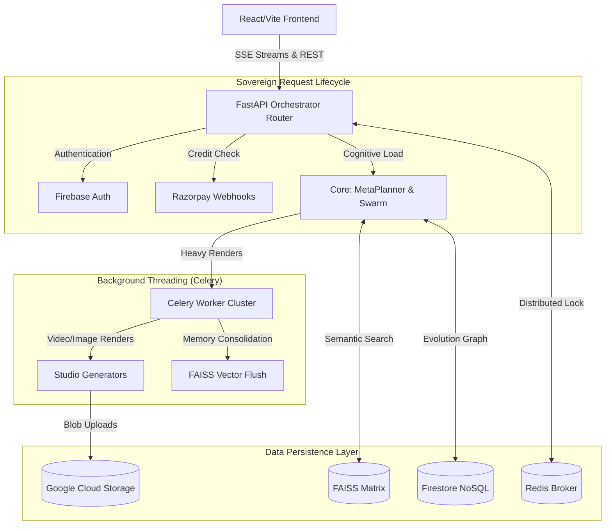

<div align="center">
  
  <h1>LEVI-AI: Sovereign OS v7</h1>
  <p><strong>The Autonomous, Multi-Modal, Domain-Driven Artificial Intelligence Orchestrator.</strong></p>

  <p>
    
    
    
    
    
    
  </p>
</div>

---

## 📑 Table of Contents
1. [System Philosophy](#-1-system-philosophy)
2. [Complete System Architecture](#-2-complete-system-architecture)
3. [Exhaustive Codebase Breakdown](#-3-exhaustive-codebase-breakdown)
4. [Subsystem Deep Dives](#-4-subsystem-deep-dives)
5. [Database & Schema Intelligence](#-5-database--schema-intelligence)
6. [API Route Matrix](#-6-api-route-matrix)
7. [Environment Configuration Reference](#-7-environment-configuration-reference)
8. [Setup & Deployment Playbook](#-8-setup--deployment-playbook)
9. [Legacy Transition (The Monolith Purge)](#-9-legacy-transition)

---

## 🌌 1. System Philosophy

**Sovereign OS v7** represents the total maturation of LEVI-AI from a monolithic script into a highly scalable, fault-tolerant execution matrix. 

Unlike traditional wrapper applications, LEVI-AI utilizes a **Multi-Agent Meta-Planner**. When a user speaks to LEVI, the orchestrator delegates the request across autonomous cognitive sub-nodes (Research, Memory, Critic, Tool-Execution). It synthesizes their findings in real-time, streaming the final semantic output back to the client via Server-Sent Events (SSE). 

LEVI-AI is capable of **Self-Evolution** (auto-rating its responses and mutating its own logic) and **Multi-Modal Output** (programmatically rendering heavily styled, Ken-Burns-effect MP4 videos and images via background workers).

---

## 🏗️ 2. Complete System Architecture



---

## 📁 3. Exhaustive Codebase Breakdown

The repository applies strictest **Domain-Driven Design (DDD)**. No module crosses boundaries without invoking proper interfaces.

### `frontend/` (The Glassmorphism Client)
* **`src/features/`**: The feature-slice architecture. Contains `chat/` (Message bubbles, Streaming inputs), `document/` (PDF upload zones), `evolution/` (Dashboard analytics), `memory/` (Vault viewers), and `studio/` (AI Prompt Canvas).
* **`src/services/`**: The network adapters. Houses `apiClient.js` (Interceptor configs) and `brainService.js` (The complex `EventSource` parser handling raw text tokens from the backend).
* **`src/store/`**: Global state management (`useChatStore.js`).
* **`src/styles/`**: Vanilla CSS matrices. No tailwind. Utterly customized animations allowing deep breathing effects, floating particles, and true blur overlays.

### `backend/api/` (Routing Terminals)
* **`main.py`**: The server entry point. Configures CORS, loads global middleware, and mounts routers.
* **`orchestrator.py`**: The central nervous system. Defers to `core/brain.py` and streams SSE chunks to the client.
* **`monitor_routes.py`**: The admin telemetry endpoints (cache efficacy, node health, routing stats).
* **`studio.py`, `payments.py`, `auth.py`**: Clean REST interfaces mapping POST/GET to their respective `services/` logic files.

### `backend/core/` (Cortex & Intelligence)
* **`meta_planner.py` & `brain.py`**: Reads intent, calculates cost, determines if the prompt requires memory access, web search, or logic loops.
* **`agents/`**: Distinct sub-agents. 
  * `diagnostic_agent.py`: Monitors the system and repairs prompts.
  * `memory_agent.py`: Interfaces with the Vector DB to extract semantic context.
  * `critic_agent.py`: Evaluates generated output before streaming to user.
* **`memory_tasks.py` & `learning_tasks.py`**: The asynchronous brain cycles that run at midnight to consolidate what LEVI-AI learned today.

### `backend/engines/` (Intensive Computations)
* **`chat/generation.py`**: The raw text synthesis loops interfacing with Groq's instantaneous Llama hardware.
* **`document/matrix.py`**: Deep PDF/Text scraping, chunking, and FAISS insertion logic.
* **`studio/`**: Holds the foundational `moviepy` and `Pillow` algorithms to cut, pan, and render raw bytes.

### `backend/services/` (Isolated Domains)
* **`learning/`**: Contains the `AdaptivePromptManager`. Reads user star-ratings and dynamically updates LEVI's core system prompt to match the user's preferred conversational style. Contains `trainer.py` to trigger fine-tuning jobs on Together AI.
* **`studio/`**: The user-facing generation layer. `video_gen.py` creates quotes, applies dynamic TTS, formats subtitles, and composites final videos. `image_gen.py` handles high-resolution SD processing.
* **`notifications/` & `payments/`**: Webhook validation logic, Stripe/Razorpay credit deduction (via atomic Redis locks), and SendGrid/SMTP dispatchers.

### `backend/db/` (Hardware Interfacing)
* **`firestore_db.py`**: Centralized, singleton connections to Google Cloud Firestore.
* **`redis_client.py`**: Handles cache arrays, AI speed tiering, and distributed transaction locks holding race-condition security.
* **`vector_store.py`**: The local `faiss-cpu` integration storing 384-dimensional arrays of conversational fragments.
* **`gcs_utils.py` & `s3_utils.py`**: Securely generates Signed URLs and pushes raw binary video/images securely to bucket instances.

---

## ⚙️ 4. Subsystem Deep Dives

### **A. Autonomous Prompt Mutation (Self-Evolution)**
LEVI-AI modifies its own code. 
1. When a user rates a response `< 3.5 stars`, the interaction is logged to a `FailureGraph` in Firestore.
2. The Celery Beat schedule (`backend/celery_app.py`) triggers `run_autonomous_evolution` every midnight.
3. The `diagnostic_agent` loops through all recent failures, compares them to 5-star successes, and rewrites the `System Instruction Prompt`.
4. It tests the new prompt against 5 "Heuristic Test Scenarios" in `trainer.py`. If it passes, the new personality is deployed live and cached in memory.

### **B. Generative Studio Array**
Video generation is incredibly heavy and blocks API threads. 
1. `api/studio.py` submits a video intent.
2. `utils.create_studio_job` acquires a Redis lock to deduct 2 credits from the user, saves a `pending` state, and pushes a task into the `celery:heavy` queue.
3. The backend immediately returns `202 Accepted` with a Job ID.
4. A Celery worker picks up the job, fetches a quote via LLM, applies Coqui TTS, composes multi-scene Ken-Burns imagery, and uploads the `.mp4` to GCS.
5. The frontend polls the Job ID, and once complete, displays the stunning visual directly in chat.

---

## 📊 5. Database & Schema Intelligence

LEVI-AI utilizes a NoSQL document structuring paradigm via Firestore.

**`users/{user_id}`**
- `uid`: String
- `tier`: Enum (free, pro, creator)
- `credits`: Integer (atomic limits)
- `preferences`: Map (theme, tone)

**`jobs/{job_id}`**
- `type`: Enum (video, image, fine_tune)
- `status`: Enum (queued, processing, completed, failed)
- `metadata`: Map (aspect_ratio, motion_bucket, prompt)
- `result_url`: String (GCS Output Path)

**`memory_matrix/{namespace}` (Vector Mappings)**
- `content`: Original string.
- `vector`: float32 array (FAISS indexed locally).
- `timestamp`: UTC DateTime.

---

## 🌐 6. API Route Matrix

| Endpoint | Method | Domain | Description |
|----------|--------|--------|-------------|
| `/api/chat/stream` | POST | **Orchestrator** | Dispatches standard text interaction and SSE streams response. |
| `/api/studio/video` | POST | **Generative** | Triggers asynchronous Celery rendering of MP4 scenes. |
| `/api/admin/orchestrator/stats` | GET | **Observability**| Outputs JSON diagnostics tracking route efficacy and fail rates. |
| `/api/memory/vault` | GET | **Cognitive** | Retrieves the decrypted semantic sub-graph for user review. |
| `/api/payments/webhook` | POST | **Financial** | Verifies Razorpay HMAC signatures to increment AI credits. |

---

## 🔑 7. Environment Configuration Reference

This application will immediately crash if its secure `.env` is unpopulated. **Do not modify `.env.bak` and never commit credentials.**

| Variable | Requirement | Purpose |
|----------|-------------|---------|
| `GROQ_API_KEY` | **Critical**   | Hardware acceleration for instantaneous cognitive decision trees. |
| `TOGETHER_API_KEY` | **Critical** | Image generation and LoRA weight fine-tuning endpoints. |
| `FIREBASE_SERVICE_ACCOUNT_JSON` | **Critical** | Absolute path to the GCP permissions file. |
| `REDIS_URL` | **Required** | Coordinates distributed locking, task queues, and rate-limiting. |
| `RAZORPAY_KEY_ID` | Optional | Processes top-ups and upgrades. |
| `RAZORPAY_KEY_SECRET` | Optional | Secures the webhook HMAC validation algorithm. |

---

## 💻 8. Setup & Deployment Playbook

### Local Native Simulation 

**1. Database Preparation:**
Ensure `Redis` is running locally on `localhost:6379`. (Use WSL or Docker on Windows).

**2. Backend Daemon Setup:**
```powershell
cd backend
python -m venv .venv
.\.venv\Scripts\Activate.ps1
pip install -r requirements.txt
```

**3. Running the Server & Task Cluster:**
You must run *two* distinct terminal processes for the backend to function.
```powershell
# Terminal A (FastAPI Matrix)
uvicorn backend.v7.api.main:app --host 0.0.0.0 --port 8000 --reload

# Terminal B (Celery Asynchronous Workers)
# Windows users MUST use --pool=solo. Linux uses standard threads.
celery -A backend.celery_app worker --pool=solo -l info
```

**4. Frontend Ignition:**
```bash
cd frontend
npm install
npm run dev
```

### ☁️ Production Deployment (GCP + Vercel)
- **Frontend** compiles easily via Vite: `npm run build`. Host securely on Vercel or Netlify.
- **Backend** is packaged via `Dockerfile.prod`. Deploy the image heavily parallelized to Google Cloud Run or AWS ECS. 
- Ensure a minimum limit of **4Gi RAM** allocated to instances interacting with MoviePy rendering algorithms.

---

## ☢️ 9. Legacy Transition (The Monolith Purge)

LEVI-AI v7 is the strict conclusion of moving off the legacy monolith.

**What Happened?**
1. **19 root-level scripts** (`agents.py`, `learning.py`, `trainer.py`, `models.py`, `firestore_db.py`, etc.) were completely lobotomized. Their files now exist exclusively as header warnings to prevent execution.
2. The logic was mathematically ported into isolated domain folders (`services/`, `core/`, `engines/`).
3. Over **41 internal scripts** were patched via the `fix_legacy_imports.py` architecture matrix to safely point references entirely to the new micro-services.

*LEVI-AI no longer functions as a script. It operates exclusively as an operating system.*
