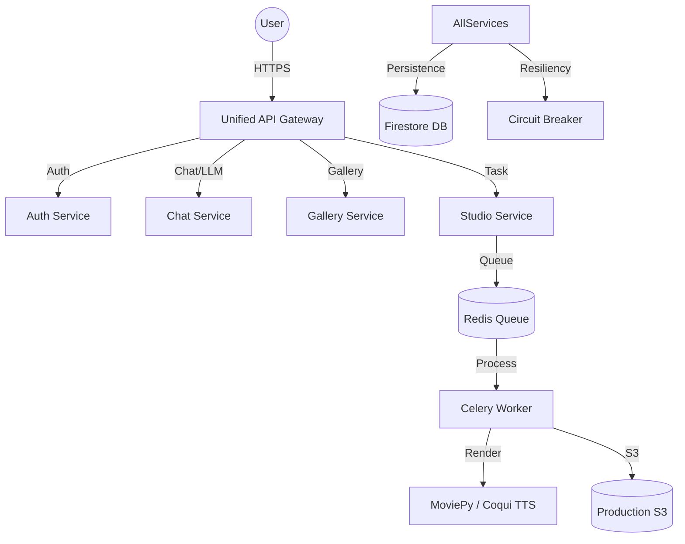

# LEVI-AI — Wisdom & Creative Muse 🌟 (v4.5 Omnipresent)

LEVI-AI is a high-scale production AI platform for philosophical exploration and artistic synthesis. **Status: v4.5 Omnipresent Release is LIVE. Features include Real-Time SSE Event Streams, Parallel 'Council of Models' Inference (Llama/Mixtral/Gemma), and a High-Fidelity Admin Control Plane.**

> [!IMPORTANT]
> **Master Technical Manual**: For architectural analysis and operational diagnostics, see the [DIAGNOSTICS_MASTER.md](file:///c:/Users/mehta/Desktop/New%20folder/LEVI-AI/DIAGNOSTICS_MASTER.md).


## 🏗️ Architecture (v3.0)



- **Unified Gateway**: Central entry point with rate limiting, circuit breakers, and sub-service routing.
- **Service Routers**: Hardened micro-service logic split into Auth, Chat, Studio, Gallery, and Analytics.
- **Async Engine**: Production-ready Celery workers for long-running image and video synthesis.
- **Council of Models**: Parallel inference engine (Llama-3.1 + Mixtral + Gemma) for high-depth philosophical synthesis.
- **Real-Time Stream**: SSE-based global activity pulse using Redis Pub/Sub orchestration.
- **Resiliency**: Built-in state monitoring and automatic S3 pre-signed URL security.

## 🛠️ Technology Stack
- **Backend**: FastAPI (v3.0 Modular Architecture), Celery, Redis.
- **Database**: 100% Firestore-Native (Universal NoSQL).
- **Storage**: AWS S3 (Secure Pre-signed URLs).
- **AI Models**: Groq (Llama-3.1), Together AI (FLUX.1).
- **Styling**: Vanilla CSS (High-Performance Glassmorphism).

## 🚀 Quick Start (Dockerized)

The easiest way to run the full bulletproof stack locally:

```bash
docker-compose up --build
```
- **Frontend**: [http://localhost](http://localhost) (via Nginx)
- **API Gateway**: [http://localhost/api/v1](http://localhost/api/v1)
- **Health Check**: [http://localhost/api/v1/health](http://localhost/api/v1/health)

## 📁 Key Components

- **backend/gateway.py**: The central control layer.
- **backend/services/**: Independent service logic and routers.
- **backend/s3_utils.py**: Secure media delivery.
- **frontend/js/config.js**: Dynamic environment discovery.

## 🚀 Production Deployment (Hardened v3.0)

The v3.0 Bulletproof stack is optimized for **Google Cloud Run**.

1. **Deploy Gateway**:
   ```bash
   gcloud run deploy levi-gateway --source . --command "gunicorn" --args "backend.gateway:app"
   ```
2. **Deploy Workers**:
   ```bash
   gcloud run deploy levi-workers --source . --command "celery" --args "-A backend.celery_app worker --loglevel=info"
   ```

**Environment Architecture**: Ensure all required variables (S3, Groq, Razorpay, Firebase) are set in the Cloud Run service configuration according to the [MAINTENANCE.md](MAINTENANCE.md).

---
**LEVI-AI v4.5 Omnipresent — Architected for Excellence.**
