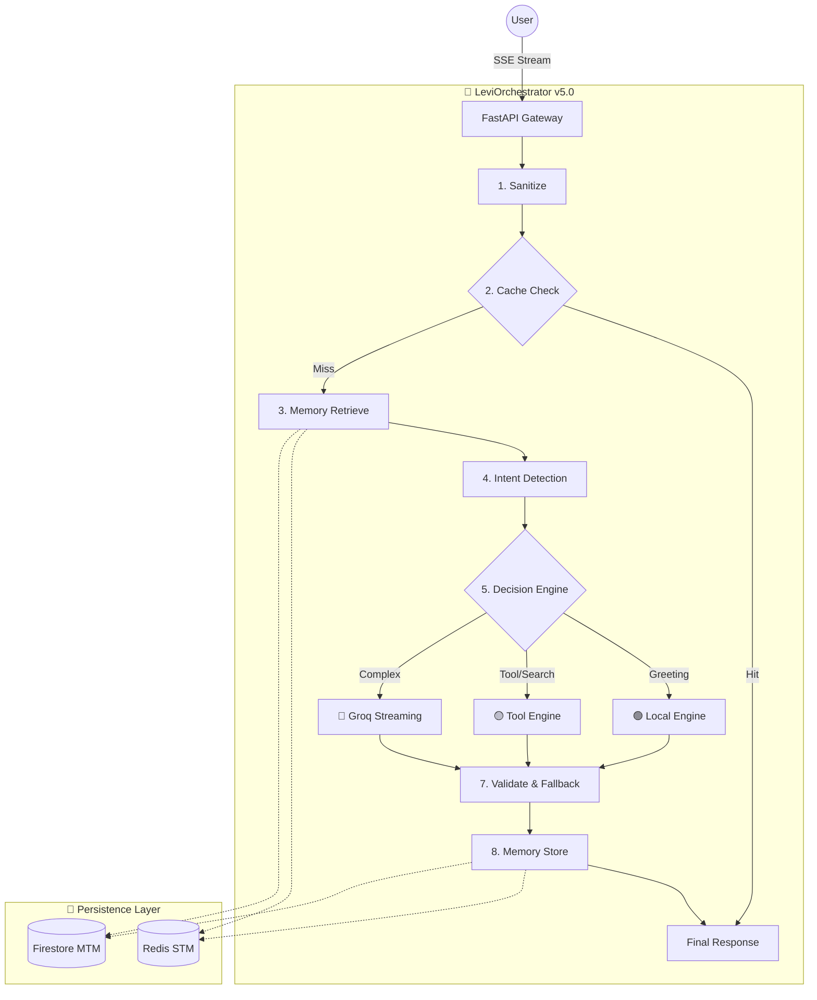

# LEVI — Autonomous AI Orchestrator (v5.0 "Hardened Architecture") 🧠

> **Learning, Evolution, Vision, Intelligence**

LEVI is a production-hardened **AI Orchestration Platform** that routes user requests through an intelligent 8-stage pipeline. Version 5.0 introduces "The Soul" memory system with background pruning, true SSE streaming, and a unified self-healing circuit breaker architecture.

---

## 🏗️ Architecture: The 8-Stage Pipeline

The LEVI Orchestrator (`engine.py`) provides an authoritative single-class entry point for every user interaction.



### 1. The Decision Engine (Routing)
| Route | Intent | Model | Cost | Latency |
|:---|:---|:---|:---|:---|
| 🟢 **Local** | Greeting, Identity | None | $0 | < 5ms |
| 🟡 **Tool** | Search, Code, Image | Llama-3.1-8B | Low | < 500ms |
| 🔴 **API** | Complex, Multi-turn | Groq 70B | Moderate | Streaming |

---

## 🚀 Key Hardening Features (v5.0)

### ⚡ True SSE Streaming
Direct token-by-token piping from the LLM provider ensures near-zero latency for the time-to-first-token.
- **Buffers Off**: Nginx is configured to avoid response buffering for real-time delivery.
- **Metadata Chunks**: Every stream includes structured JSON chunks for `intent`, `route`, and `job_id`.

### 🛡️ Unified Circuit Breaker
Consolidated architecture in `backend/utils/network.py`.
- **States**: `CLOSED` (Healthy), `OPEN` (Tripped), `HALF_OPEN` (Healing).
- **Proactive Alerts**: Triggers a POST to `ALERT_WEBHOOK_URL` (Discord/Slack) on service failure.
- **Self-Healing**: Automatically tests service health every 30-60 seconds after a trip.

### 💾 "The Soul" Memory System
A 3-layer persistence strategy for high-context AI synthesis.
1. **Short-Term (Redis)**: Instant session state and request history.
2. **Mid-Term (Firestore)**: Persistent interaction history and learned facts.
3. **Long-Term (Vector)**: Deep semantic facts (via sentence-transformers).
- **Automatic Pruning**: A daily background job via Celery Beat removes facts older than 30 days based on native timestamps.

---

## 🛠️ Production Stack

- **Gateway**: FastAPI + Gunicorn/Uvicorn (Asynchronous)
- **Broker/Cache**: Redis alpine (High concurrency)
- **Database**: Firestore (NoSQL, GCP managed)
- **Ingress**: Nginx (SSE optimized, gzip enabled)
- **Tasks**: Celery + Celery Beat (Background flushes & exports)

---

## 🚀 Quick Start (Hardened Prod)

```bash
# 1. Setup Env
cp .env.example .env
export ENVIRONMENT=production

# 2. Build Stack
docker compose up --build -d

# 3. Verify Health
curl http://localhost/api/health
```

For domain-specific details, see the specialized guides:
- [**RUNBOOK.md**](RUNBOOK.md): The definitive Ops & Troubleshooting guide.
- [**INTEGRATION.md**](INTEGRATION.md): API reference and response shapes.
- [**MAINTENANCE.md**](MAINTENANCE.md): Scheduled tasks and data lifecycle.
- [**DIAGNOSTICS_MASTER.md**](DIAGNOSTICS_MASTER.md): Health signals and log analysis.
- [**DEPLOYMENT.md**](DEPLOYMENT.md): Step-by-step production setup.

---

**LEVI — Built for emergence. Hardened for depth. Optimized to never fail.**  
*Blackdrg/levi-ai-innovate · Apache 2.0*
