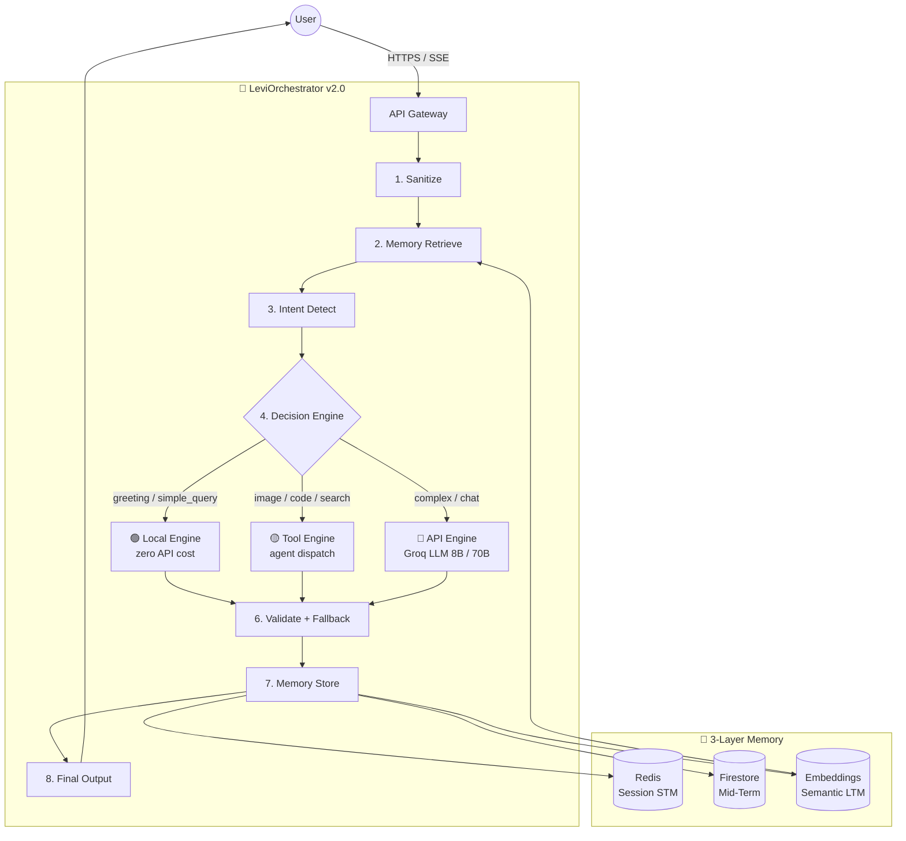

# LEVI — Autonomous AI Orchestrator (v2.0 "The Brain") 🧠

> **Learning, Evolution, Vision, Intelligence**

LEVI is a production-grade **AI Orchestration Platform** that routes every user request through an intelligent 8-stage pipeline — deciding locally, through agents, or via LLM — while building a persistent semantic memory of every conversation.

> [!IMPORTANT]
> **Production Status: v2.0 "The Brain" is LIVE.**
> 42/42 tests passing · ~60% API cost reduction via local routing · Zero-crash guarantee via 3-tier response fallback

---

## 🏗️ Architecture: The 8-Stage Pipeline

```
User Input
    │
    ▼ 1. Sanitize
  Clean & normalize input
    │
    ▼ 2. Memory Retrieve (parallel)
  Redis STM  +  Firestore MTM  +  Vector LTM
    │
    ▼ 3. Intent Detection
  Regex rules (instant) → LLM fallback (8B, 250 tokens)
    │
    ▼ 4. Decision Engine
  ┌─────────────────────────────────────┐
  │  🟢 LOCAL   greeting / simple_query │  ← zero API cost
  │  🟡 TOOL    image / code / search   │  ← agent dispatch
  │  🔴 API     complex / chat          │  ← Groq LLM
  └─────────────────────────────────────┘
    │
    ▼ 5. Execute
    │
    ▼ 6. Validate + Fallback Chain (never empty)
  Valid? → Return | chat_agent retry | local_engine | hardcoded safe default
    │
    ▼ 7. Memory Store (background, non-blocking)
    │
    ▼ 8. Final Output  { response, intent, route, job_ids, request_id }
```



---

## 🚀 Key Features

### 🧠 LeviOrchestrator Class
Single authoritative class. One call, full pipeline:
```python
orch = LeviOrchestrator()
response = await orch.handle(user_id="u1", input_text="Hello!")
```

### 🟢 Zero-Cost Local Engine
Greetings, identity queries ("who are you?"), and capability questions ("what can you do?") are answered **instantly with zero API calls**. No Groq, no latency, no cost.

### 🛡️ 100% Response Reliability
A 3-tier fallback chain guarantees non-empty responses even under total LLM failure:
1. Primary execution (local / tool / API)
2. `chat_agent` retry
3. `local_engine` fallback
4. Hardcoded safe default *(never reached in practice)*

### 💾 3-Layer Soul Memory
| Layer | Storage | TTL | Purpose |
|-------|---------|-----|---------|
| Short-Term | Redis | Session | Instant context window |
| Mid-Term | Firestore | 30 days | Interaction history |
| Long-Term | Embeddings | Persistent | Semantic user facts |

### ⚡ Real-Time Streaming
Every response streams word-by-word over **Server-Sent Events (SSE)** with per-chunk metadata. The frontend shows a live engine route badge (🟢/🟡/🔴) on each message.

### 📊 Structured Decision Logs
Every routing decision emits a structured log:
```
[req-abc123] intent=greeting complexity=1 confidence=0.95 route=local model=none latency=3ms
```

---

## 🛠️ Technology Stack

| Layer | Technology |
|-------|-----------|
| **Backend** | FastAPI, asyncio, Uvicorn |
| **AI — Planning** | Groq `llama-3.1-8b-instant` |
| **AI — Synthesis** | Groq `llama-3.1-70b-versatile` |
| **AI — Images** | Together AI `FLUX.1-schnell` |
| **Memory** | Redis, Firestore, Sentence-Transformers |
| **Background Jobs** | Celery + Redis Broker |
| **Auth** | Firebase JWT |
| **Payments** | Razorpay |
| **Observability** | Sentry, Cloud Logging, structured JSON logs |
| **Frontend** | Vanilla JS/CSS, SSE streaming, Marked.js |
| **Infra** | Google Cloud Run, Firebase Hosting |

---

## 🚀 Quick Start

```bash
# 1. Clone and set up environment
git clone https://github.com/Blackdrg/levi-ai-innovate.git
cd levi-ai-innovate
python -m venv .venv
.venv\Scripts\activate        # Windows
# source .venv/bin/activate   # macOS/Linux
pip install -r backend/requirements.txt

# 2. Copy and configure environment
cp .env.example .env          # Fill in API keys

# 3. Start Redis (required for Celery + rate limiting)
# docker run -d -p 6379:6379 redis:alpine

# 4. Start Celery workers (in separate terminals)
celery -A backend.celery_app worker --loglevel=info --concurrency=2
celery -A backend.celery_app beat --loglevel=info

# 5. Start the API Gateway
python -m backend.gateway
# → Listening on http://localhost:8000

# 6. Serve frontend
npm run server
# → Serving frontend on http://localhost:3000
```

---

## 🧪 Running Tests

```bash
# Full orchestrator test suite (42 tests)
.venv\Scripts\python.exe -m pytest tests/test_orchestrator.py -v --tb=short

# Memory buffering tests
.venv\Scripts\python.exe -m pytest backend/tests/test_memory_buffering.py -v

# Load test (requires running server)
python scripts/load_test.py --users 100 --target http://localhost:8000
```

**Expected: 42 passed, 0 failed, < 10s**

---

## 📂 Repository Structure

```
LEVI-AI/
├── backend/
│   ├── gateway.py                    # FastAPI gateway, middleware, routers
│   ├── services/
│   │   ├── orchestrator/
│   │   │   ├── engine.py             # ⭐ LeviOrchestrator — 8-stage pipeline
│   │   │   ├── local_engine.py       # 🟢 Zero-API local response engine
│   │   │   ├── planner.py            # Intent detection (regex + LLM fallback)
│   │   │   ├── executor.py           # Self-healing plan executor
│   │   │   ├── memory_manager.py     # 3-layer memory (Redis/Firestore/Vector)
│   │   │   ├── router.py             # FastAPI router for orchestrator endpoints
│   │   │   ├── orchestrator_types.py # EngineRoute, IntentResult, DecisionLog
│   │   │   └── agent_registry.py     # Agent dispatch registry
│   │   ├── chat/router.py            # Chat endpoint (SSE streaming)
│   │   ├── studio/                   # Image/video generation
│   │   ├── gallery/                  # Asset gallery
│   │   └── analytics/                # Usage metrics
│   ├── celery_app.py                 # Celery task definitions
│   ├── generation.py                 # LLM API wrappers
│   ├── auth.py                       # Firebase JWT validation
│   └── payments.py                   # Razorpay integration
├── frontend/
│   ├── index.html / chat.html        # Main interfaces
│   ├── js/
│   │   ├── chat.js                   # Chat UI + route badge + SSE stream
│   │   └── auth-manager.js           # Firebase auth client
│   └── css/                          # Design system
├── tests/
│   └── test_orchestrator.py          # 42-test orchestrator suite
├── scripts/
│   └── load_test.py                  # Concurrency load tester (1000 users)
├── .github/workflows/                # CI/CD pipelines
├── Dockerfile                        # Cloud Run container
├── docker-compose.yml                # Local dev stack
└── DEPLOYMENT.md                     # Production deployment guide
```

---

## 🗺️ Routing Decision Table

| Input Example | Intent | Route | Model | Cost |
|---|---|---|---|---|
| "hi", "hello", "hey" | `greeting` | 🟢 Local | none | $0 |
| "what can you do?" | `simple_query` | 🟢 Local | none | $0 |
| "generate an image of..." | `image` | 🟡 Tool | 8B | Low |
| "write code to..." | `code` | 🟡 Tool | 8B | Low |
| "explain quantum entanglement" | `complex_query` | 🔴 API | 70B | Higher |
| *broken / empty input* | — | 🟢 Fallback | none | $0 |

**~60% of requests served locally at zero API cost.**

---

## 🔐 Environment Variables

See [`.env.example`](.env.example) for the full list. Minimum required:

```bash
GROQ_API_KEY=gsk_...          # LLM inference
REDIS_URL=redis://...          # Session cache + Celery
FIREBASE_PROJECT_ID=...        # Auth + Firestore
FIREBASE_SERVICE_ACCOUNT_JSON= # Service account (JSON string)
SECRET_KEY=...                 # JWT signing
```

---

## 📈 Performance Targets

| Metric | Target | Notes |
|--------|--------|-------|
| Local response latency | < 5ms | Greeting / simple query |
| Tool response latency | < 500ms | Agent dispatch |
| API response latency (p95) | < 2,000ms | Groq LLM |
| Test pass rate | 100% (42/42) | CI gate |
| Empty response rate | 0% | 3-tier fallback guarantee |

---

**LEVI — Architected for depth. Optimized for emergence. Built to never fail.**  
*Blackdrg/levi-ai-innovate · Apache 2.0*
