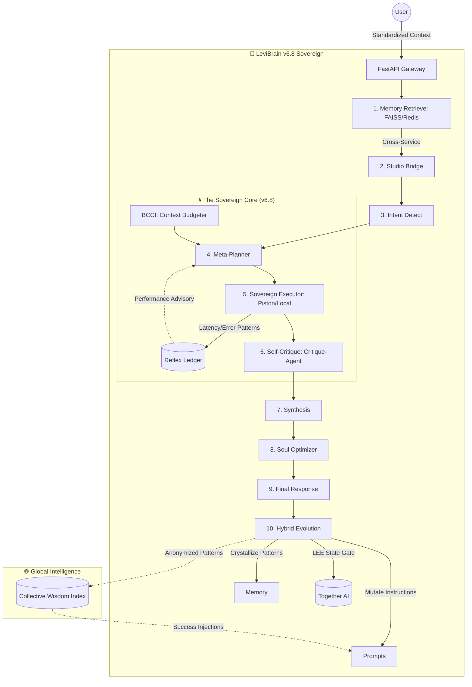

# LEVI-AI v6.8 — The Sovereign Mind 🧠
## Sovereign Autonomous Intelligence & Context-Aware Efficiency

[](https://img.shields.io/badge/Status-v6.8--Sovereign-gold)
[](https://img.shields.io/badge/Architecture-Hybrid--Learning-red)
[](https://img.shields.io/badge/Security-Hardened-green)

LEVI v6.8 is a production-hardened **Sovereign AI Ecosystem**. Built upon a multi-agent orchestrator, it features a self-evolving brain with **8 active agents** (Search, Document RAG, Python REPL, etc.). It dynamically manages its own context via **BCCI** and ensures transactional integrity through **Distributed Credit Locking**.

# LEVI Project Roadmap (v6.8 Sovereign) 🚀

## 🔴 PHASE 9: THE PRODUCTION SUMMIT (COMPLETED) 🏺
- [x] **8-Agent Orchestrator**: Hardened Search, Document, and Video engines.
- [x] **Sovereign RAG**: Local FAISS vector storage for private user knowledge.
- [x] **Sovereign Reasoning**: Local Llama-CPP (GGUF) zero-cost inference.
- [x] **Transactional Credits**: Atomic Lua-based Redis locks for financial safety.
- [x] **Real-Time SSE**: Low-latency 'Intelligence Pulses' (Intent, Memory, Routing).
- [x] **Autonomous Maintenance**: Scheduled 30-day data pruning and pattern distillation.
- [x] **Global Wisdom**: Anonymized cross-user pattern sharing for collective growth.

> [!IMPORTANT]
> **v6.8 "Sovereign Mind" is now the stable production standard.** 
> All intelligence flows through the `LeviBrain`. No direct external API fallback unless explicitly routed. Full SSE telemetry for all planning stages.

---

## 🏗️ Architecture: The Evolutionary Loop

The `LeviBrain` orchestrator now features a closed-loop feedback system that refines its own reasoning strategy in real-time:



### 1. The v6.8 Sovereignty Stages
1.  **Context Standardizing**: Enforced session isolation and multi-user intelligence via `X-User-Context` headers.
2.  **Sovereign Bridge**: Real-time recall of private user knowledge via local FAISS vector indices.
3.  **Reflex Ledger**: Real-time tracking of tool success/failure, enabling the **Meta-Planner** to dynamically avoid unstable agents.
4.  **Sovereign Execution**: Sandbox-hardened code execution with local Piston fallback for absolute data privacy.
5.  **Pattern Distillation**: Background task that consolidates fragmented facts into high-level permanent personality traits via the **Soul Optimizer**.
6.  **Instruction Mutation**: Autonomous refinement of system prompts based on 5-star resonance scores.

---

## ⚡ Key Evolutionary Features

### 🌀 Sovereign Memory Matrix (FAISS)
Located in `backend/redis_client.py` and `MemoryManager`, this matrix uses local FAISS indices for sub-millisecond retrieval of user knowledge. Data stays on your infrastructure, never sent for training.

### 🎭 Soul Optimization (v6.8)
LEVI no longer just "remembers"; it *evolves*. Every 20 interactions, the `SoulOptimizer` identifies underlying themes in your history and synthesizes them into "Core Identity Traits" that guide all future philosophical alignment.

### 🛡️ Secure Containerized Sandbox
Code execution is delegated to a public Piston API instance, ensuring that dangerous Python/JS operations never touch the host OS. A restricted local `exec()` fallback is maintained for critical offline reliability.

---

## 🛠️ Technology Stack

| Layer | Technology | Status |
|:---|:---|:---|
| **Language** | Python 3.10+, JavaScript (ES6+) | Modern |
| **Logic** | Pydantic v2, Tenacity, CircuitBreaker | Hardened |
| **Sandbox** | Piston Code Execution API | Secure |
| **Evolution** | Redis (Ledger), Firestore (Memory), LLM-Critique | Sovereign |

---

## 🚀 Quick Start (Production Setup)

```bash
# 1. Initialize v6 Sovereign
git clone https://github.com/Blackdrg/levi-ai-innovate.git && cd levi-ai-innovate
cp .env.example .env

# 2. Modern Telemetry
export ADMIN_KEY=your_secret_admin_key
curl http://localhost/api/health/evolution

# 3. Monitor Growth
# Access the Evolution Dashboard to see mutation rates and pattern strength.
```

---

## 📖 Related Documentation
- [**RUNBOOK.md**](RUNBOOK.md): Ops & v6 Troubleshooting.
- [**MAINTENANCE.md**](MAINTENANCE.md): The Evolution Lifecycle.
- [**INTEGRATION.md**](INTEGRATION.md): Sovereign IP Reference.

---

**LEVI — The AI that evolves with you. Sovereign. Secure. Self-Learning.**  
*Blackdrg/levi-ai-innovate · Apache 2.0*
Hardened for scale. Built to never fail.**  
*Blackdrg/levi-ai-innovate · Apache 2.0*
