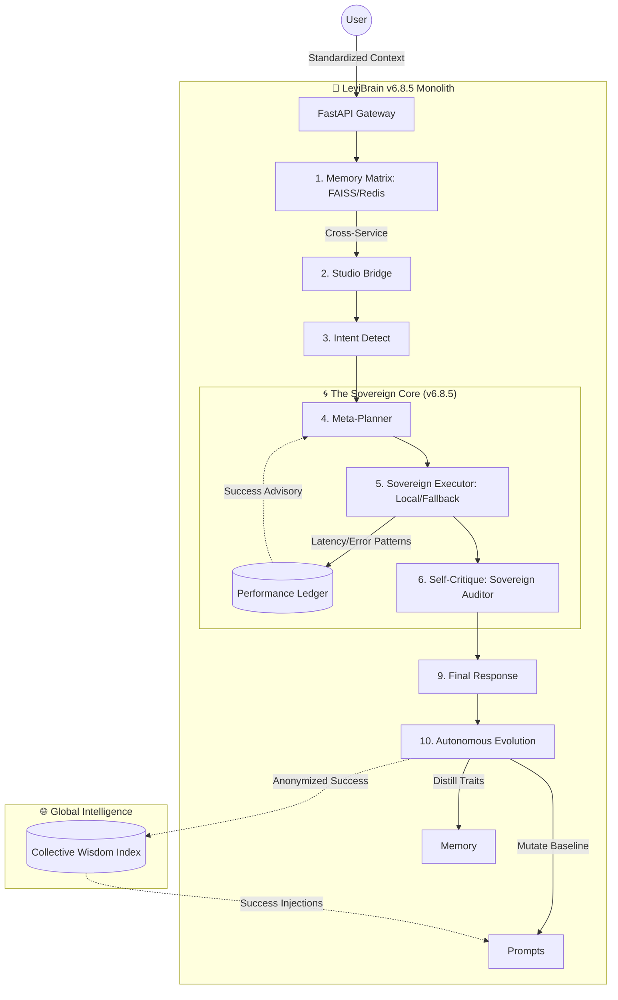

# LEVI-AI v6.8.5 — The Sovereign Monolith 🧠
## Sovereign Autonomous Intelligence & Context-Aware Efficiency

[](https://img.shields.io/badge/Status-v6.8.5--Sovereign-gold)
[](https://img.shields.io/badge/Architecture-Sovereign--Monolith-blue)
[](https://img.shields.io/badge/Security-Hardened-green)

LEVI v6.8.5 is a production-hardened **Sovereign Monolith**. Built with a focus on data privacy and reasoning autonomy, it features a self-evolving brain with local **Llama-3-8B** (GGUF) reasoning and persistent **FAISS memory matrix** via GCS FUSE. It dynamically manages its own context and ensures absolute data sovereignty through cross-tier atomic wipes.

# LEVI Project Roadmap (v6.8.5 Sovereign) 🚀

## 🏛️ THE PRODUCTION HARDENING (COMPLETE) 🏺
- [x] **Consolidated Monolith**: Unified architecture on Google Cloud Run with 8Gi RAM.
- [x] **Sovereign Reasoning**: Local Llama-3-8B (GGUF) zero-cost inference.
- [x] **Persistent Memory Matrix**: User-scoped FAISS indices with GCS FUSE persistence.
- [x] **Autonomous Evolution**: AI persona mutation based on 5-star success patterns.
- [x] **Intelligence Pulse (SSE)**: Real-time telemetry for intent, memory, and engine routing.
- [x] **Sovereign Engine Probe**: Deep diagnostic audit of sub-system health (`/health/sovereign`).
- [x] **Absolute Privacy**: Atomic memory wipe across Redis, Firestore, and FAISS.

---

## 🏗️ Architecture: The Evolutionary Loop

The `LeviBrain` orchestrator features a closed-loop feedback system that refines its own reasoning strategy in real-time.



### 1. The v6.8.5 Sovereignty Stages
1.  **Context Standardizing**: Enforced session isolation via `X-User-Context` headers.
2.  **Sovereign Memory Matrix**: Real-time recall of private knowledge via local FAISS on GCS FUSE.
3.  **Performance Ledger**: Error-resilient tracking of tool success for dynamic routing.
4.  **Collective Distillation**: Background synthesis of fragmented facts into persona traits.
5.  **Instruction Mutation**: Autonomous refinement of system prompts based on resonance scores.

---

## 🛠️ Technology Stack

| Layer | Technology | Status |
|:---|:---|:---|
| **Core** | Python 3.11, FastAPI, React 18 | Production |
| **Logic** | Pydantic v2, Tenacity, Llama-CPP | Hardened |
| **Persistence** | Firestore, Redis, FAISS, GCS FUSE | Sovereign |
| **Deployment** | Google Cloud Run (8Gi RAM), Vercel | Monolith |

---

## 🚀 Quick Start (Production Setup)

```bash
# 1. Initialize v6.8.5 Sovereign Monolith
git clone https://github.com/Blackdrg/levi-ai-innovate.git && cd levi-ai-innovate

# 2. Deploy Monolith
# Execute the deploy_production.yml workflow to push the 8Gi monolith to Cloud Run.

# 3. Verify Health
# Access GET /health/sovereign with your X-Admin-Key to audit the reasoning core.
```

---

## 📖 Related Documentation
- [**LAUNCH_MANIFEST.md**](LAUNCH_MANIFEST.md): Production Handoff & Secrets.
- [**INTEGRATION.md**](INTEGRATION.md): Sovereign SSE Reference.
- [**SECURITY.md**](SECURITY.md): Defense Strategy.
- [**MAINTENANCE.md**](MAINTENANCE.md): Distillation & Life-cycles.

---

**LEVI — The AI that evolves with you. Sovereign. Secure. Self-Learning.**  
*Blackdrg/levi-ai-innovate · Apache 2.0*
