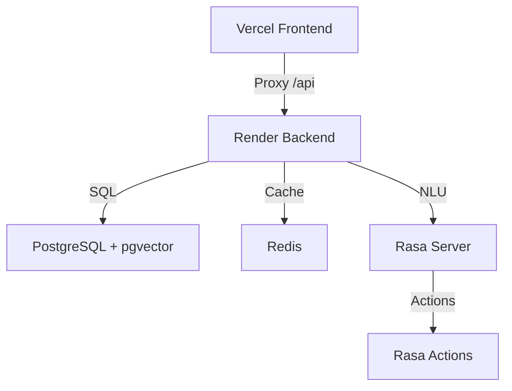

# LEVI - AI Wisdom & Creative Muse 🌟

LEVI is a full-stack AI application designed to spark creativity through semantic quote search, AI-driven conversations, and artistic visual generation. Built with a modern glassmorphism UI and a robust microservices backend.

---

## 🏗️ Architecture Overview

LEVI follows a decoupled, high-performance architecture optimized for production environments like **Vercel** and **Render**:



- **Frontend**: Static files + Tailwind CSS + Vanilla JS, hosted on **Vercel**.
- **Backend API**: FastAPI (Python), containerized and hosted on **Render**.
- **AI Engine**: Sentence Transformers (Embeddings) + DistilGPT2 (Generation) + Rasa (NLU).
- **Data Layer**: PostgreSQL with `pgvector` for semantic search and Redis for session caching.

---

## ✨ Core Features

- **Semantic Search**: Find quotes by meaning, not just keywords, using vector embeddings.
- **AI Chat**: Engage in philosophical or creative conversations with LEVI.
- **Visual Generation**: Generate artistic, shareable images from any quote.
- **Multi-language Support**: Support for English and Hindi conversations.
- **Daily Wisdom**: Fresh quotes delivered daily via open-source API integration.
- **Public Feed**: Share and discover liked quotes and generated visuals.

---

## 🛠️ Tech Stack

### Frontend
- **Framework**: Vanilla JavaScript (ES6+)
- **Styling**: Tailwind CSS + Custom Glassmorphism CSS
- **Icons/UI**: Lucide Icons + FontAwesome
- **Deployment**: Vercel (via `vercel.json` rewrites)

### Backend
- **Framework**: FastAPI (Asynchronous Python)
- **Database**: SQLAlchemy 2.0 + PostgreSQL (pgvector)
- **Caching**: Redis (Session & Search Caching)
- **AI/ML**: 
  - `transformers` (DistilGPT2)
  - `sentence-transformers` (MiniLM-L6-v2)
  - `rasa` (Natural Language Understanding)
- **Image Gen**: Pillow (PIL) for dynamic compositing.

---

## 🚀 Production Deployment Guide

### 1. Backend (Render)
The backend is optimized for the **Render Free Tier** (512MB RAM).

- **Blueprints**: Use the provided [render.yaml](render.yaml) for one-click setup.
- **Environment Variables**:
  - `DATABASE_URL`: Internal string from Render Postgres.
  - `REDIS_URL`: Internal string from Render Redis.
  - `CLIENT_KEY`: Random secret for API security.
  - `CORS_ORIGINS`: Set to your Vercel domain.
- **Health Checks**: Set path to `/` in Render dashboard.
- **Pre-deploy**: `python seed.py` is automatically configured to populate your DB.

### 2. Frontend (Vercel)
- **Proxying**: The [vercel.json](vercel.json) file handles routing `/api/*` to your Render backend to bypass CORS issues.
- **Deployment**: Connect your GitHub repo to Vercel and it will auto-deploy the `frontend/` directory.

---

## 💻 Local Development

### Prerequisites
- Python 3.11+
- Docker & Docker Compose (optional but recommended)

### Quick Start
1. **Clone the repo**:
   ```bash
   git clone https://github.com/Blackdrg/LEVI.git
   cd LEVI
   ```
2. **Run with one command**:
   ```bash
   python run_app.py
   ```
   This will start the Backend (8000) and Frontend (8080) simultaneously.

### Manual Backend Setup
```bash
cd backend
pip install -r requirements.txt
python seed.py  # Seed the initial database
uvicorn main:app --reload
```

---

## 📱 Project Structure

```text
LEVI/
├── backend/            # FastAPI Application
│   ├── data/           # Initial CSV datasets
│   ├── tests/          # Pytest suite
│   └── Dockerfile.prod # Optimized production image
├── frontend/           # Vanilla JS Website
│   ├── js/             # API client & UI logic
│   └── css/            # Glassmorphism styling
├── rasa/               # Rasa NLU configuration
├── render.yaml         # Render Infrastructure-as-Code
├── vercel.json         # Vercel routing configuration
└── Dockerfile          # Root deployment target
```

---

## 🛡️ Security & Performance
- **Background Loading**: AI models load in separate threads to pass health checks immediately.
- **Hybrid Imports**: Code works seamlessly in both local and containerized environments.
- **Worker Optimization**: Uvicorn set to 1 worker in production to save memory.
- **Database Guards**: Strict checks ensure PostgreSQL is used in production while SQLite works for local testing.

---

## 📄 License
MIT License - Developed by Blackdrg.
