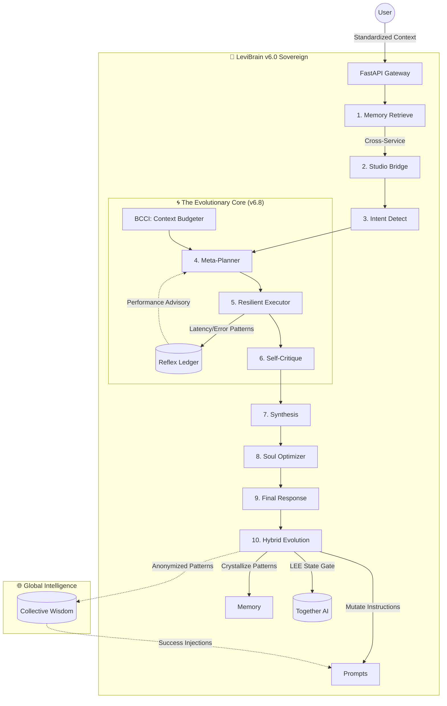

# LEVI-AI v6.8 — The Sovereign Mind 🧠
## Sovereign Autonomous Intelligence & Context-Aware Efficiency

[](https://img.shields.io/badge/Status-v6.8--Sovereign-gold)
[](https://img.shields.io/badge/Architecture-Hybrid--Learning-red)
[](https://img.shields.io/badge/Efficiency-BCCI--Optimized-blue)

LEVI v6.8 is a production-hardened **Sovereign AI Ecosystem**. Built upon a multi-agent orchestrator, it features a self-evolving brain that adapts through a **Hybrid Learning System** (Retrieval-Enhanced ICL + Selective Fine-Tuning). It dynamically manages its own context via **BCCI** and monitors system health through the **Learning Escalation Engine (LEE)**.

# LEVI Project Roadmap (v6.8 Sovereign) 🚀

## 🔴 PHASE 6.8: THE SOVEREIGN HORIZON (CURRENT)
- [x] **Local AI Reasoning**: Integrated `llama-cpp-python` (GGUF) local-first inference.
- [x] **FAISS Vector Memory**: Persistent, high-performance semantic retrieval (Hybrid Model).
- [x] **Real-Time Activity SSE**: Immediate 'Brain Thinking' transparency via streaming.
- [x] **Hybrid Learning System**: Retrieval-based ICL and Feedback-driven Adaptation.
- [x] **BCCI (Context Optimization)**: Brain-Controlled Token Budgeting and Compression.
- [x] **Learning Escalation Engine (LEE)**: State-based Gatekeeper (HEALTHY/DEGRADED/CRITICAL).
- [x] **Pattern Crystallization**: Instant 5-star learning from successful interactions.
- [x] **Critic-Driven Evolution**: Diagnostic Agent analyzing performance for prompt mutation.

> [!IMPORTANT]
> **v6.0 Revolutionary Architecture is LIVE.**
> Adaptive Meta-Planning · Autonomous Self-Mutation · Secure Piston-Containerized Execution · Sovereign Identity Distillation.

---

## 🏗️ Architecture: The Evolutionary Loop

The `LeviBrain` orchestrator now features a closed-loop feedback system that refines its own reasoning strategy in real-time:



### 1. The v6 Sovereignty Stages
1.  **Context Standardizing**: Enforced session isolation and mult-user intelligence via `X-User-Context` headers.
2.  **Studio Bridge**: Real-time recall of recent creative activity (Jobs, Gallery) within conversation.
3.  **Reflex Ledger**: Real-time tracking of tool success/failure, enabling the **Meta-Planner** to dynamically avoid unstable agents.
4.  **Resilient Execution**: Sandbox-hardened code execution via the **Piston API** with local fallback.
5.  **The Dream (Silent Distillation)**: Background task that consildates fragmented facts into high-level permanent personality traits.
6.  **Instruction Mutation**: Autonomous refinement of system prompts based on 5-star resonance scores.

---

## ⚡ Key evolutionary Features

### 🌀 The Reflex Ledger
Located in `backend/redis_client.py` and `executor.py`, this ledger monitors every tool call. If an agent (e.g., `image_agent`) drops below a 70% success rate, the Meta-Brain automatically triggers a "System Advisory" to pivot strategies.

### 🎭 Silent Persona Distillation
LEVI no longer just "remembers"; it *evolves*. Every 20 interactions, the `MemoryManager` identifies underlying themes in your history and synthesizes them into "Core Identity Traits" that guide all future philosophical alignment.

### 🛡️ Secure Containerized Sandbox
Code execution is delegated to a public Piston API instance, ensuring that dangerous Python/JS operations never touch the host OS. A restricted local `exec()` fallback is maintained for critical offline reliability.

---

## 🛠️ Technology Stack

| Layer | Technology | Status |
|:---|:---|:---|
| **Language** | Python 3.10+, JavaScript (ES6+) | Modern |
| **Logic** | Pydantic v2, Tenacity, CircuitBreaker | Hardened |
| **Sandbox** | Piston Code Execution API | Secure |
| **Evolution** | Redis (Ledger), Firestore (Memory), LLM-Critique | Sovereign |

---

## 🚀 Quick Start (Production Setup)

```bash
# 1. Initialize v6 Sovereign
git clone https://github.com/Blackdrg/levi-ai-innovate.git && cd levi-ai-innovate
cp .env.example .env

# 2. Modern Telemetry
export ADMIN_KEY=your_secret_admin_key
curl http://localhost/api/health/evolution

# 3. Monitor Growth
# Access the Evolution Dashboard to see mutation rates and pattern strength.
```

---

## 📖 Related Documentation
- [**RUNBOOK.md**](RUNBOOK.md): Ops & v6 Troubleshooting.
- [**MAINTENANCE.md**](MAINTENANCE.md): The Evolution Lifecycle.
- [**INTEGRATION.md**](INTEGRATION.md): Sovereign IP Reference.

---

**LEVI — The AI that evolves with you. Sovereign. Secure. Self-Learning.**  
*Blackdrg/levi-ai-innovate · Apache 2.0*
Hardened for scale. Built to never fail.**  
*Blackdrg/levi-ai-innovate · Apache 2.0*
