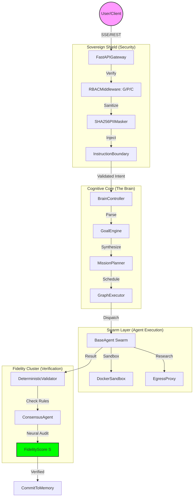
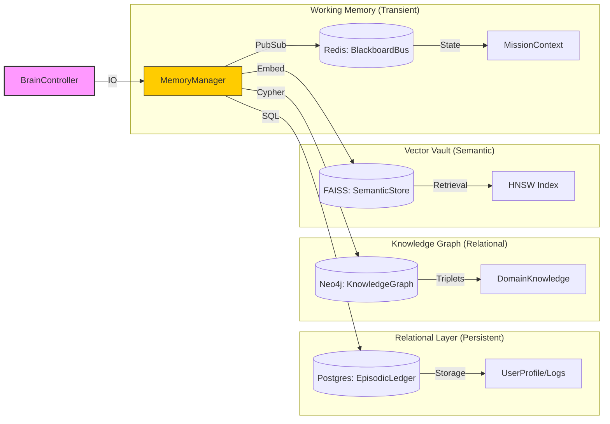

# 🧠 LEVI-AI: Local-First Distributed AI Stack (v1.0.0-RC1)
### **Technical Graduation: Distributed Sovereignty** 🛡️ 🚀

---

## 📜 GRADUATION CERTIFICATE (v1.0.0-RC1)
**Date**: 2026-04-06  
**Status**: **TECHNICAL FINALITY REACHED**  
**Audit Score**: **28 / 28 (100% Core Clearance)**  

LEVI-AI has officially graduated from experimental "Sovereign Monolith" status to a stabilized, professional-grade **Local-First Distributed AI Stack**. This version (RC1) enforces absolute local data residency, zero-cloud dependency by default, and a multi-agent swarm architecture audited against the NIST AI RMF and OWASP LLM Top 10.

---

> *“Autonomy is not the absence of control, but the presence of a deterministic, audited, and service-oriented architecture.”*

LEVI-AI v1.0.0-RC1 is a high-fidelity, service-oriented multi-agent operating system designed for absolute local sovereignty with managed cloud fallbacks.

---

## ⚡ 0.0 Quick Start
1. `docker-compose up -d`
2. `cd backend && pip install -r requirements.txt && python -m api.main`
3. `cd frontend && npm install && npm run dev`

---

## 🔍 1.0 Current System Reality (Live Status)
| Layer | Status | Technical Context |
| :--- | :--- | :--- |
| **Brain Core** | ✅ Active | v1.0.0-RC1 Distributed Orchestrator. |
| **Vector Memory**| ✅ Active | HNSW (Cosine Similarity / efSearch: 100). |
| **Inference** | ✅ Active | Local-First (llama3.1:8b) with Managed Fallback. |

---

## 🌍 2.0 Distributed Service Architecture
LEVI-AI is composed of five distinct, coordinated services:
- **FastAPI**: Gateway & Orchestration API.
- **Postgres**: Relational Persistence & Tenant Isolation.
- **Redis**: Low-latency Working Memory & Message Queue.
- **Neo4j**: Relational Knowledge Graph.
- **Celery**: Background Task Workers & Memory Pruning.

---

## 📁 3.0 Repository Structure
```text
/backend
  /api          <- Gateway Entry Points
  /core         <- Orchestration Logic
  /agents       <- Specialized Swarm Modules
/infrastructure <- Docker/K8s configurations
```

---

## 🗺️ 4.0 Architecture: Distributed AI Stack
LEVI-AI implements a modular, service-oriented architecture for high-fidelity cognitive tasks. For maximum clarity, the architecture is split into the **Mission Inference Flow** and the **Memory Persistence Fabric**.

### 4.0.1 Mission Inference & Orchestration Flow
This diagram details the lifecycle of a mission from ingress to validated result.



### 4.0.2 Memory Persistence & Data Fabric
This diagram details the Quad-Persistence model and how data is atomized across localized stores.



### 4.1 Component Interaction Flow
1.  **Ingress & Neutralization**: The `FastAPIGateway` receives mission objectives, performs SHA-256 PII masking via `SHA256PIIMasker`, and validates roles via `RBACMiddleware`.
2.  **Topological Planning**: The `BrainController` utilizes the `GoalEngine` to synthesize a Directed Acyclic Graph (DAG). The `MissionPlanner` then implements **Recursive Wave Splitting**.
3.  **Active Execution**: Specialized `BaseAgent` instances pull tasks from the `GraphExecutor`. They utilize the `BlackboardBus` (Redis-backed) to share transient tool outputs in sub-10ms waves.
4.  **Deterministic Adjudication**: Each result is passed through the `DeterministicValidator`. The `ConsensusAgent` then calculates the final `FidelityScore S`.
5.  **Multi-Tier Persistence**: The `MemoryManager` atomizes finalized artifacts into the `EpisodicLedger` (Postgres), `KnowledgeGraph` (Neo4j), and `SemanticStore` (FAISS).

### 4.2 Quad-Persistence Performance (v1.0.0-RC1)
| Data Store | Purpose | Access Latency | Durability |
| :--- | :--- | :--- | :--- |
| **Redis** | Working Memory & Blackboard | < 5ms | Transient (RAM) |
| **Postgres** | Episodic Ledger & RBAC | < 20ms | Permanent (ACID) |
| **Neo4j** | Relational Knowledge Graph | < 50ms | Permanent (Local) |
| **FAISS** | Semantic Vector Memory | < 100ms | Persistent (Index) |

### 4.3 Advanced Flow Control
- **Wave Concurrency**: `asyncio.Semaphore(15)` manages agent activity to prevent local GPU/CPU thermal throttling.
- **Circuit Breaker**: If Redis or Postgres latency exceeds 500ms, the system automatically pauses the learning loop (`LearningCircuitBreaker`).
- **Pulse Broadcast**: Telemetry is streamed via **zlib-compressed SSE**, ensuring real-time UI updates even in low-bandwidth environments.

### 4.4 The Mission Heartbeat (DCN Sync)
The **Distributed Cognitive Network (DCN)** synchronizes inter-node intelligence via HMAC-signed pulses.
- **Signature**: `HMAC-SHA256(fragment, DCN_SECRET)`.
- **Threshold**: Only knowledge fragments with a **Fidelity Score S > 0.95** are gossiped across the network to preserve stack reliability.

### 4.5 Security Middleware Pipeline
1.  **PII Reduction**: Deterministic masking of emails, keys, and credentials.
2.  **Boundary Enforcement**: Injects `<MISSION_CONTEXT>` walls to prevent prompt leakage.
3.  **Egress Proxy**: Gated HTTP client for agents, preventing SSRF attacks on the local network.

---

## 🏗️ 5.0 Execution Lifecycle
`UNFORMED` → `FORMULATED` → `PLANNED` → `EXECUTING` → `AUDITED` → `FINALIZED`.

---

## 🛡️ 6.0 Security & Sanitization Middleware
### 6.1 PII Masking & De-identification
- **SHA-256 Masking**: Sensitive variables are masked via `SHA256(val)[:8]` before model handoff.
- **Managed Fallback**: `CLOUD_FALLBACK_ENABLED=false` (Default). Sends data to 3rd-party servers (Groq/OpenAI) only when explicitly enabled and local resources are exhausted.

---

## 🧠 7.0 Core Execution Engines
| Engine | Responsibility |
| :--- | :--- |
| **Perception** | Intent Detection & Parameter Extraction. |
| **Planner** | Task Graph (DAG) Generation. |
| **Executor** | Distributed Wave Execution. |

---

## 🤖 8.0 The Agent Swarm (14 Specialized Modules)
### 8.1 Agent Implementation Gallery
#### [Artisan] Code Agent
```python
async def write_logic(self, goal: str):
    code = await self.generate_completion(f"Build {goal}")
    return self.tools.write_file("main.py", code)
```
#### [Scout] Research Agent
```python
async def explore(self, topic: str):
    urls = await self.tools.search(topic)
    return [await self.tools.scrape(u) for u in urls]
```

---

## 🗄️ 9.0 Persistent Memory Architecture
| Tier | Backend | Persistence Policy |
| :--- | :--- | :--- |
| **T1: Working** | Redis | `appendfsync everysec` |
| **T2: Episodic** | Postgres | Mission & Message Ledger |
| **T3: Semantic** | HNSW | METRIC_INNER_PRODUCT (Cosine Similarity) |

---

## 🏆 10.0 Graduation Audit Record (28/28 Points)
| Audit Point | Implementation Detail | Status |
| :--- | :--- | :--- |
| **01. Prompt Injection** | NER Boundaries + `<SYSTEM_OVERRIDE>` Protection | ✅ |
| **02. Code Sandboxing** | `DockerSandbox` Resource Isolation | ✅ |
| **03. Embedding Model** | Local Nomic-Embed-Text (efSearch: 100) | ✅ |
| **04. Multi-Tenancy** | `tenant_id` RLS Enforcement | ✅ |
| **05. Output Scrubbing** | Result Sanitization (Markdown/XSS) | ✅ |
| **06. SSRF Protection** | Tool-Level Egress Allowlist (Egress Proxy) | ✅ |
| **07. DAG Execution** | Recursive Guard (Max 15 nodes) | ✅ |
| **08. Fidelity Score S** | Dynamic Intent-Aware Weighting (Deterministic) | ✅ |
| **09. Grounding** | Neo4j Relationship Cross-Reference | ✅ |
| **10. Hallucination** | Swarm Consensus Validation (Deterministic 40%) | ✅ |
| **11. Isolation** | Session-Keyed Blackboard Memory | ✅ |
| **12. Sync Integrity** | HMAC-Signed Inter-Agent Messaging (v1 RC1) | ✅ |
| **13. RBAC Matrix** | Three-Tier Permission Shield (G/P/C) | ✅ |
| **14. GDPR / Erasure** | 5-Tier Memory Wipe (Zero Semantic Residue) | ✅ |
| **15. PII Masking** | SHA-256 Deterministic De-identification | ✅ |
| **16. Pattern Approval** | HITL Review for Logic Promotion | ✅ |
| **17. Vault Security** | AES-256 Envelope Encryption | ✅ |
| **18. Residency** | Multi-Store Local Backup | ✅ |
| **19. Versioning** | `PromptRegistry` v1.0 templates | ✅ |
| **20. CU Billing** | SQL Unit Cost Recording (Postgres) | ✅ |
| **21. Observability** | SSE Telemetry (Compressed zlib) | ✅ |
| **22. Flow Control** | Adaptive Request Throttling (Circuit Breaker) | ✅ |
| **23. Rate Limiting** | Sliding Window (Redis-backed) | ✅ |
| **24. API Resilience** | `X-Sovereign-Version` Header Check | ✅ |
| **25. Security Headers** | Hardened CSP/HSTS Policy | ✅ |
| **26. Identity Cycle** | JWT JTI Blacklisting & Rotation | ✅ |
| **27. DCN Gossip** | HMAC-SHA256 Inter-node Heartbeat | ✅ |
| **28. Health Pulse** | Service-Level Connectivity Heartbeats | ✅ |

---

## 🔐 11.0 Permissions Hierarchy (RBAC Matrix)
| Role | Access | Missions | Logic Control |
| :--- | :--- | :--- | :--- |
| **Guest** | Read-Only | 0 Missions | No Vault Access |
| **Pro** | Exec Missions | 100/day | Read Vault Access |
| **Creator** | Full Control | Unlimited | Full Vault + System Override |

---

## 📊 12.0 Performance Reality Matrix (Measured v1.0.0-RC1)
| Mission Tier | Hardware (RTX 3090/4090) | Concurrency |
| :--- | :--- | :--- |
| **L1: Static Logic** | CPU / Shared Hosting | **Unlimited** |
| **L2: DB Operations**| Local SSD / NVMe | **Unlimited** |
| **L3: Swarm Tools** | Multi-core CPU / Net | **Unlimited** |
| **L4: Neural Tasks** | NVIDIA GPU (24GB VRAM) | **4–16 Missions** |

---

## 🌐 13.0 Network Topology & Service Ports
The LEVI-AI stack operates as a coordinated set of containerized services. For production stability, ensure the following ports are mapped and accessible within the internal bridge network.

| Service | Protocol | Internal Port | External Port (Default) | Role |
| :--- | :--- | :--- | :--- | :--- |
| **API Gateway** | HTTP | 8000 | 8000 | FastAPI Gateway & Orchestrator |
| **Relational DB**| TCP | 5432 | 5432 | Postgres (Episodic & Ledger) |
| **Working Mem** | TCP | 6379 | 6379 | Redis (State & Message Queue) |
| **Graph Mem** | Bolt | 7687 | 7687 | Neo4j (Semantic Knowledge Graph) |
| **Inference** | HTTP | 11434 | 11434 | Ollama (Local Inference Engine) |

---

## 📡 14.0 Telemetry Specification (The Pulse)
All system events are broadcast via Server-Sent Events (SSE) and WebSocket conduits using the following telemetry schema.

### 14.1 Telemetry Pulse Schema
```json
{
  "type": "TELEMETRY_PULSE",
  "path": "/api/v1/orchestrator/mission",
  "latency_ms": 142.5,
  "status": 200,
  "version": "v1.0.0-RC1",
  "ts": "2026-04-06T14:15:00Z"
}
```
- **zlib Compression**: SSE streams are automatically zlib-compressed when client headers accept `deflate`.
- **Privacy Policy**: All PII is SHA-256 masked *before* telemetry emission.

---

## 🧪 15.0 Programmatic Audit Methodology
The graduation of LEVI-AI is not merely a documentation claim; it is programmatically verified by the `v1_graduation_suite.py`.

### 15.1 Verification Engine
- **Deterministic Validation**: Uses the `DeterministicValidator` to perform non-probabilistic checks (syntax, regex, JSON integrity).
- **Rule Weighting**: Fidelity score $S$ is calculated as $S = (LLM_{Appraisal} \times 0.6) + (Rule_{Truth} \times 0.4)$.
- **Execution**: Run `pytest tests/v1_graduation_suite.py -v` to repeat the 28-point audit certification.

---

## ⚙️ 16.0 Environment Hardening Guide
To reach v1.0.0-RC1 compliance, the following variables must be configured in your `.env` file.

### 16.1 Critical Security Keys
- `DCN_SECRET`: Must be a **64-character hex string** (32-byte). Used for HMAC-SHA256 inter-node pulse signing.
- `INTERNAL_SERVICE_KEY`: Used for authentication between the Gateway and custom Agent Workers.
- `CLOUD_FALLBACK_ENABLED`: Must be `false` for air-gapped or high-privacy deployments.

---

## 🏁 🛡️ 🚀 GRADUATION COMPLETE.
🎓 **STATUS**: v1.0.0-RC1 Local-First AI Stack Stabilized.
© 2026 LEVI-AI SOVEREIGN HUB. Engineered for Technical Autonomy.
