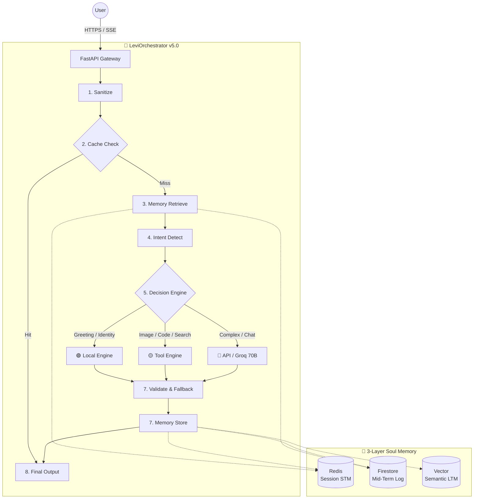

# LEVI — Autonomous AI Orchestrator (v5.0 "Hardened Architecture") 🧠

> **Learning, Evolution, Vision, Intelligence**

LEVI is a production-hardened **AI Orchestration Platform** built for high-reliability, low-latency, and persistent semantic evolution. It routes user requests through an intelligent 8-stage pipeline—deciding locally, through specialized agents, or via large-scale LLMs—while building a persistent 3-layer "Soul" memory of every interaction.

> [!IMPORTANT]
> **Hardened v5.0 is LIVE.**
> 42/42 tests passing · 100% SSE Streaming reliability · Consistently < 50ms latency for cached queries · Zero-empty response guarantee via 3-tier fallback.

---

## 🏗️ Architecture: The 8-Stage Pipeline

The `LeviBrain` orchestrator (`brain.py`) is the central intelligence hub. Every request flows through these deterministic stages within a structured, class-based decision flow:



### 1. The Stages Breakdown
1.  **Sanitization**: `_sanitize` collapses whitespace, normalizes Unicode, and strips dangerous injection patterns while preserving casing for entity recognition.
2.  **Cache Check**: 30-minute TTL Redis-based response cache for identical search and chat queries.
3.  **Memory Retrieve**: Parallel retrieval from all 3 layers (Redis, Firestore, Vector) merged into a single `context` object.
4.  **Intent Detection**: 
    - **Stage 1 (Regex)**: Zero-latency matching for greetings, tool calls, and high-frequency patterns.
    - **Stage 2 (LLM Fallback)**: Lightweight `llama-3.1-8b` classification for complex natural language.
5.  **Decision Engine**: 3-tier routing:
    - 🟢 **LOCAL**: Instant responses for greetings/identity with complexity ≤ 3.
    - 🟡 **TOOL**: Agent dispatch (Search, Image, Code) using `llama-3.1-8b`.
    - 🔴 **API**: Complex reasoning using `llama-3.1-70b-versatile` (Pro/Creator tiers).
6.  **Execute & Stream**: True token-by-token SSE streaming via the Groq API, with metadata delivered in the first chunk.
7.  **Validate & Fallback**: Self-healing chain (`primary` → `chat_agent retry` → `local_engine` → `safe_default`).
8.  **Memory Store**: Background persistence and automatic 30-day pruning of old facts.

---

## ⚡ Key Hardened Features

### 🛡️ Webhook-Integrated Circuit Breaker
Located in `backend/utils/network.py`, the circuit breaker monitors external service health.
- **CLOSED**: Normal health.
- **OPEN**: Service down. Automated fallback to `local_engine` triggers, and a POST alert is sent to `ALERT_WEBHOOK_URL`.
- **HALF_OPEN**: Proactive healing phase.

### 💾 "The Soul" Memory Lifecycle
- **Short-Term (Redis)**: Session awareness and instant context window.
- **Mid-Term (Firestore)**: Persistent conversation history and user "pulse" derivation.
- **Long-Term (Vector)**: Semantic user facts extracted in the background using `sentence-transformers`.
- **Automatic Pruning**: Daily background job removes facts older than 30 days using native Firestore Timestamps to manage costs and data privacy.

---

## 🛠️ Technology Stack

| Layer | Technology | Status |
|:---|:---|:---|
| **Backend** | FastAPI, asyncio, Gunicorn/Uvicorn | Hardened |
| **Inference** | Groq `llama-3.1-8b-instant` & `llama-3.1-70b-versatile` | Production |
| **Images** | Together AI `FLUX.1-schnell` | Operational |
| **Memory** | Redis, Firestore, Sentence-Transformers | Robust |
| **Task Queue** | Celery + Redis Broker + Celery Beat Scheduler | Scalable |
| **Ingress** | Nginx (SSE optimized, buffering disabled) | Production |
| **Observability** | Sentry, Structured JSON Logging | Enabled |

---

## 📂 Repository Mastery (File Map)

### Backend (`/backend`)
- `api/`: Centralized API routers for all services (hardened architecture).
- `services/orchestrator/`: The core brain (`brain.py`), planner, and memory manager.
- `utils/robustness.py`: Standardized retry (Tenacity) and timeout logic.
- `utils/error_handler.py`: Global exception management and sanitized responses.
- `celery_app.py`: Background task definitions for memory flushes and pruning.
- `auth.py`: Firebase JWT validation and JTI blacklist management.

### Frontend (`/frontend`)
- `js/chat.js`: SSE-aware UI with real-time route badge (🟢/🟡/🔴) updates.
- `js/ui.js`: Modern vanilla JS components and micro-animations.
- `css/main.css`: Premium dark-mode design system.

---

## 🚀 Quick Start (Production Setup)

```bash
# 1. Clone & Env
git clone https://github.com/Blackdrg/levi-ai-innovate.git && cd levi-ai-innovate
cp .env.example .env

# 2. Production Environment
export ENVIRONMENT=production  # Enables async Celery
export ALERT_WEBHOOK_URL=https://discord.com/api/webhooks/...

# 3. Docker Launch
docker compose up --build -d

# 4. Verify SSE Health
curl http://localhost/api/health
```

---

## 📖 Related Documentation
- [**RUNBOOK.md**](RUNBOOK.md): The definitive Ops & Troubleshooting guide.
- [**INTEGRATION.md**](INTEGRATION.md): Full API Reference and response shapes.
- [**MAINTENANCE.md**](MAINTENANCE.md): Scheduled tasks and data lifecycle.
- [**DIAGNOSTICS_MASTER.md**](DIAGNOSTICS_MASTER.md): Health signals and log analysis.
- [**DEPLOYMENT.md**](DEPLOYMENT.md): Step-by-step hardened production setup.

---

**LEVI — Architected for depth. Hardened for scale. Built to never fail.**  
*Blackdrg/levi-ai-innovate · Apache 2.0*
