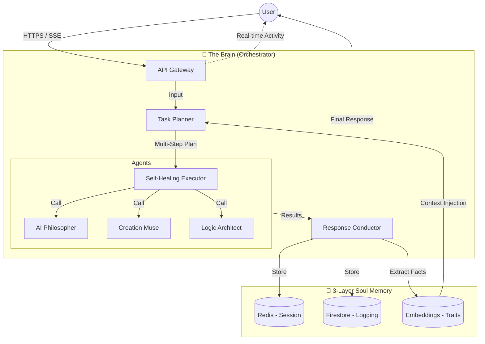

# LEVI — The Celestial AI Philosopher (v6.0 Production) 🌌

LEVI is a high-fidelity **AI Orchestrator** designed for philosophical exploration and autonomous task execution. It has evolved from a simple chatbot into a sophisticated **Intent → Plan → Execute → Synthesize** loop, capable of cross-session memory and real-time state synchronization.

> [!IMPORTANT]
> **Production Status**: v6.0 "The Soul" Is LIVE. 
> Integrates: **Autonomous Orchestrator**, **3-Layer Semantic Memory**, **Real-Time SSE Activity**, and **Tier-Aware Credit Processing**.

---

## 🏗️ Architecture: The Orchestrator Loop

LEVI coordinates specialized agents to solve complex human requests, moving beyond simple prompts into a self-healing, multi-step execution pipeline.



---

## 🚀 Key Features (v6.0)

### 🧠 Autonomous Orchestration
LEVI analyzes every request for intent and complexity. If you ask for a complex task, it generates a multi-step execution plan across specialized agents, synthesizing the final result into a cohesive philosophical dialogue.

### 💾 3-Layer Soul Memory
- **Short-Term (Redis)**: Instant, sub-millisecond session awareness.
- **Mid-Term (Firestore)**: Historical interaction tracking and "Interaction Pulse" (Mood).
- **Long-Term (Embeddings)**: **Semantic Fact Extraction**. LEVI identifies traits and preferences during your conversation, building a persistent "Soul" profile that persists across all future sessions.

### ⚡ Real-Time Omnipresence
Implemented using **Server-Sent Events (SSE)**, the platform now features a global activity stream and real-time credit synchronization. Your user state (Tier/Credits) updates instantly across all open tabs.

### 🛡️ Production Hardening
- **Self-Healing Execution**: Automatic retries with exponential backoff for all agent calls.
- **Managed Background Tasks**: Strong-referenced task handlers prevent memory processing failures during high-concurrency requests.
- **Secure Gateway**: Hardened API gateway with JWT injection and CORS-locked origins.

---

## 🛠️ Technology Stack
- **Frontend**: Vanilla JS & CSS (High Performance/Zero-Hydration), SSE Streaming.
- **Backend**: FastAPI, asyncio worker threads, Standardized API v1 Gateway.
- **AI Stack**: Groq (Llama 3.1 70B/8B), Together AI (FLUX.1-schnell), Sentence-Transformers.
- **Infrastructure**: Firebase (Auth/Firestore), Redis (Session Cache/Pub-Sub), Vercel/Cloud Run.

---

## 🚀 Quick Start (Development)

1. **Environment Setup**:
   ```bash
   python -m venv .venv
   source .venv/bin/activate  # or .\.venv\Scripts\Activate.ps1
   pip install -r requirements.txt
   ```
2. **Local Development**:
   LEVI features a robust **Auth STUB** for local development. You can test the full "Brain" logic even without Firebase production keys.
   ```bash
   python -m backend.gateway
   ```

---

## 📂 Repository Structure
- **[/backend](backend/)**: Core Orchestrator services, Memory Management, and API Gateway.
- **[/frontend](frontend/)**: The primary philosophical interface and dynamic studio.
- **[/scripts](scripts/)**: Deployment and maintenance utilities.
- **[vercel.json](vercel.json)** & **[firebase.json](firebase.json)**: Production routing and API rewrite alignment.

---

**LEVI — Architected for depth. Optimized for emergence.**  
*Exploring the intersection of human intent and machine logic.*
