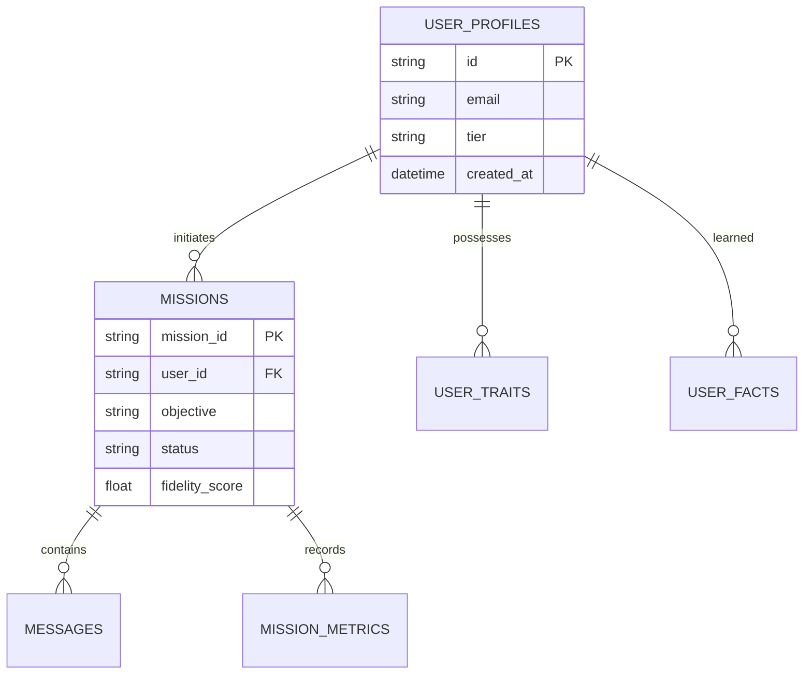

# LEVI-AI Database & Persistence Manifest (v14.2)

LEVI-AI utilizes a multi-engine persistence strategy to balance relational integrity with semantic discovery and episodic speed.

## 🗄️ Relational Schema (PostgreSQL 15)

The PostgreSQL instance acts as the absolute source of truth for missions, identity, and compliance.

### ER Diagram (Mermaid)


## 🧠 Cognitive Persistence Layers

- **Tier 1 (Episodic)**: [Redis] 7-day rolling interaction buffer.
- **Tier 2 (Factual)**: [PostgreSQL] Immutable mission history.
- **Tier 3 (Relational)**: [Neo4j] Knowledge graph of semantic triples (User->Knows->Entity).
- **Tier 4 (Identity)**: [FAISS/Vector Store] Distributed vector memory for similarity RAG.

## 🔄 Lifecycle & Migrations

- **Alembic**: Relational migrations are managed via Alembic.
  ```bash
  alembic upgrade head
  ```
- **Data Lifecycle**: Audit logs are partitioned monthly. GDPR deletions trigger a "Multi-Tier Sovereign Wipe" that physically erases data across all 4 tiers plus the Cloud Tasks queue.

## 🛡️ Index Strategy
- **B-Tree**: On `user_id` and `mission_id` across all relational tables.
- **HNSW**: On the Vector store for sub-10ms similarity search at scale.
- **Relational Indices**: Neo4j labels on `User` and `Concept` nodes for rapid graph resonance.
