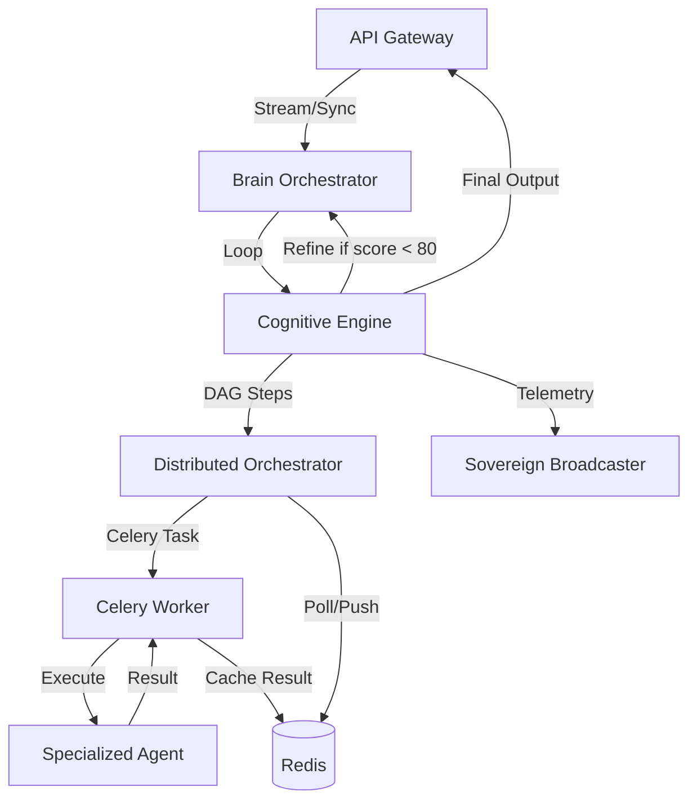

# Sovereign Cognitive Orchestration Architecture (v22.1-Autonomous)

## Overview
The Sovereign Cognitive Orchestration Engine transforms basic LLM interactions into an autonomous, self-refining "Thinking Loop." It manages the transition from user intent to verifiable high-fidelity outcomes via a distributed multi-agent system.

## Core Components

### 1. Cognitive Engine (`cognitive_engine.py`)
- **State Machine**: Manages mission lifecycles (`PLANNING` -> `EXECUTING` -> `VALIDATING` -> `REFINING` -> `COMPLETED`).
- **Thinking Loop**: Implements the `Plan-Execute-Evaluate-Refine` cycle.
- **Parallel DAG Executive**: Executes non-dependent mission steps in parallel using `asyncio.gather`.
- **Fidelity Gate**: Scoring mechanism (0-100) to ensure output quality before completion.

### 2. Distributed Orchestrator (`orchestrator.py`)
- **Control Plane**: Coordinates between the Cognitive Engine and the Task Queue.
- **Distributed Tasks**: Offloads intensive agent work to Celery worker nodes.
- **State Store**: Uses Redis for real-time mission state persistence and tracking.
- **Global Pulse**: Connects mission events to the `SovereignBroadcaster` for system-wide telemetry.

### 3. Multi-Agent System (MAS)
- **Cognition (The Architect)**: High-order reasoning and strategic planning.
- **Sentinel (The Auditor)**: Adversarial validation and security scrubbing.
- **Librarian (The Memory)**: Semantic retrieval and knowledge anchoring.
- **Executor (The Action)**: Tool invocation and system-level operations.

## Connection Topology

## Resilience Features
- **Deterministic State Tracking**: Every mission has a unique ID and persistent state in Redis.
- **Exponential Backoff**: Automated retries for failed agent tasks.
- **Truth Anchoring**: Shared contextual fact extraction ensures factuality across agent roles.
- **Adversarial Reflection**: The Sentinel agent provides a critical layer of verification before any data reaches the user.

## Verification
Use `verify_engine.py` to run a full-loop integration test.
