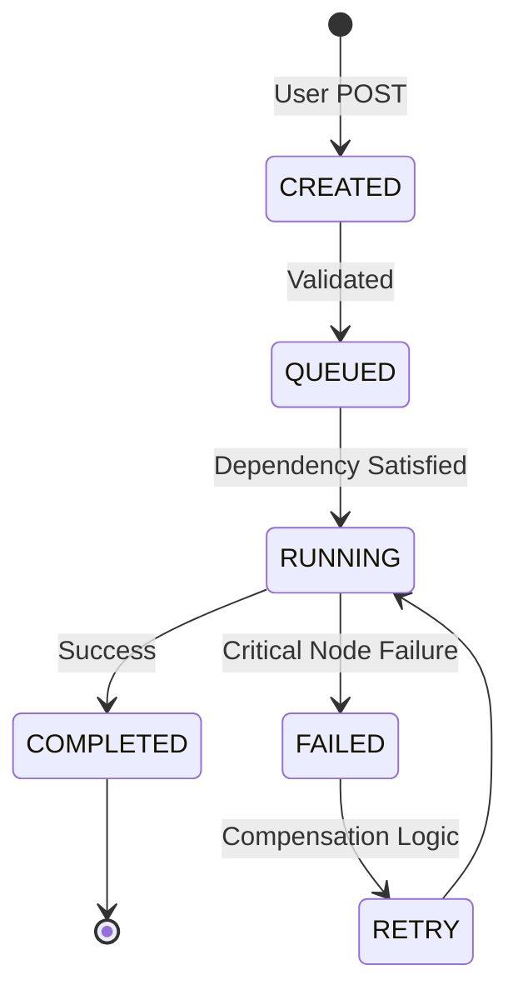
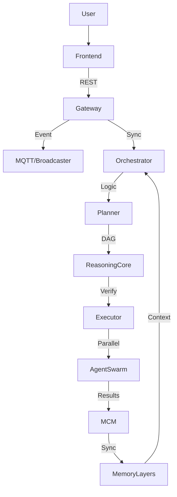

# LEVI-AI Brain: Core Reasoning & Orchestration (v14.2)

The LEVI-AI Brain is the centralized intelligence tier of the Sovereign OS. it governs the transition from unstructured user intent to deterministic mission execution waves.

## 🎯 Cognitive Engines

1.  **Planning Engine**: Converts perception and User Intent into a Goal-Aligned Directed Acyclic Graph (DAG).
2.  **Reasoning Engine**: Performs context-aware critique and simulation of the DAG. Assigns a confidence score before execution.
3.  **Execution Engine**: Pulls mission nodes from the wave scheduler and assigns them to specialized agents in the swarm.
4.  **Memory Engine**: Manages the 4-tier cognitive persistence layers and ensures cross-regional consistency (MCM).
5.  **Evolution Engine**: Analyzes mission fidelity ($F$) to distill traits and promote stable patterns to the Fast-Path cache.

## 🧠 Reasoning Algorithm (Master Flow)

The LEVI-AI reasoning pipeline follows a strict five-stage transformation:

`User Intent → Perception → Planner → DAG → Reasoning (Gate) → Executor → Output`

### Confidence Scoring Logic
The **Reasoning Core** calculates a Confidence Score ($S$) before allow any DAG to enter the execution pipeline:

$$S = 1.0 - (0.2 \cdot \text{Issues}) - (0.05 \cdot \text{Warnings}) - \text{Complexity Penalty}$$

- **Issues**: Critical logic flaws detected during DAG simulation.
- **Warnings**: Potential bottlenecks or tool overlaps.
- **Threshold**: Missions with $S < 0.55$ are automatically sent back for **Re-Planning (Pass 2)**.

## 🎯 Orchestrator State Machine

The mission lifecycle is governed by a strict state machine:

## 🔌 Service Wiring (Real-time Flow)

