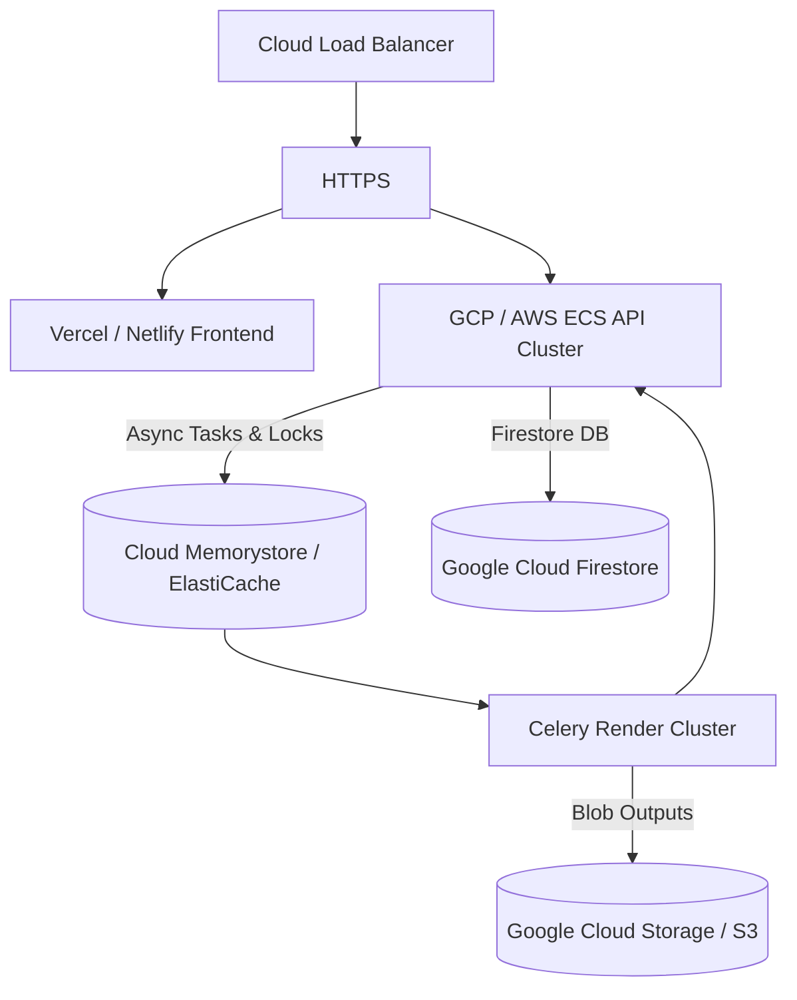

# 🚢 LEVI-AI Global CI/CD Deployment Architecture

> [!IMPORTANT]
> **Sovereign OS v7 Specification**
> LEVI-AI is no longer a localized monolith. It is a strictly structured micro-service array. Deployment requires dual-process hosting (FastAPI synchronous nodes + Celery asynchronous workers) backed by external State and Blob instances.

---

## 🏗️ 1. Infrastructure Topology

To successfully deploy LEVI-AI, your cloud provider MUST support the following topology:



## ⚙️ 2. Hardware Matrix Recommendations

LEVI-AI is modular. You scale the **API** independently from the **Worker Nodes**.

| Node Type | Minimum Spec | Recommended Spec | Primary Role |
|-----------|--------------|------------------|--------------|
| **API Web Node** | 1 vCPU, 512MB RAM | 2 vCPU, 8GB RAM | Routing, Identity, Token Streaming. (8Gi recommended for Monolith) |
| **Generative Worker** | 2 vCPU, 4GB RAM | 4 vCPU, 8GB RAM | Image processing, PyDub Audio, Ken-Burns Rendering. |
| **FAISS Matrix Worker** | 2 vCPU, 2GB RAM | 4 vCPU, 4GB RAM | Keeps `paraphrase-MiniLM` in RAM for rapid vector inference. |
| **Cache Broker** | 50MB RAM | 1GB RAM Redis | Handles distributed locks and pub/sub Celery routing. |

---

## ☁️ 3. Deployment Provider Guides

### Google Cloud Run (Recommended for API)
LEVI-AI was built natively with GCP APIs (Firestore, GCS). 
1. **Containerize:** Use the included `backend/Dockerfile.prod`.
2. **Deploy via Cloud Build:** 
   ```bash
   gcloud run deploy levi-ai-api --source . --platform managed --allow-unauthenticated
   ```
3. **Secrets Management:** Instead of raw `.env` texts, bind GCP Secret Manager directly to your container.

### Render / Digital Ocean App Platform
> [!WARNING]
> Render Free Tier drops connections after 15 minutes of inactivity. Due to the massive RAM usage of sentence-transformers, LEVI-AI detects `RENDER=true` in its environment variables and forces a deterministic Numpy hash fallback for the FAISS matrix.

1. **Create Web Service (API)**: Set the start command to `uvicorn backend.api.main:app --host 0.0.0.0 --port 10000`.
2. **Create Background Worker**: Set the start command to `celery -A backend.celery_app worker --loglevel=info --pool=solo`.

### Vercel (Frontend Client)
1. Fork the GitHub repository.
2. Link Vercel exclusively to the `frontend/` Root Directory.
3. Configure Environment Variables:
   - `VITE_API_BASE_URL=https://api.your-levi-instance.app`
4. Deploy the Vite React SPA.

---

## 🔐 4. Environmental Configuration Validation

Before booting a Production Node, guarantee the following values are properly injected:

```env
# ── Identity ──
FIREBASE_SERVICE_ACCOUNT_JSON=/etc/secrets/firebase.json

# ── AI Acceleration ──
GROQ_API_KEY=gsk_....
TOGETHER_API_KEY=....

# ── Infrastructure ──
ENVIRONMENT=production
REDIS_URL=redis://your-remote-host:6379/0

# ── Monetization ──
RAZORPAY_KEY_ID=rzp_live_...
RAZORPAY_KEY_SECRET=...
```

> [!CAUTION]
> **Do not deploy the Worker Instance without the FAISS path correctly mapped!** 
> Set `VECTOR_DB_PATH=/tmp/faiss_data` on serverless instances, or mount a persistent volume if you want vector memory to sustain across pod restarts.
