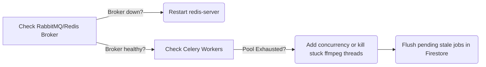

# 🚨 Priority 1 Escalation: LEVI-AI Server Runbook

Because LEVI-AI v7 is a multi-process, distributed pipeline, a failure usually isolates into one of three domains: Node Routing, Data Stores, or Generator Queues.

## Level 1: API / Core Router Failure
**Symptoms:** FastAPI is returning `500` continuously, or Server-Sent Events (SSE) immediately disconnect.
**Resolution Steps:**
1. Check the Llama.cpp fallback path or Groq API rate-limits. If `GROQ_API_KEY` hit request limits, the MetaPlanner will stall.
2. Examine the `server_log.txt` in the root or `backend/logs/`.
3. Hard reset the API container cluster (`backend/api/main.py`) without touching the Database or Celery Workers.

## Level 2: Async Queue Rendering Deadlock (Studio)
**Symptoms:** Users click `Generate Video` and the job hangs in a `pending` state indefinitely.
**Resolution Steps:**

1. Access the `Flower` web UI on `http://localhost:5555`.
2. Determine if MoviePy spawned an invisible sub-process of `ImageMagick` that is hanging on a prompt.
3. If using Windows, ensure the pool is set to `solo` (`--pool=solo`). Permitting `prefork` on Windows causes severe billiard semaphore deadlocks.

## Level 3: Distributed Matrix / FAISS Failure
**Symptoms:** Memory retrieval returns empty, or process dumps huge amounts of RAM.
**Resolution Steps:**
If RAM spikes to 100%, an embedded `paraphrase-MiniLM` sentence transformer is likely memory leaking across multi-threaded loads. 
- You MUST cap Uvicorn workers and limit Celery concurrency, or switch to the `RENDER=true` simulated hashing algorithm to instantly cut memory usage by 800MB.
