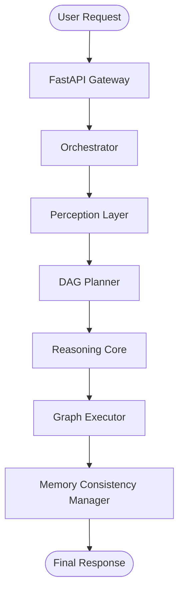

# LEVI-AI: Cognitive Architecture Deep Dive (v14.1)
### Architectural Specification: Unified Mission Pipeline

> [!IMPORTANT]
> Spec v14.1 collapses the cognitive surface area by merging the `Brain`, `GoalEngine`, and `PolicyEngine` into a unified `Orchestrator` and `Planner` architecture.

---

## 1. Unified Mission Pipeline

The complete cognitive lifecycle is managed by three primary hardened components:



---

## 2. Component Specifications

### 2.1 Sovereign Orchestrator
The central entry point for mission lifecycle management.
- **Role**: Coordinates intent capture, security gating, and memory synchronization.
- **Hardening**: Implements the **Deterministic Fast-Path** (Spec v14.1) to bypass planning for graduated rules.
- **States**: `UNFORMED` → `PLANNED` → `EXECUTING` → `VALIDATING` → `COMPLETE`.

### 2.2 DAG Planner (Goal + Policy)
A unified planning engine that absorbs both **Goal Formulation** and **Policy Allocation**.
- **Role**: Decomposes intent into a Goal, selects the appropriate `BrainMode`, and generates a topological Task DAG.
- **Logic**: Implements **Fragility-Aware Mode Selection**, escalating to `DEEP` mode for fragile domains.

### 2.3 Graph Executor (Stateful Execution)
A rigorous DAG execution engine with formal node lifecycle states.
- **Role**: Executes DAG waves in parallel, manages agent slots, and enforces compensation guarantees.
- **States**: `CREATED`, `SCHEDULED`, `RUNNING`, `COMPLETED`, `FAILED`, `COMPENSATED`.

---

## 3. Fidelity Specification

Fidelity is the primary metric for mission truth and evolution triggers.

```
S = (LLM_Appraisal × 0.6) + (Heuristic_Grounding × 0.4)
```

- **Crystallization Gate**: $S > 0.85$ → Patterns added to `training_corpus`.
- **Graduation Gate**: $S > 0.95$ (with stability) → Pattern promoted to `GraduatedRule`.

---

## 4. Tiered Critic Validation

All mission results and deterministic overrides are passed through the **Tiered Critic Logic**:
- **Tier-0**: Mandatory syntactic validation.
- **Tier-1**: Deep semantic consistency (bypassed only for stable, high-fidelity rules).
- **Tier-2**: Comprehensive multi-agent validation for critical/inconsistent states.

---

*© 2026 LEVI-AI Sovereign Hub — Architectural Specification v14.1.0-Autonomous-SOVEREIGN Graduation*
