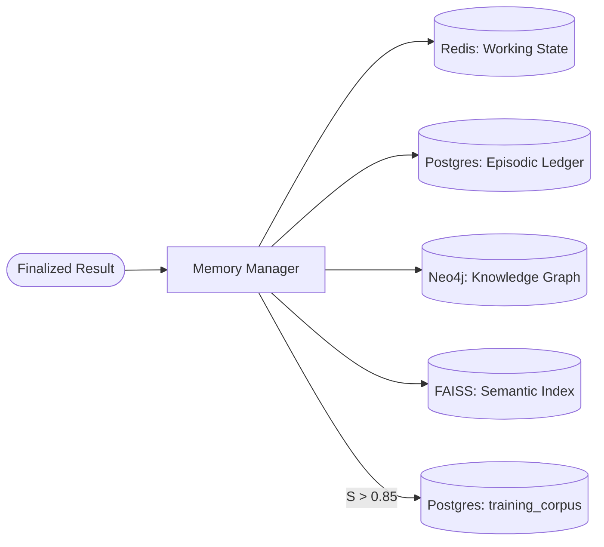

# LEVI-AI: Cognitive Architecture Deep Dive
### Architectural Specification v14.0.0-Autonomous-SOVEREIGN

---

## 1. The Brain Controller

The `BrainController` is the central cognitive hub of LEVI-AI. It manages the full mission lifecycle from perception to crystallization.

### 1.1 Mission States
```
UNFORMED → FORMULATED → PLANNED → EXECUTING → AUDITED → FINALIZED
```

| State | Module | Trigger |
| :--- | :--- | :--- |
| `UNFORMED` | Gateway | User submits raw natural language intent. |
| `FORMULATED` | GoalEngine | Intent decomposed into structured goal tree. |
| `PLANNED` | MissionPlanner | Goal tree converted to topological DAG. |
| `EXECUTING` | GraphExecutor | DAG waves dispatched to swarm agents. |
| `AUDITED` | CriticAgent | Fidelity Score S calculated across results. |
| `FINALIZED` | MemoryManager | Quad-sync to all 4 persistence tiers. |

---

## 2. GoalEngine — Intent Decomposition

The GoalEngine transforms raw user input into a structured goal tree for the planner.

### 2.1 Decomposition Strategy
- **Primary Intent**: The core action the user wants to achieve.
- **Sub-Goals**: Dependent tasks that must be completed to satisfy the primary intent.
- **Context Anchors**: Historical facts from the Memory Vault that ground the plan.

### 2.2 Interaction with Memory
```
UserInput → GoalEngine → [Neo4j: entity recall] → [FAISS: semantic context]
                       → StructuredGoalTree → MissionPlanner
```

---

## 3. MissionPlanner — DAG Construction

The `MissionPlanner` generates a Directed Acyclic Graph (DAG) from the goal tree.

### 3.1 Wave Topology
Each "wave" is a set of tasks with no inter-dependencies — they can safely execute in parallel.

```
Wave 1: [Research]                     # No deps
Wave 2: [Analyze, Validate]            # Dep: Wave 1 results
Wave 3: [Synthesize, Write]            # Dep: Wave 2 results
Wave 4: [Critic Review]               # Dep: Wave 3 results
```

### 3.2 Safety Guards
- `MAX_WAVES = 8`: Prevents infinite recursion in complex missions.
- `MAX_MISSION_NODES = 15`: Hard cap on total task nodes per mission.
- `WARNING_THRESHOLD = 8`: Emits a complexity pulse if exceeded.

---

## 4. GraphExecutor — Wave Execution Engine

### 4.1 Execution Protocol
1. Identify executable nodes (all dependencies satisfied).
2. Acquire GPU slot from `asyncio.Semaphore(4)`.
3. Dispatch tasks in parallel via `asyncio.gather()`.
4. Collect `ToolResult` objects from each agent.
5. Release GPU slot.
6. Update completed set and advance to next wave.

### 4.2 Distributed Mode (DCN Preview)
When `DISTRIBUTED_MODE=true`, waves are enqueued to `dcn:task_queue` (Redis) for multi-node execution instead of local parallel processing.

---

## 5. Fidelity Score — Mathematical Specification

```
S = (LLM_Appraisal × 0.6) + (Rule_Truth × 0.4)
```

- **Range**: [0.0, 1.0]
- **Crystallization Gate**: S > 0.85 → Pattern added to `training_corpus`.
- **Retry Gate**: S < 0.5 → Task retried (max 2 retries, exponential backoff).
- **Abort Gate**: S < 0.2 on critical node → Mission aborted.

---

## 6. Memory Crystallization Flow



---

*© 2026 LEVI-AI Sovereign Hub — Architectural Specification v14.0.0-Autonomous-SOVEREIGN*
