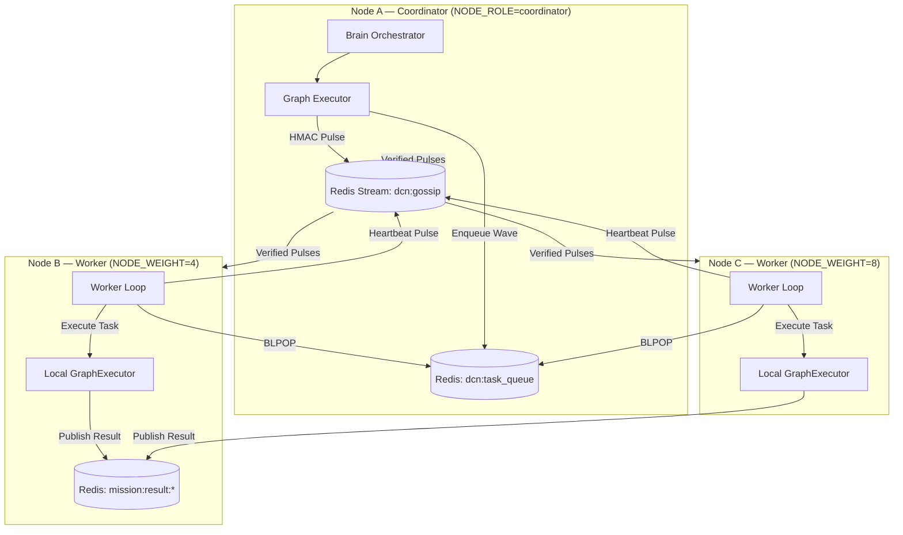

# LEVI-AI: Distributed Cognitive Network (DCN) v2.0
### Architectural Specification v14.0.0-Autonomous-SOVEREIGN [PREVIEW]

> [!IMPORTANT]
> DCN Multi-Node is in **Preview Status**. Target production graduation: **Q3 2026**.

---

## 1. Architecture Overview



---

## 2. Gossip Protocol Specification

### 2.1 Pulse Schema
```json
{
  "node": "node-alpha",
  "role": "coordinator",
  "weight": 4,
  "ts": 1712480000.123,
  "payload": {
    "type": "node_heartbeat",
    "vram_free_gb": 18.4,
    "active_tasks": 2,
    "mission_count": 142
  }
}
```

### 2.2 Signature Verification
```python
# On broadcast
sig = hmac.new(DCN_SECRET.encode(), msg_json.encode(), sha256).hexdigest()
await redis.xadd("dcn:gossip", {"msg": msg_json, "sig": sig})

# On receive
expected = hmac.new(secret, msg_json.encode(), sha256).hexdigest()
if not hmac.compare_digest(sig, expected):
    raise PulseRejected("Tampered or unauthenticated pulse.")
```

---

## 3. Task-Stealing Protocol

### 3.1 Weighted Concurrency
Each node's `NODE_WEIGHT` determines how many GPU slots it contributes:

| Node | NODE_WEIGHT | Concurrent Slots | Hardware |
| :--- | :--- | :--- | :--- |
| Alpha (Coordinator) | 4 | 4 tasks | RTX 4090 |
| Beta (Worker) | 8 | 8 tasks | 2x RTX 3090 |
| Gamma (Worker) | 16 | 16 tasks | A100 |

### 3.2 Task Stealing Logic
```python
async def worker_loop(self):
    while self.is_running:
        item = await redis.blpop("dcn:task_queue", timeout=5)
        if not item:
            continue  # idle

        if self.semaphore.locked():
            # No GPU slot available — put task back for another node
            await redis.rpush("dcn:task_queue", item[1])
            await asyncio.sleep(0.5)  # prevent spin
            continue

        asyncio.create_task(self._process_task(json.loads(item[1])))
```

---

## 4. Security Constraints

| Rule | Enforcement | Consequence |
| :--- | :--- | :--- |
| **Coordinator-only enqueue** | `node_role == "coordinator"` check | Worker nodes cannot submit waves |
| **HMAC signature required** | `compare_digest()` on every pulse | Unsigned/tampered pulses rejected |
| **Secret min length** | `len(DCN_SECRET) >= 32` | Warning logged if below threshold |
| **Self-pulse ignored** | `pulse["node"] == self.node_id` check | Prevents echo loops |

---

## 5. Environment Variables

| Variable | Example | Description |
| :--- | :--- | :--- |
| `DCN_NODE_ID` | `node-alpha` | Unique node identifier |
| `NODE_ROLE` | `coordinator` or `worker` | Controls enqueue permissions |
| `NODE_WEIGHT` | `4` | Number of GPU concurrency slots |
| `DCN_SECRET` | `[64-char hex]` | HMAC-SHA256 signing secret |
| `DISTRIBUTED_MODE` | `true` | Activates the worker loop on startup |
| `REDIS_URL` | `redis://localhost:6379/0` | Shared Redis cluster URL |

---

*© 2026 LEVI-AI Sovereign Hub — DCN v2.0 Specification v14.0.0-Autonomous-SOVEREIGN*
