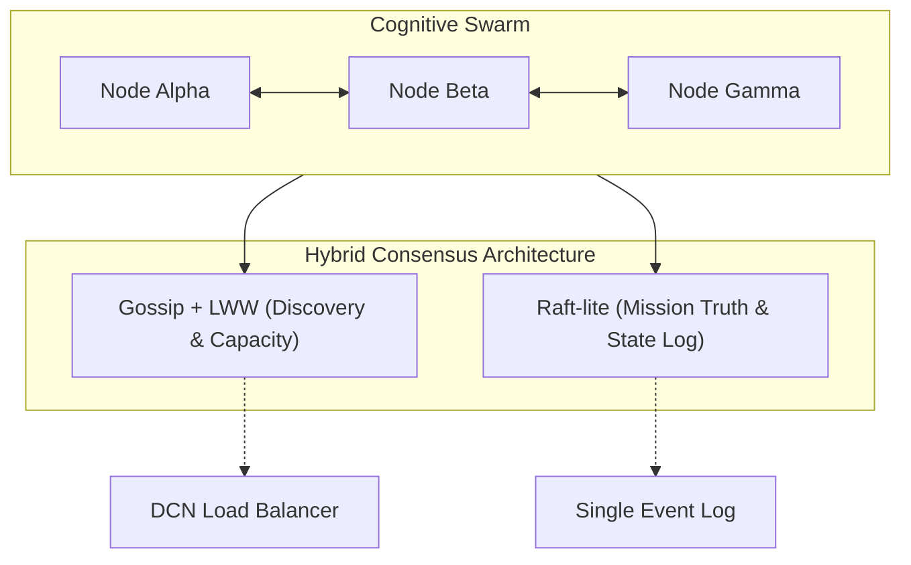

# LEVI-AI: Distributed Cognitive Network (DCN) v14.1
### Architectural Specification: Hybrid Consensus (Gossip + Raft-lite)

> [!IMPORTANT]
> DCN v14.1 graduates the protocol to a **Hybrid Consensus** model, ensuring both high-availability discovery and strong consistency for mission truth.

---

## 1. Architecture Overview



---

## 2. Hybrid Consensus Specification

### 2.1 Layer 1: Gossip + LWW (Availability)
- **Purpose**: Autonomous discovery, node health, and capacity propagation.
- **Algorithm**: Gossip protocol with Last-Write-Wins (LWW) conflict resolution for non-critical metadata.
- **Payloads**: Heartbeats, VRAM availability, CPU load, and non-critical cognitive observations.

### 2.2 Layer 2: Raft-lite (Consistency)
- **Purpose**: Definitive "Mission Truth" (Mission outcomes, execution indices, and audit-ready state).
- **Semantics**:
    - **Terms**: Monotonic terms to prevent stale voting/propagation.
    - **Indices**: Sequential commit indices for mission state transitions.
    - **Quorum**: Critical outcomes require a cluster-weighted quorum (v15 roadmap) or Term-based leader verification (v14.1).

---

## 3. Protocol Specification (v14.1)

### 3.1 DCN Pulse Schema (Unified)
```json
{
  "node_id": "node-alpha",
  "mission_id": "mission-456",
  "mode": "raft", // or "gossip"
  "term": 14,
  "index": 127,
  "payload_type": "mission_state",
  "payload": {
    "status": "completed",
    "result_hash": "sha256:..."
  },
  "signature": "hmac-sha256:...",
  "timestamp": 1712480000.123
}
```

### 3.2 Security: HMAC-SHA256
Every pulse must be signed with the shared `DCN_SECRET` (min 32 bytes).
Nodes discard any pulse where:
1. `hmac_verify(signature, payload_json) == False`
2. `mode == "raft"` AND `term < current_term`
3. `mode == "raft"` AND `index <= last_applied_index`

---

## 4. Failure Model & Reconciliation

| Scenario | Detection | Reconciliation Rule |
| :--- | :--- | :--- |
| **Node Crash** | Missing Heartbeat (60s) | Lease expiration in Redis State |
| **Network Partition** | Multiple terms detected | Raft term hierarchy (Higher term wins) |
| **State Drift** | Checksum mismatch | Replay from Single Event Log (Redis Stream) |
| **Omission** | TCP reset/timeout | Automatic Gossip re-propagation |

---

## 5. Environment Variables

| Variable | Requirement | Description |
| :--- | :--- | :--- |
| `DCN_SECRET` | Mandatory (min 32) | Shared secret for pulse authentication |
| `DCN_NODE_ID` | Mandatory | Unique identifier for the local node |
| `NODE_ROLE` | Optional | `coordinator` or `worker` (defaults to discovery) |
| `DCN_SYNC_INTERVAL` | Optional (30s) | Heartbeat and anti-entropy interval |

---

*© 2026 LEVI-AI Sovereign Hub — DCN Protocol Specification v14.1.0-Autonomous-SOVEREIGN Graduation*
