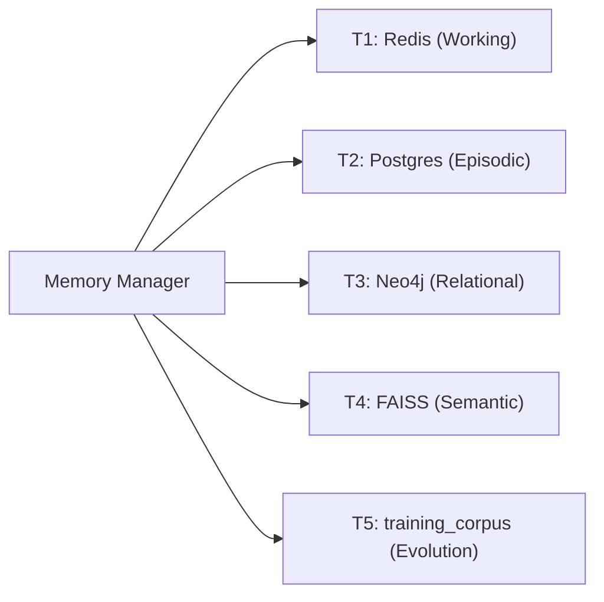

# LEVI-AI: Memory & Persistence Architecture
### Specification v14.0.0-Autonomous-SOVEREIGN

---

## 1. Quad-Persistence Strategy

LEVI-AI distributes cognitive state across 4 specialized stores. Every store serves a distinct memory tier optimized for its access pattern.



---

## 2. Tier Specifications

### T1 — Redis (Working State)
- **Purpose**: Real-time mission blackboard and pub/sub telemetry.
- **Durability**: `appendfsync everysec` (max 1s data loss).
- **Key Patterns**: `mission:{id}:state`, `dcn:task_queue`, `dcn:gossip`.
- **TTL Policy**: Blackboard keys expire after 3600s.

### T2 — Postgres (Episodic Ledger)
- **Purpose**: ACID-compliant historical mission trails and billing.
- **Durability**: WAL archiving every 5 minutes → `./vault/backups/wal`.
- **Key Tables**: `missions`, `messages`, `cognitive_usage`, `user_facts`, `training_corpus`.
- **PITR**: Point-in-time recovery to any 5-minute snapshot.

### T3 — Neo4j (Knowledge Graph)
- **Purpose**: Semantic entity-relationship mapping and contextual grounding.
- **Durability**: Full backup every 12 hours via `neo4j-admin backup`.
- **Schema**: Triplet format: `(Subject)-[RELATION]->(Object)`.
- **Query**: Cypher-based relational lookups for mission context enrichment.

### T4 — FAISS (Semantic Index)
- **Purpose**: High-recall vector search for RAG operations.
- **Durability**: Snapshot every 6 hours via `SnapshotOrchestrator`.
- **Index**: HNSW with `efSearch=64`, `efConstruction=200`.
- **Vector Model**: `nomic-embed-text` (768 dimensions).

### T5 — training_corpus (LearningLoop — ACTIVE)
- **Purpose**: Long-term crystallization of high-fidelity mission patterns.
- **Gate**: Only missions with `fidelity_score > 0.85` are stored.
- **Status**: **[ACTIVE] v14.0.0** — Autonomous 4-bit LoRA (Q4_K_M) fine-tuning pipeline enabled.
- **Evolution**: 5% improvement gate (Eval Harness) before hot-swapping adapters.

---

## 3. Memory Write Flow

```
Mission Finalized
    ↓
MemoryManager.store(result, fidelity_score)
    ↓
├── Redis.set(key, state, ex=3600)          # T1
├── Postgres.insert(Mission, CognitiveUsage) # T2
├── Neo4j.merge(entity_triplets)            # T3
├── FAISS.add(embedding_vector)             # T4
└── if fidelity_score > 0.85:
        Postgres.insert(TrainingPattern)    # T5
```

---

## 4. Disaster Recovery

### 4.1 RPO / RTO Targets
| Target | Value | Proof |
| :--- | :--- | :--- |
| RTO | < 300 seconds | `restore_drill.py` automated test |
| RPO | < 1 hour | WAL every 5min + `everysec` AOF |

### 4.2 Restore Drill
```bash
python -m backend.scripts.restore_drill
# Step 1: Snapshot all stores
# Step 2: Simulate store failures
# Step 3: Restore each store from backup
# Step 4: Assert all data intact within 300s
```

### 4.3 Backup Schedule
| Store | Method | Interval |
| :--- | :--- | :--- |
| Postgres | `pg_dump` + WAL | Every 5 min (PITR) |
| Neo4j | `neo4j-admin backup` | Every 12 hours |
| Redis | `appendonly.aof` | Continuous (`everysec`) |
| FAISS | Binary copy | Every 6 hours |

---

## 5. GDPR 5-Tier Erasure

When a user requests data deletion, LEVI-AI executes an atomic, ordered wipe across all 5 tiers:

```python
async def absolute_wipe(user_id: str):
    await redis.delete_pattern(f"user:{user_id}:*")          # T1
    await postgres.execute("DELETE FROM missions WHERE user_id=?", user_id)  # T2
    await neo4j.run("MATCH (n {user_id:$u}) DETACH DELETE n", u=user_id)    # T3
    await faiss_index.remove_ids_by_metadata(user_id=user_id)               # T4
    await postgres.execute("DELETE FROM training_corpus WHERE user_id=?", user_id)  # T5
```

---

*© 2026 LEVI-AI Sovereign Hub — Memory Architecture Specification v14.0.0-Autonomous-SOVEREIGN*
