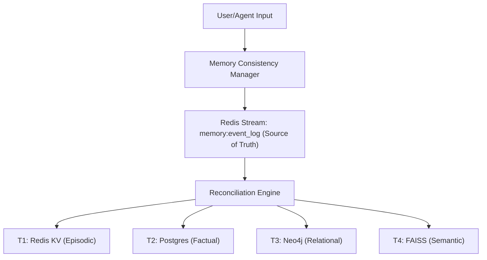

# LEVI-AI: Memory & Persistence Architecture (v14.1)
### Architectural Specification: Event-Sourced Cognitive Memory

> [!IMPORTANT]
> Memory v14.1 transitions from a multi-write system to a **Single Event Log** (Event Sourcing) model. This ensures absolute audit-stability and deterministic state reconciliation.

---

## 1. Event Sourcing Strategy

LEVI-AI implements a single source of truth for all memory events. Projections to downstream stores are derived from this immutable log.

---

## 2. Tier Specifications (v14.1 Hardened)

### Tier 0 — Single Event Log (Source of Truth)
- **Implementation**: Redis Stream (`memory:event_log`).
- **Purpose**: Immutable ledger of all cognitive arrivals, interaction results, and profile changes.
- **Integrity**: HMAC-SHA256 checksums per event.
- **Retention**: 10,000 events (sliding window); archived to cold Postgres storage.

### Tier 1 — Redis KV (Episodic Context)
- **Purpose**: Low-latency session history retrieval for real-time inference.
- **Sync**: Derived from Tier 0.
- **Durability**: AOF every-second.

### Tier 2 — Postgres (Factual History)
- **Purpose**: ACID-compliant long-term history and audit trails.
- **Sync**: Derived from Tier 0 via background reconciliation.

### Tier 3 — Neo4j (Relational Knowledge)
- **Purpose**: Semantic entity-relationship mapping for knowledge graphing.
- **Sync**: Derived from Tier 0 via extraction pipelines.

### Tier 4 — FAISS (Semantic Memory)
- **Purpose**: Vector indices for similarity-based recall (RAG).
- **Sync**: Derived from Tier 0 via embedding pipelines.

---

## 3. Memory Lifecycle

### 3.1 Write: Event Registration
1. `MemoryManager.store()` is called.
2. `MCM.register_event()` creates a signed `MemoryEvent`.
3. Event is appended to `memory:event_log` in Redis.
4. (Optional) Real-time projections are updated immediately for user feedback.

### 3.2 Read: Multi-Tier Retrieval
1. `MemoryManager.get_combined_context()` triggers parallel fetches from T1-T4.
2. Results are merged, ranked by relevance, and trimmed to fit the model's context window.
3. Context drift detection checks recent interaction patterns.

---

## 4. Reconciliation & Consistency

The **Reconciliation Engine** monitors the `memory:event_log` and ensures all derived tiers (Postgres, Neo4j, FAISS) reflect the latest events.

- **Checkpointing**: Tracks `last_synced_event_id` per tier.
- **Healing**: If a tier write fails, the engine retries from the last checkpoint.
- **Anomaly Detection**: Mismatches between Tier 0 and derived tiers are logged for audit.

---

## 5. Security & Privacy (GDPR)

- **Audit-Stability**: Every memory state is traceable back to a specific event in the log.
- **Absolute Wipe**: User-initiated deletion triggers an atomic wipe across Tier 0 (log entries) and all T1-T4 projections.
- **Data Isolation**: `tenant_id` and `user_id` partitioning enforced at all layers.

---

*© 2026 LEVI-AI Sovereign Hub — Memory Architecture Specification v14.1.0-Autonomous-SOVEREIGN Graduation*
