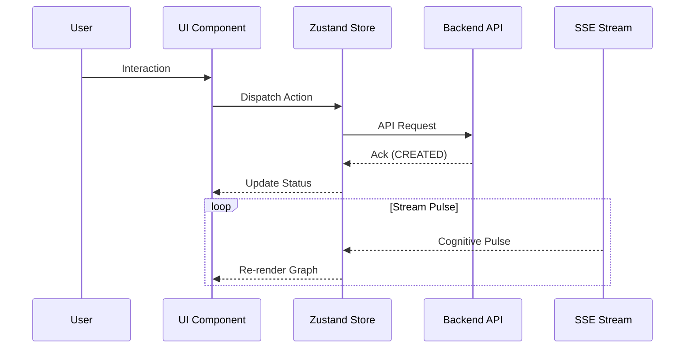

# LEVI-AI Frontend: Cybernetic Dashboard (v14.2)

The LEVI-AI frontend is a hyper-modern React 18 application designed for real-time mission observability. It utilizes a centralized Zustand store for managing cognitive telemetry and mission states.

## 🎨 Architecture & Data Flow

User Input → UI Component → API Client → Backend → SSE Updates → UI Refresh

### Data Flow Diagram (Mermaid)


## 📂 Component Hierarchy

- **`App`**: Root Entry & Auth Router.
- **`Layout`**: Navigation & DCN Health Sidebar.
- **`Dashboard`**: High-level mission grid and hardware monitors.
- **`MissionStudio`**: DAG generation and configuration center.
- **`GraphInterface`**: ReactFlow-based execution visualizer.
- **`TelemetryMonitor`**: Real-time Prometheus/SSE data feeds.

## 🛡️ Auth Flow & State
- **Auth**: `login.html` → POST `/api/v1/auth/session` → Token stored in `localStorage` → Axios Interceptor injects `Authorization` header.
- **State**: `useChatStore` manages the mission history, active DAG, and real-time pulse.

## ❌ Current Gaps (Reality Check)
- **DAG Visualization**: ReactFlow components exist, but are currently not wired to the live `frozen_dag` pulse (Mocked).
- **Voice UI**: Infrastructure exists in `backend/v1/voice`, but there is no integrated UI component for STT/TTS yet.
- **Real-time Updates**: SSE broadcaster is active on the backend, but the frontend hooks (`useSSE`) are in early development.

## 🛠️ Setup
```bash
cd frontend
npm install
npm run dev
```
